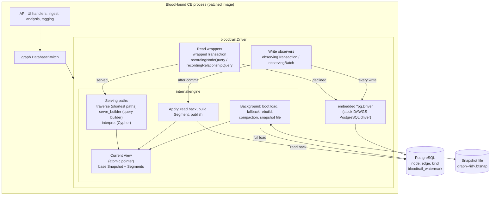

# BloodTrail: an in-memory graph engine underneath BloodHound CE

This paper explains how BloodTrail works and why it is built the way it is. It is written for a
reader who knows what a graph is, roughly what a database does, and what BloodHound is used for.
Everything else is explained in [Section 2](#2-background) before it is needed. Sections 3 to 19
then walk through the design and the implementation one component at a time, with references to the
source files and functions involved, so that a reader can move from the explanation straight into
the code.

The paper describes BloodTrail as of its latest revision (after release v0.1.2), built against
BloodHound CE v9.6.0 and later and DAWGS v0.8.0. Operator-facing instructions (installation,
configuration, troubleshooting) live in the [README](README.md); measured results live in
[BENCHMARK.md](BENCHMARK.md).

---

## Contents

1. [Introduction](#1-introduction)
2. [Background](#2-background)
3. [Design principles](#3-design-principles)
4. [Architecture overview](#4-architecture-overview)
5. [Integration with BloodHound](#5-integration-with-bloodhound)
6. [The in-memory replica](#6-the-in-memory-replica)
7. [Loading the replica from PostgreSQL](#7-loading-the-replica-from-postgresql)
8. [Serving reads](#8-serving-reads)
9. [The shortest-path engine](#9-the-shortest-path-engine)
10. [Query-builder serving](#10-query-builder-serving)
11. [The Cypher interpreter](#11-the-cypher-interpreter)
12. [Write-through](#12-write-through)
13. [The watermark](#13-the-watermark)
14. [Compaction, the snapshot file, and boot](#14-compaction-the-snapshot-file-and-boot)
15. [Memory](#15-memory)
16. [Correctness strategy](#16-correctness-strategy)
17. [Performance](#17-performance)
18. [Deployment](#18-deployment)
19. [Limitations](#19-limitations)

Appendices: [A. Settings](#appendix-a-settings) · [B. Log messages](#appendix-b-log-messages) · [C.
Code map](#appendix-c-code-map) · [D. Glossary](#appendix-d-glossary)

---

## 1. Introduction

### 1.1 The problem

BloodHound CE stores an organisation's Active Directory and Entra ID estate as a graph and answers
questions such as "which accounts can become Domain Admin, and how?" by searching that graph. It
keeps the graph in a database, PostgreSQL or Neo4j, reached through a library called DAWGS.

Databases are good at storing records and looking them up. They are much less good at the search
BloodHound needs most: following chains of relationships many steps deep, across a graph where a few
"hub" nodes (such as the *Domain Users* group) connect to almost everything. A database performs
such a search one step at a time, and each step costs query planning, execution and intermediate
tables. On a large estate the shipped shortest-path queries take tens of seconds or do not finish at
all. BloodHound's own sizing guidance above 50,000 users is 96 GB of RAM and 12 CPU cores.

### 1.2 The observation

The part of the graph that a path search needs is small: which nodes exist, what kinds they have,
and for each edge its start, its end and its kind. A minimal compressed layout of exactly that
information for 5 million nodes and 50 million edges fits in about 0.6 GB, and a single CPU core
visits every edge of it in under a second (`bench/csrbench`: 580 MB heap after the build, a full
breadth-first search in 857 ms). The data fits in memory comfortably. What is slow is the way the
database searches it.

### 1.3 The approach

BloodTrail keeps BloodHound exactly as it is (its ingest, its analysis, its tagging, its API and its
UI) and keeps PostgreSQL as the place where the graph is durably stored. It adds one component
underneath: a DAWGS **driver** named `bloodtrail`. The driver:

1. keeps a compact **replica** of the whole graph in the memory of the BloodHound process, laid out
   for fast traversal;
2. answers a read from that replica **only when it can guarantee the same answer PostgreSQL would
   give**, and otherwise passes the read, unchanged, to the stock PostgreSQL driver;
3. sends every write to PostgreSQL first, then brings the replica up to date **before** the write
   call returns, so the replica is never stale.

The few known exceptions to the second and third promises are narrow, and
[Section 19](#19-limitations) lists them.

Three independent serving paths share the replica: a shortest-path engine, a recognizer for the
structural queries BloodHound's own code issues, and an interpreter for a large subset of the Cypher
query language, which covers every pre-built query BloodHound ships.

### 1.4 Results at a glance

On a hybrid AD/Entra graph of about one million nodes, the 182 benchmark queries (every shipped
pre-built and selector query, plus queries written to attack BloodTrail's weak spots) took
**85.56 s** in total on stock BloodHound with PostgreSQL and **7.87 s** with BloodTrail. The slowest
shipped query, "Shortest paths to Azure Subscriptions", went from **49 s to 63 ms**. The costs are
memory (1.92 GiB against 1.21 GiB resident in that run) and slower writes: keeping the replica
current adds about a quarter to write time. [Section 17](#17-performance) has the details.

### 1.5 How to read this paper

[Section 2](#2-background) is a self-contained primer; readers who know BloodHound, DAWGS,
PostgreSQL's graph schema and CSR graph layouts can skim it. Sections 3 and 4 give the principles
and the overall architecture. Sections 5 to 14 follow the life of the system: how it plugs in, what
the replica looks like, how it is loaded, how reads are answered, how writes keep it current, and
how it survives restarts. Sections 15 to 19 cover memory, correctness, performance, deployment and
limitations. Each technical section ends with a short **Code** note naming the files and functions
it describes; [Appendix C](#appendix-c-code-map) maps the whole repository.

---

## 2. Background

This section introduces every idea the rest of the paper relies on.

### 2.1 BloodHound and attack graphs

An attacker who takes over one account in a Windows domain rarely gets what they want directly. They
chain small permissions together: the account is a member of a group, the group may administer a
server, a Domain Administrator is logged in to that server, so the attacker can steal that
administrator's credentials. Each link looks harmless; the chain is a compromise. BloodHound models
these links as a **graph**, and finding attack chains becomes **finding paths**.

**Nodes and edges.** A graph consists of *nodes* (the objects: users, computers, groups, domains,
group policies, organisational units, certificate templates, and their Entra ID equivalents) and
*edges*, also called relationships (the arrows between them). An edge `A → B` means "A has some
capability over B". Edges are directed: "Alice is a member of Admins" is not the same as "Admins is
a member of Alice".

**Kinds.** Every node and edge is labelled with a *kind*:

- Node kinds include `User`, `Computer`, `Group`, `Domain`, `GPO`, `OU`, `CertTemplate`, `AZUser`,
  `AZTenant`. A node can carry several kinds; every Active Directory node also carries the umbrella
  kind `Base`, and every Azure node carries `AZBase`.
- Edge kinds include `MemberOf`, `AdminTo`, `HasSession`, `GenericAll`, `WriteDacl`, `AddMember`,
  `CanRDP`, `DCSync`, `ADCSESC1`, `AZGlobalAdmin`. An edge has exactly one kind.

**Properties.** Nodes and edges also carry *properties*: named values such as `name`, `enabled`,
`lastlogon` or `operatingsystem`. The most important is **`objectid`**, the security identifier
(SID) or GUID that identifies the object. For example, a domain's *Domain Admins* group always has
an objectid ending in `-512`.

An **attack path** is a directed path through this graph: a sequence of nodes where each has an edge
to the next.

**How the graph is built and used.**

1. **Collection.** SharpHound (for on-premises Active Directory) and AzureHound (for Entra ID and
   Azure) gather data and write JSON files. **OpenGraph** extends BloodHound to other systems: an
   OpenGraph file declares its own node and edge kinds (the users, teams and repositories of a
   source-control organization, say), with properties whose values are text, numbers, booleans, or
   lists of one of those. An *extension schema*, registered with BloodHound separately, marks which
   of those edge kinds pathfinding may follow. A file can name a `metadata.source_kind`, which
   BloodHound registers and puts first on every node the upload writes. Edges may also start at
   Active Directory objects, so paths can cross from one system into the other.
2. **Ingest.** The operator uploads the files; BloodHound turns them into nodes and edges and writes
   them to the database. An OpenGraph edge names its endpoints by `objectid`, or by name or another
   property, which BloodHound first resolves to an `objectid`; an endpoint that does not exist yet
   is created as a *stub* node. "Clear database" can later remove the data of chosen source kinds,
   all *sourceless* data (nodes with no registered source kind), or the edges of chosen kinds.
3. **Analysis.** BloodHound derives additional edges from the collected ones, for example the
   certificate-abuse edges (the "ADCS ESC" family), `CanRDP` or `DCSync`. Its schema lists 31 such
   derived AD edge kinds. Analysis deletes and recomputes them every time it runs.
4. **Tagging.** High-value objects are tagged as "Tier Zero", historically through the value
   `admin_tier_0` in a `system_tags` property and in newer versions through a `Tag_Tier_Zero` kind.
5. **Questions.** Users explore the graph through:
   - **pathfinding**: pick a start and an end object and see every shortest path between them (for
     OpenGraph data, over the edge kinds an extension marks traversable);
   - **pre-built queries**: ready-made questions in the UI ("Shortest paths to Domain Admins",
     "Kerberoastable users with most admin privileges", ...) plus "selector" queries that locate
     well-known objects; BloodHound v9.6.0 ships the pre-built list in two variants, one per Tier
     Zero tagging scheme, so together with the selectors there are 222 active entries and 150
     distinct queries;
   - **entity panels**: click a node to see its members, controllers, sessions and so on;
   - **custom Cypher** typed by the user.

### 2.2 Four facts about the workload

Four properties of BloodHound's workload drive BloodTrail's design.

1. **Hub nodes.** *Domain Users* contains every user in a domain; *Everyone* and *Authenticated
   Users* are similar. One step from a hub reaches the whole domain.
2. **Wide edge alternations.** The shipped shortest-path queries follow an alternation of about
   sixty AD edge kinds at once, so almost every edge is traversable.
3. **Unbounded depth.** With one exception (an Azure role query written `*1..2`), every
   variable-length pattern the UI ships is written `*1..`, `*0..` or `*..`, meaning "any number of
   steps". In practice the only limits are `LIMIT 1000` and the backend's own depth cap.
4. **Read-mostly.** Data arrives in bursts (ingest followed by analysis). The rest of the time the
   graph is only read, interactively and by analysis itself.

### 2.3 Searching a graph

A **path** from A to B is a chain of edges leading from A to B; its **length** is its number of
edges. A **shortest path** has the minimum length, and there may be several; "all shortest paths"
means every path of that minimum length. BloodHound asks for shortest paths because they are the
most direct attacks, and because "all paths of any length" would usually be astronomically many.

**Breadth-first search (BFS)** finds shortest paths. Start at A and visit all its neighbours
(distance 1), then all their unvisited neighbours (distance 2), and so on, one ring at a time. The
set of nodes being expanded in a round is the **frontier**. The first time the search reaches B, it
has found the shortest distance, because nearer nodes are always explored before farther ones. To
list the paths themselves, the search records each node's distance from A; an edge `u → w` can be
part of a shortest path only if `w` is exactly one step farther from A than `u`.

**Bidirectional BFS** runs two searches at once: forward from A, and backward from B (following
edges against their direction). Each round, it grows whichever frontier is currently smaller. When
the two meet, the distance is known. Two small circles that meet in the middle usually cover far
fewer nodes than one large circle reaching across, so for a single start and end this is much
faster.

**Why hubs hurt.** A search that passes through *Domain Users* goes from a handful of frontier nodes
to every user in the domain in a single step. Any strategy that handles the frontier slowly, for
example by writing it into a table, pays for that step in full.

**Trails.** A **trail** is a path that never uses the same edge twice but may visit the same node
twice. DAWGS's variable-length patterns (below) match trails.

### 2.4 DAWGS: the layer between BloodHound and its database

BloodHound never talks to its graph database directly. It talks to **DAWGS** ("Database Abstraction
Wrapper for Graph Schemas", `github.com/specterops/dawgs`). DAWGS defines interfaces for every graph
operation, and a **driver** implements them for one particular database. DAWGS ships two drivers:
Neo4j (a dedicated graph database) and PostgreSQL.

| Interface | Important methods | Role |
|---|---|---|
| `graph.Database` | `ReadTransaction`, `WriteTransaction`, `BatchOperation`, `AssertSchema`, `SetDefaultGraph`, `Run`, `Close` | A connected backend |
| `graph.Transaction` | `Nodes()`, `Relationships()`, `Query(cypher, params)`, `Raw`, `CreateNode`, `UpdateNode`, `CreateRelationshipByIDs`, `UpdateRelationship`, `WithGraph`, `Commit` | One unit of work |
| `graph.Batch` | `CreateNode`, `DeleteNode`, `UpdateNodeBy`, `UpdateNodes`, `CreateRelationship`, `DeleteRelationship`, `UpdateRelationshipBy`, `Commit` | Bulk writes, used by ingest |
| `graph.NodeQuery`, `graph.RelationshipQuery` | `Filter`, `OrderBy`, `Limit`, `Count`, `First`, `Fetch`, `FetchIDs`, `FetchKinds`, `Update`, `Delete`, `Query`; relationships add `FetchTriples`, `FetchDirection`, `FetchAllShortestPaths` | The fluent **query builder** |

A driver registers under a name with `dawgs.Register(name, constructor)`, usually from an `init()`
function, and BloodHound opens one by name with `dawgs.Open`. BloodHound picks the name from its
configuration (`bhe_graph_driver`), unless a row in its `database_switch` table overrides it. This
registry is the door BloodTrail comes through: **BloodTrail is a third driver**.

**Two ways to ask a question.** BloodHound's program code usually builds questions with the query
builder: for example, "relationships of kind `MemberOf` whose end node has id 42, count them". Users
and the pre-built queries write **Cypher** text instead
([§2.6](#26-cypher-and-how-dawgs-translates-it)). Both routes produce the same thing. Cypher text is
first **parsed**, that is, turned from text into a tree-shaped data structure that represents the
query's meaning, called a **syntax tree** or AST. The query builder builds the same kind of tree
directly. The PostgreSQL driver then translates that tree into SQL. BloodTrail relies on this: it
can inspect the tree to understand any question, whichever way it was asked.

### 2.5 The PostgreSQL backend

**Tables.** A relational database stores data in tables: columns are fields, rows are records, and
each row has an `id`. DAWGS's PostgreSQL driver stores a graph in two main tables:

```sql
create table node (id bigserial, graph_id integer, kind_ids smallint[], properties jsonb,
                   primary key (id, graph_id)) partition by list (graph_id);
create table edge (id bigserial, graph_id integer, start_id bigint, end_id bigint,
                   kind_id smallint, properties jsonb, primary key (id, graph_id),
                   unique (start_id, end_id, kind_id, graph_id)) partition by list (graph_id);
```

Kinds are stored as small integers: a node has an array of them (`kind_ids`), an edge exactly one
(`kind_id`). A third table, `kind`, maps the integers to names. `graph_id` allows several graphs in
one database, each stored in its own partition. The `unique` constraint on the edge table means that
there is at most one edge with a given (start, end, kind); BloodTrail uses that fact to identify
edges.

**JSON properties.** Properties are stored as **JSON**, a text format for key–value data such as
`{"name": "ALICE@CORP.LOCAL", "enabled": true, "admincount": 1}`. PostgreSQL's binary JSON type is
`jsonb`. Two facts about JSON matter throughout the paper:

- A key can be **absent** (the node has no `enabled` key at all) or **present with the value
  `null`**. PostgreSQL treats the two differently in some operations, so BloodTrail must too.
- Values have types: text, number, boolean (`true`/`false`), list, nested object.

PostgreSQL offers two ways to read a property. `properties -> 'k'` returns the value as `jsonb`,
keeping its type. `properties ->> 'k'` returns the value **as text**: the number `12345` becomes the
text `'12345'`, `true` becomes `'true'`, a list becomes its JSON text. A text value can then be
**cast** (converted) to another type, for example `(properties ->> 'k')::int8` to a 64-bit integer;
a cast of text that is not a valid number raises an error that aborts the whole query. Which of
these DAWGS uses for which Cypher operation turns out to matter a great deal
([§2.6](#26-cypher-and-how-dawgs-translates-it)).

**Indexes.** To find matching rows, a database either reads every row and tests it (a **scan**) or
uses an **index**: a separate sorted structure that leads straight to matching rows, like the index
at the back of a book. An index helps only with questions it was built for. The graph tables have
indexes for:

- nodes by kind (a GIN index on `kind_ids`);
- edges by kind, and edges by start node or end node combined with kind (B-tree indexes);
- rows by id.

For properties, BloodHound's graph schema declares a few indexes, which DAWGS creates when
BloodHound asserts its schema at startup: a unique index on `objectid`, text-search (trigram)
indexes on `name`, `system_tags` and `user_tags`, and ordinary indexes on `domainsid`, `tenantid`
and `environmentid`. Every other property has no index, including the ones BloodHound's queries test
most often (`enabled`, `hasspn`, `pwdneverexpires`, `operatingsystem`, the encryption-type lists).
And an index helps only when the question matches it: a sorted index on `objectid` cannot find
"objectids that *end* with `-512`", because sorting groups values by how they *start*. So most
property conditions are answered by scanning every node of the right kind.

**Transactions.** A **transaction** groups changes so that they happen all together or not at all.
The changes become visible to others only when the transaction **commits**; if something fails it
**rolls back** as though nothing happened. A statement run on its own commits immediately
(**autocommit**). A program keeps a small set of open connections to the database and lends them out
as needed: a **connection pool**. BloodHound writes through DAWGS in two ways: transactions for
individual changes, and **batches** for bulk ingest. DAWGS's PostgreSQL batch writes in chunks, each
of which commits on its own, so a failed batch may already have written part of its work.

### 2.6 Cypher, and how DAWGS translates it

**Cypher in brief.** Cypher describes a question as a picture of the pattern to find:

```cypher
MATCH (u:User)-[:MemberOf]->(g:Group)
WHERE g.objectid ENDS WITH '-512'
RETURN u
```

`(u:User)` is a node of kind `User`, named `u` within this query; `-[:MemberOf]->` is an edge of
kind `MemberOf` pointing right; `WHERE` adds conditions; `RETURN` says what to return. Other forms
used in this paper:

| Cypher | Meaning |
|---|---|
| `-[:MemberOf*1..3]->` | a chain of 1 to 3 `MemberOf` edges (a **variable-length** relationship) |
| `-[:MemberOf*1..]->` | a chain of any length |
| `-[:A\|B]->` | an edge of kind `A` or kind `B` |
| `p = (a)-[...]->(b)` | name the whole matched path `p`, so it can be returned |
| `shortestPath(...)`, `allShortestPaths(...)` | one shortest path for each start/end pair; or all shortest paths, which with several pairs can mean only those of the overall shortest length (below) |
| `OPTIONAL MATCH` | a pattern that may be missing; if it is, its variables are `null` |
| `WITH ...` | pass intermediate results to a second stage of the query |
| `COUNT(x)`, `COLLECT(x)` | count results, or gather them into a list |
| `DISTINCT`, `ORDER BY`, `SKIP`, `LIMIT` | remove duplicates, sort, skip, cap the number of results |
| `STARTS WITH`, `ENDS WITH`, `CONTAINS`, `=~` | text matching; `=~` is a regular expression |
| `$name` | a parameter whose value is supplied separately from the query text |

**Three-valued logic.** A condition can be true, false, or *unknown* (`null`), for example when it
tests a missing property. `WHERE` keeps only rows whose condition is true, and `NOT unknown` is
still unknown.

**How DAWGS turns Cypher into SQL.** SQL is PostgreSQL's query language. The translation works as
follows.

- **Fixed-length patterns** such as `(a)-[:K]->(b)` become **joins**: SQL that combines rows of the
  node and edge tables where `edge.start_id = a.id` and `edge.end_id = b.id`.
- **Variable-length patterns** become a **recursive query** (`WITH RECURSIVE`): a query that
  repeatedly extends the rows it has by one more edge until no new rows appear. Each row carries the
  list of edge ids used so far, and an edge already in the list may not be used again, which is what
  gives trail semantics. Every extension copies that list, and the check scans it. A pattern with no
  upper bound is capped at **15** steps. A simplified sketch:

  ```sql
  with recursive s(root_id, next_id, depth, path) as (
    select e.start_id, e.end_id, 1, array[e.id] from edge e where ...
    union all
    select s.root_id, e.end_id, s.depth + 1, s.path || e.id
    from s join edge e on e.start_id = s.next_id
    where s.depth < 15 and e.id != all(s.path))
  ```

- **`shortestPath`/`allShortestPaths`** cannot use a recursive query, because a recursive query
  cannot stop early once the target is found. DAWGS instead calls small programs stored inside
  PostgreSQL (PL/pgSQL functions) that run the search one ring at a time, writing each frontier into
  **temporary tables** that are discarded afterwards. A bidirectional variant expands the smaller
  side. The depth cap is again 15. If the query does not say `s <> t` and a node is both a start and
  an end of the search, with an admissible first step out of it, these functions raise an error
  (SQLSTATE `22023`, "shortest path endpoints must not resolve to the same node"). The check sits in
  the SQL of the first step, beside the starts' own conditions, and PostgreSQL may evaluate it
  before those conditions have narrowed the starts, so whether it fires can depend on the query
  plan PostgreSQL picks.

  These functions also decide what "shortest" means when a query has several start/end pairs at
  different distances. The `shortestPath` function keeps a separate search for each start, until
  that start has reached all of its ends or the depth cap, so it returns one shortest path for every
  connected pair, however long. The `allShortestPaths` functions give one of two answers. Usually
  they search from all the starts at once and stop at the first ring in which any start reaches any
  end: the answer is every path of the query's **overall** shortest length, and a pair that lies
  farther apart contributes nothing. That search keeps no record of the nodes it has visited, so a
  path that leads back to a start which is also an end counts like any other. In some cases DAWGS
  instead lists the exact start/end pairs in advance (a **pair filter**) and calls the bidirectional
  function, which finishes each pair at its own distance and so returns **every pair's** shortest
  paths. It does this when it judges both endpoints selective enough, for example when both carry an
  equality, `IN` or `STARTS WITH` condition on a property or an id, or were bound by an earlier
  `MATCH`. The judgement is DAWGS's own heuristic: kind tests do not count, nor do a range such as
  `s.x > 5` or an `IS NOT NULL` test, and `NOT s.name = 'n3'` does not count where `s.name <> 'n3'`
  does. That is why BloodTrail reads the choice from the translation instead of predicting it
  ([§11.7](#117-executing-the-pattern)). The same pattern can therefore get either answer:
  `allShortestPaths((u:User)-[*1..]->(r:Repo))` with `WHERE r.objectid = 'X'` returns only the paths
  of the users nearest to the repository, while adding `AND u.objectid IN ['A', 'B']` returns the
  shortest paths of both listed users, each at its own length.
- **Property conditions** are mostly evaluated on the **text** form of the property. `STARTS WITH`,
  `ENDS WITH`, `CONTAINS`, `=~`, `IN [...]`, `coalesce(...)`, `<`/`>` comparisons and arithmetic all
  read `properties ->> 'k'` and cast it to the type of the other operand when needed:
  `n.p IN [1, 2]` and `n.p + 1` cast the text to a 64-bit integer, so the text `'5'` plus 1 is 6,
  and the text `'1.5'` is an error that aborts the whole query. Equality and inequality are
  type-aware only when written plainly: `n.p = 'text'` and `n.p <> 'text'` also check that the
  stored value is text, and `n.p = 5` or `n.p = true`, with the property on the left, compares
  `jsonb` values directly. Small changes of spelling change the SQL. With the number on the left
  (`5 = n.p`), DAWGS parses the property's text as JSON, so the text `'5'` equals 5 and the text
  `'abc'` is an error; with the property in parentheses (`(n.p) = 5`), it compares text with a
  number, which PostgreSQL refuses to run.

  With a literal on the right, `STARTS WITH`, `ENDS WITH` and `CONTAINS` become SQL's `LIKE` pattern
  match: `n.objectid ENDS WITH '-512'` becomes `… LIKE '%-512'`. In a `LIKE` pattern, `_` stands for
  any one character and `%` for any run of characters. DAWGS escapes these characters in the literal
  only when the left side is a plain property; for any other left side, the literal goes in as
  written. So `coalesce(n.system_tags, '') CONTAINS 'admin_tier_0'`, a form BloodHound's pre-built
  queries use, also matches `admin-tier-0`.

  The consequences are real: the number `12345` matches `STARTS WITH '12'`, and the text `"7"`
  satisfies `n.p > 5`. BloodTrail reproduces exactly this behaviour, not the textbook Cypher one, or
  declines the query ([§11.2](#112-matching-dawgss-semantics)).

**Collation.** Databases sort text according to rules called a **collation**: whether uppercase
sorts before lowercase, where accented letters go, and so on. The rules depend on the database's
locale configuration, and another program cannot reliably reproduce them. Any answer that depends on
text *ordering* must therefore come from PostgreSQL.

### 2.7 Why path questions are slow in the database

Putting the previous subsections together:

- **Work happens one ring at a time, through SQL.** Each ring of a shortest-path search plans and
  runs SQL and materialises the frontier as rows of a temporary table. The bookkeeping costs far
  more than following the edges.
- **Hubs make rings enormous.** One step from *Domain Users*, the frontier is the whole domain.
- **Wide alternations filter little.** With about sixty admissible edge kinds, the kind filter
  rejects almost nothing.
- **Recursive queries copy paths.** The list of used edges is copied for every partial path at every
  step, and the no-repeat check scans it.
- **Go-side traversals issue one query per step.** BloodHound's analysis code uses a DAWGS traversal
  library that issues a database query for every path segment it expands.

In the benchmark in [Section 17](#17-performance), the shipped "Shortest paths to Azure
Subscriptions" takes 49 seconds on stock BloodHound with PostgreSQL.

### 2.8 Data-structure toolbox

The rest of the paper uses the following ideas.

**Arrays and hash maps.** An *array* is a numbered row of boxes; reading box *n* is instant, and
reading boxes in order is the fastest thing a processor does, because memory is fetched in chunks
and the next chunk is predicted. A *hash map* (dictionary) maps arbitrary keys to values; each
lookup is fast but jumps to an unpredictable place in memory, and each entry costs more memory.
BloodTrail uses arrays wherever it can.

**Dense ids.** Database ids are large and full of gaps. BloodTrail renumbers nodes `0, 1, …, N−1`
with no gaps: these are *dense ids*. It assigns them in ascending database-id order, so within one
loaded copy, sorting by one sorts by the other. Any per-node fact can then live in box *n* of an
array; a single hash map translates an incoming database id to a dense id.

**Compressed sparse row (CSR).** CSR stores "who points to whom" in two arrays: `targets`, holding
every node's neighbours concatenated (node 0's first, then node 1's, and so on), and `offsets`,
where node *n*'s neighbours are `targets[offsets[n]]` up to, but not including,
`targets[offsets[n+1]]`. For example, if node 0 points to nodes 1 and 2 and node 1 points to 2:

```
offsets = [0, 2, 3, 3]
targets = [1, 2, 2]
```

Further arrays of the same length as `targets` hold one fact per edge, such as its kind or its
database id; each position is a *slot*. Walking a node's edges is two array reads and a short
contiguous scan. A second CSR built the other way round ("who points *to* each node") allows walking
edges backwards.

**Bitsets.** A *bitset* stores a set of nodes as one bit per node: bit *n* is 1 if node *n* is in
the set. A million nodes take 125 KB; membership is one bit test; intersection and union handle
64 nodes per machine instruction; and counting the members of a set is cheap.

**Binary search.** In a sorted array, a value can be found by repeatedly halving the range: about
20 steps for a million entries. BloodTrail's indexes are mostly sorted arrays searched this way.

**Immutability and layers.** Data that is never modified after creation is *immutable*; many threads
can read it at once without locks, because nothing can change under them. When data must change, the
change can be recorded as a separate *layer* on top of an immutable base ("the base says X, but this
layer says node 42 is now Y"). Readers look at the newest layer first. Adding a layer creates a new
*view*, while readers of the old view keep a consistent picture. Now and then the layers are merged
into a fresh base; this is *compaction*. Publishing a new view is a single **atomic pointer swap**:
a pointer that readers load without locking and that a writer replaces in one indivisible step.

**Caches and staleness.** A *cache* is a copy of data kept close to where it is used. Its danger is
*staleness*: the original changes and the copy does not. Most caches tolerate some staleness or
periodically discard themselves. BloodTrail is built never to be stale ([Section
12](#12-write-through)).

**A counter as proof.** If every change to a system increments a shared counter *before* it takes
effect, then a copy saved when the counter read 1000, checked against a counter now reading 1003, is
missing at most the three changes numbered 1001 to 1003. If each of those three can be accounted
for, the copy plus those changes is complete. BloodTrail uses this to decide whether a saved copy
can be trusted after a restart ([Section 13](#13-the-watermark)). It works only if every change goes
through the counter; [§13.5](#135-the-lineage) covers changes that do not.

**Go specifics.** BloodTrail is written in Go, like BloodHound. Go runs concurrent work in
lightweight threads called *goroutines*. Memory is reclaimed by a *garbage collector*, which by
default lets the heap grow to about twice the live data before collecting; the `GOMEMLIMIT` setting
tells it to collect harder near a given limit ([Section 15](#15-memory)). BloodHound has no plugin
mechanism (and Go's own plugin support requires building with exactly the same toolchain and
dependencies), so adding a driver to BloodHound means building a new BloodHound binary ([Section
5](#5-integration-with-bloodhound)).

---

## 3. Design principles

The project chose an in-process replica packaged as a DAWGS driver over the alternatives:

- tuning Neo4j;
- switching to plain PostgreSQL;
- running a separate graph server behind the Neo4j driver;
- writing a standalone tool.

The requirements were that *every* graph query should get faster, not only shortest paths; that
BloodHound's ingest, derived-edge analysis, tagging, UI and user model be kept, since
re-implementing the roughly 12,000 lines of AD analysis code alone would be a project of its own;
and that the result install onto existing deployments.

The implementation follows seven principles, visible throughout the code:

1. **PostgreSQL is the system of record.** The replica is a cache with a proof of freshness, never
   an independent store. Every write reaches PostgreSQL through the unmodified PostgreSQL driver.
2. **Decline over guess.** The engine answers a query only when its behaviour is pinned to what
   the PostgreSQL driver would return, with the few exceptions listed in
   [Section 19](#19-limitations). Anything uncertain is **declined**: passed, unchanged, to the
   PostgreSQL driver. A decline costs latency, never correctness. Recognizers and the Cypher planner
   are *default-deny*: they accept an explicit list of shapes and decline everything else.
3. **Never a partial answer.** Budgets on rows, work and memory never cut a result short; exceeding
   one declines the whole query.
4. **Fail closed, not empty.** A shortcut that proposes candidate rows may propose too many, since
   every row is re-checked, but never too few. An empty candidate set is a wrong answer, not a fast
   one. When a fact derived from partial information would gate behaviour, the engine declines.
5. **Match DAWGS's SQL, not the Cypher textbook.** Where DAWGS's translation differs from the Cypher
   specification, BloodTrail reproduces the SQL's behaviour exactly or declines the shape.
6. **Immutable views.** A query reads one immutable view from start to finish. Writes publish new
   views and never modify old ones, so readers never wait for writers and nothing is re-checked
   afterwards.
7. **Measured numbers.** Enforced performance thresholds in the benchmarks are derived from
   measurements (typically the measured worst case × about 1.75) and pinned by tests; several
   constants in the code carry the measurement that sized them in their comments.

---

## 4. Architecture overview



| Component | Location | Responsibility |
|---|---|---|
| Driver | [`driver.go`](driver.go), [`transaction.go`](transaction.go), [`node_query.go`](node_query.go), [`relationship_query.go`](relationship_query.go), [`write_observer.go`](write_observer.go), [`settings.go`](settings.go) | Registers `bloodtrail` with DAWGS, wraps the PostgreSQL driver, routes reads to the engine, observes writes |
| Snapshot | [`internal/engine/snapshot`](internal/engine/snapshot) | The replica's data structures: base `Snapshot`, `Segment` deltas, the `View` that combines them, read indexes, `Fold`, the file format |
| Engine | [`internal/engine`](internal/engine) | Engine state, loading, write-through `Apply`, read-back, watermark, boot, compaction, persistence, result building |
| Traverse | [`internal/engine/traverse`](internal/engine/traverse) | The shortest-path search engine |
| Recognize | [`internal/engine/recognize`](internal/engine/recognize) | Recognizes query-builder question shapes |
| Interpret | [`internal/engine/interpret`](internal/engine/interpret) | The Cypher planner, executor and expression evaluator |
| Installer | [`cmd/bloodtrail`](cmd/bloodtrail), [`internal/installer`](internal/installer) and helpers | Installs, verifies, reports on and rolls back BloodTrail in a Docker Compose deployment |

Once a replica has been loaded, the engine is in one of two states:

- **SERVING**: a current view exists, and reads are offered to the engine first;
- **FALLBACK**: every read goes to PostgreSQL while a background task reloads the replica.

Before the first load finishes, or with `BLOODTRAIL_ENGINE=off`, there is no view and every read
goes to PostgreSQL. Reads never wait for writes, and writes never wait for readers.

---

## 5. Integration with BloodHound

This section describes how BloodTrail becomes BloodHound's graph driver, and how its wrapper
decides, call by call, whether the engine is involved.

### 5.1 The patch

BloodHound has no way to load a driver at run time, so BloodTrail ships as a rebuilt BloodHound
image. The change to BloodHound's source is a small patch,
[`patches/bloodhound-driver.patch`](patches/bloodhound-driver.patch), with two changes, one in each
of two files:

1. **Driver selection** (`cmd/api/src/bootstrap/util.go`). BloodHound's `ConnectGraph` chooses a
   backend with a `switch` on the configured driver name. The patch adds one case, identical in
   shape to the existing PostgreSQL case:

   ```go
   case bloodtrail.DriverName:
       slog.InfoContext(ctx, "Connecting to graph using BloodTrail")
       connectionString = cfg.Database.PostgreSQLConnectionString()
       pool, err = dbpool.NewDawgsPool(cfg.Database)
       if err != nil { return nil, err }
   ```

   BloodHound then calls `dawgs.Open` with that connection pool and its configured per-query memory
   limit, and wraps the result in a `graph.DatabaseSwitch`, exactly as it does for PostgreSQL.

2. **A PostgreSQL check in a migration** (`cmd/api/src/migrations/manifest.go`). One of BloodHound's
   own graph migrations, `Version_852_Migration`, only runs "if the graph is on PostgreSQL", which
   it tests with `pg.IsPostgreSQLGraph(db)`. That test checks for the concrete `*pg.Driver` type.
   BloodTrail's driver *contains* a `*pg.Driver` but is a different type, so without the patch the
   migration would be recorded as done without having run. The patch extends the test to
   `pg.IsPostgreSQLGraph(db) || graph.IsDriver[*bloodtrail.Driver](db)`. The migration only runs on
   graphs whose stored migration version is older than 8.5.2, so an ordinary install never exercises
   it.

The build script, [`build/build-image.sh`](build/build-image.sh), clones BloodHound at a release
tag, applies the patch, copies BloodTrail's driver package and `internal/engine` into
`packages/go/bloodtrail` (without test files), points BloodHound's `go.mod` at it with
`go mod edit`, and builds with BloodHound's own Dockerfile ([Section 18](#18-deployment)). Editing
`go.mod` from the script, rather than in the patch, means upstream dependency bumps never conflict
with the patch. The edit is not free of side effects: Go's module resolution takes the higher of
the DAWGS version BloodHound pins and the one BloodTrail needs, so an image can carry a newer DAWGS
than the stock release (v9.6.0 pins v0.7.0, and its image carries v0.8.0: the engine does not
compile against v0.7.0). The script therefore checks the DAWGS version each image resolves
([§18.1](#181-the-image)).

### 5.2 Registration and `Open`

The driver registers itself under the name `bloodtrail` when the program starts:

```go
const DriverName = "bloodtrail"
func init() { dawgs.Register(DriverName, Open) }
```

`Open` ([`driver.go`](driver.go)) then:

1. parses the `BLOODTRAIL_*` environment variables (`SettingsFromEnv` in
   [`settings.go`](settings.go)); a malformed value fails startup with an error naming the variable;
2. requires BloodHound's connection pool (`dawgs.Config.Pool`);
3. opens the stock PostgreSQL driver with the **same** configuration, `dawgs.Open(ctx, "pg", cfg)`;
4. creates the engine (`engine.New`), handing it that driver (for kind-name lookups and loading) and
   the raw pool (for its own queries). The one pool the engine creates itself is a small one for
   the write path (`writePathPool` in [`writepool.go`](internal/engine/writepool.go)): two
   connections, made from BloodHound's pool configuration without DAWGS's connection hooks, opened
   on the first write and closed at shutdown after the snapshot file is saved, so that a write's
   counter increment and its read-back never need a second connection from BloodHound's pool
   while the write holds one
   ([§12.3](#123-reading-back), [§13.1](#131-the-counter));
5. calls `engine.Start` with a background context, because the boot goroutine must outlive `Open`.
   `Start` synchronously sweeps stale snapshot temp files, creates the watermark table if it is
   missing and gives it its `lineage` column if that is missing ([Section 13](#13-the-watermark)).
   With the engine on and a snapshot directory configured, it then records where the watermark
   counter and the node and edge id sequences stand, before `Open` has returned a driver anything
   could write through ([§13.6](#136-rows-inserted-behind-the-counter)). Finally it starts the boot
   load in the background ([Section 14](#14-compaction-the-snapshot-file-and-boot));
6. logs `BloodTrail driver active`, which the installer waits for to confirm the new image runs.

### 5.3 The wrapper

```go
type Driver struct {
    *pg.Driver            // the stock DAWGS PostgreSQL driver, embedded
    settings Settings
    engine   *engine.Engine
    // plus a test-only override of the pg backend
}
```

Go's *embedding* makes every method of the PostgreSQL driver available on `*bloodtrail.Driver`
unchanged: `AssertSchema`, `FetchKinds`, `RefreshKinds`, `OptimizeStorage`, `KindMapper` and the
rest pass straight through. BloodTrail overrides nine methods:

| Method | Why it is overridden |
|---|---|
| `ReadTransaction` | Wraps each transaction so reads can be answered from memory ([§5.4](#54-the-read-side)) |
| `WriteTransaction`, `BatchOperation` | Wrap the transaction or batch in an *observer* that records what each write touched, then call `engine.Apply` ([§5.5](#55-the-write-side)) |
| `Close` | Stops the engine and saves the snapshot file, then closes the write path's pool and PostgreSQL |
| `Run`, `WipeGraph`, `SetDefaultGraph`, `DeleteNodesByKinds`, `DeleteRelationshipsByKinds` | These change the graph (or, for `SetDefaultGraph`, which graph the replica mirrors), but inside the PostgreSQL driver they work through its own internal methods or a raw connection, which would bypass the overrides above |

The last row needs one more word of explanation. Go embedding has no "virtual dispatch": when the
embedded PostgreSQL driver's `Run` calls its own `WriteTransaction`, it calls the PostgreSQL
version, not BloodTrail's. And BloodHound finds `WipeGraph` and the two delete-by-kind methods
through `graph.AsDriver[...]`, which unwraps the `DatabaseSwitch` and type-asserts the concrete
driver, so the assertion lands on `*bloodtrail.Driver` and the methods must be defined there.

### 5.4 The read side

`Driver.ReadTransaction` hands BloodHound's code a `wrappedTransaction`
([`transaction.go`](transaction.go)) around the PostgreSQL transaction. The wrapper carries the
engine, the caller's context, a `declined` flag, and a record of any writes made through it.

**What it intercepts.**

- **`Query(cypher, params)`** is offered to `engine.TryCypher` ([Section
  11](#11-the-cypher-interpreter)). If the engine declines, the text goes to PostgreSQL's `Query`
  exactly as it would have without BloodTrail.
- **`Nodes()`** returns a `recordingNodeQuery` ([`node_query.go`](node_query.go)), which records
  every `Filter` criterion and offers `Count`, `FetchIDs` and `FetchKinds` to the engine ([Section
  10](#10-query-builder-serving)). `OrderBy`, `Offset`, `Limit`, `Query` and `Fetch` *taint* the
  builder: a tainted builder is never answered from memory, because those modifiers change the
  answer in ways the engine does not implement. `First` and `Fetch`, which return full entities
  with properties, always go to PostgreSQL.
- **`Relationships()`** returns a `recordingRelationshipQuery`
  ([`relationship_query.go`](relationship_query.go)), which additionally intercepts
  `FetchAllShortestPaths` ([Section 9](#9-the-shortest-path-engine)), `FetchTriples`, and a few
  recognised row projections through `Query`. An `OrderBy` on the edge id, ascending, is recognised
  rather than tainting, because it is the paging order DAWGS's own traversal library uses.
- **`WithGraph(g)`** switches the transaction to another graph. The engine only replicates the
  default graph, so from then on the wrapper *declines* everything. It marks both the new wrapper
  and the old one, because DAWGS's PostgreSQL transaction changes itself and returns itself.

Every engine entry point returns `(result, served bool)`. `served == false` means "call PostgreSQL
instead", and the wrapper does exactly that; the engine never returns an error for a query it chose
not to serve.

**Context.** Engine-served reads run under the context BloodHound passed to `ReadTransaction`. In
production that context comes from BloodHound's `DatabaseSwitch` and is cancelled with the request,
so a cancelled request also cancels the engine's own PostgreSQL round trips (such as fetching edge
properties). The Cypher interpreter honours it too: it declines a request whose context is already
done, and a request cancelled while it runs stops at the interpreter's next work check, at most
1,024 units of work later ([§11.9](#119-budgets)). The builder counts decline a done context on
entry. Either way the query goes to PostgreSQL, which returns the context's own error. Two served
paths still ignore a cancellation: the shortest-path search
([§9.4](#94-limits-and-engineering-details)), and the builder's row projections, whose rows are
produced as the caller reads them.

**Writes made through a read transaction.** DAWGS's PostgreSQL `ReadTransaction` does not actually
open a database transaction: it runs each statement on its own, committing immediately. So a write
issued inside a "read" transaction (a `CreateNode`, an `UpdateNode`, a relationship create or
update, a `Raw` statement, a Cypher query that changes data, a builder `Update`/`Delete`, or a
builder `Query` (or a node builder's `Fetch`) handed an updating clause, such as a delete, in its
final criteria) is durable the moment it runs. The wrapper therefore notes each such write before it
runs: it records a fallback reason and, at the first such write, increments the watermark counter
([Section 13](#13-the-watermark)). When the read transaction ends, whatever it returned, the engine
applies that record, which switches it to FALLBACK and rebuilds the replica
([§12.5](#125-fallback)). From the first such write on, nothing else in that read transaction is
answered from memory. BloodHound's Cypher endpoint sends data-changing queries through write
transactions, so in ordinary use this is a safety net.

**Consistency.** Because DAWGS's PostgreSQL read transaction is a sequence of independent
statements, PostgreSQL itself gives no single consistent snapshot across the statements of one "read
transaction". BloodTrail likewise takes the current view per call, not per transaction: two reads in
one read transaction may see two views if a write lands in between.

### 5.5 The write side

`WriteTransaction` and `BatchOperation` wrap the PostgreSQL transaction or batch in an
`observingTransaction` or `observingBatch` ([`write_observer.go`](write_observer.go)). An observer
forwards every call to PostgreSQL unchanged, and additionally records in a per-write `WriteScope`
**what the call touched** ([§12.2](#122-what-the-observers-record)). Before the first change of each
transaction or batch, it increments the watermark counter (`ensureBumped`, [Section
13](#13-the-watermark)).

The observers wrap the raw PostgreSQL transaction, never a `wrappedTransaction`, so **nothing read
inside a write transaction is ever answered from memory**. A transaction must be able to read its
own uncommitted changes, and only PostgreSQL has them.

Query builders and `WithGraph` children handed out by an observer do not hold their own copy of the
write scope; they hold a pointer to the *root* observer's scope field. When code calls `Commit` in
the middle of a transaction or batch and the commit succeeds, the observer applies the scope so far
and replaces the root's field with a fresh scope, and every child sees the replacement, so no write
recorded after a mid-way commit is lost. A batch `Commit` that fails applies nothing and keeps the
scope: DAWGS's batch keeps the buffers that failed to flush and writes them at its final commit, so
their keys must still be recorded when the batch's last apply reads them back. (A transaction
`Commit` that fails has an unknown outcome; it records a fallback and applies.)

After PostgreSQL commits, the driver calls `engine.Apply` with the scope; `Apply` brings the replica
up to date before `WriteTransaction` returns to BloodHound ([Section 12](#12-write-through)). What
happens when something fails depends on whether the failed write might have reached the database:

| Call | Error treated as "nothing happened" (no apply) | Error treated as "it may have landed" (fallback and rebuild) |
|---|---|---|
| `WriteTransaction` | The code inside returned an error, so PostgreSQL rolled back; or the final COMMIT failed for a transaction that wrote nothing | The code inside succeeded and wrote (or incremented the counter for a write), but the final COMMIT failed: the outcome is unknown |
| `BatchOperation` | — (always applied: DAWGS's batch commits in chunks, so earlier chunks may be durable, and read-back reads whatever was committed) | — |
| `Run`, `WipeGraph` | Any error before the commit step (connection, BEGIN, the statement, the truncate) | An error from the COMMIT itself |
| `DeleteNodesByKinds`, `DeleteRelationshipsByKinds` | A connection error, or the delete's own up-front refusal of an unknown kind to exclude | Anything else: these deletes run as a single auto-committed statement, and an error can be reported after the delete has already taken effect |
| `SetDefaultGraph` | Every error (it cannot have written anything) | — |

"Nothing happened" still settles the watermark bookkeeping (`ResolveAbandonedWrite`, [Section
13](#13-the-watermark)). "It may have landed" records a fallback, so the engine rebuilds and learns
the truth from PostgreSQL.

A panic in the code run inside `WriteTransaction`, `BatchOperation` or `ReadTransaction` is not
caught: it reaches BloodHound unchanged, with its own stack. The driver settles the write on the
way out (`settleWriteTransactionPanic` and the deferred handlers in [`driver.go`](driver.go)): a
`WriteTransaction` whose code panicked was rolled back by DAWGS, so it settles as "nothing
happened", and one that panicked after its code returned settles like a failed final COMMIT; a
batch records a fallback and applies, because the panic may have come between a write and its
record; a read transaction applies the writes it noted. `Run`, `WipeGraph` and the other overridden
methods have no such handling: a panic inside one of them (`WipeGraph` runs a callback its caller
supplies) leaves its counter increment unresolved, and the process then writes no snapshot file
until it restarts ([§13.1](#131-the-counter)).

### 5.6 OpenGraph data

OpenGraph data ([§2.1](#21-bloodhound-and-attack-graphs)) reaches the graph through the same driver
calls collector data does, so BloodTrail needs nothing OpenGraph-specific. The integration suite
replays the calls BloodHound v9.6.0 makes for it (unchanged through v9.7.1) and checks every step
against the plain PostgreSQL driver ([§16.2](#162-differential-tests-against-postgresql)):

- **Uploads.** An upload runs in one `BatchOperation`. BloodHound registers the upload's source kind
  and node kinds in the `kind` table and calls `RefreshKinds`, which passes straight through to the
  PostgreSQL driver ([§5.3](#53-the-wrapper)). It then upserts nodes with `UpdateNodeBy` and edges
  with `UpdateRelationshipBy`, all identified by exactly `["objectid"]`: the upserts write-through
  records by key ([§12.2](#122-what-the-observers-record)). So every node and edge of an upload is
  replayed without a reload, stub endpoints included, and so is an Active Directory user that gains
  the source kind through a hybrid edge.
- **Endpoints named by name or property** are first resolved to an `objectid` by a read in a
  transaction of its own. That read is a builder `Query` returning a property, which the wrapper
  never answers from memory ([§5.4](#54-the-read-side)), so it goes to PostgreSQL.
- **Reads** are answered from memory: Cypher over custom kinds (scans over every OpenGraph value
  type, multi-kind and stub nodes, variable-length paths, `shortestPath`, both of PostgreSQL's
  `allShortestPaths` answers, hybrid AD-to-OpenGraph paths, aggregates), builder counts, and the
  pathfinding endpoint. That endpoint looks both nodes up with `First`, which goes to PostgreSQL,
  then asks `FetchAllShortestPaths` for the pair over the edge kinds the extension marks
  traversable, which the path engine answers ([Section 9](#9-the-shortest-path-engine)).
- **"Clear database"** calls `DeleteRelationshipsByKinds` for the chosen edge kinds, and
  `DeleteNodesByKinds` for the chosen source kinds (those kinds included) or for sourceless data (no
  kind included, every registered source kind excluded); both node deletes also exclude BloodHound's
  `MigrationData` kind. Each is applied by reading back, from PostgreSQL, the rows of the replica it
  may have removed ([§12.1](#121-record-the-keys-then-read-back-the-truth)). A failed upload can
  leave behind a source kind that PostgreSQL has registered but no row carries. The replica learns
  kinds from its last full load and from the rows it reads back, so it may not know that name;
  read-back resolves it through the driver's kind mapper, and the sourceless delete that excludes it
  replays without a fallback.
- **What still goes to PostgreSQL**: a query naming a kind no row carries yet, such as that failed
  upload's source kind, until the replica learns the kind (declined as `unsupported`); and the same
  shapes that delegate for any other data.

**Code.** [`driver.go`](driver.go): `Open`, `Driver`, `ReadTransaction`, `WriteTransaction`,
`settleWriteTransactionPanic`, `resolveWriteTransactionFailure`, `BatchOperation`, `Run`,
`WipeGraph`, `settleOverrideWrite`, `SetDefaultGraph`, `DeleteNodesByKinds`,
`DeleteRelationshipsByKinds`, `settleDeleteFailure`, `Close`. [`transaction.go`](transaction.go):
`wrappedTransaction`, `readWrites`, `readQueryMutates`. [`node_query.go`](node_query.go),
[`relationship_query.go`](relationship_query.go): the recording builders.
[`write_observer.go`](write_observer.go): `observingTransaction`, `observingBatch`,
`observingNodeQuery`, `observingRelationshipQuery`, `hasUpdatingClause`,
`recordUpdatingFinalCriteria`, `scopeSlot`, `ensureBumped`.
[`writepool.go`](internal/engine/writepool.go): `writePathPool`.

---

## 6. The in-memory replica

All of the replica's data structures live in [`internal/engine/snapshot`](internal/engine/snapshot).
The replica has three layers:

- a **base snapshot** (`Snapshot`): a complete, compact, immutable copy of the graph, built from
  PostgreSQL or read from a file;
- zero or more **segments** (`Segment`): small immutable deltas, one per applied write;
- a **view** (`View`): a base plus its stack of segments, which is what every query reads.

### 6.1 The base snapshot: topology

```go
type Snapshot struct {
    GraphID     int32
    GraphIDs    []uint64   // dense id -> database id, strictly ascending
    OutOffsets  []uint64   // forward CSR offsets, len N+1
    OutTargets  []NodeID   // forward CSR: target of each out-edge (NodeID = uint32)
    OutKinds    []KindID   // kind of each out-edge (KindID = int16)
    OutEdgeIDs  []uint64   // database id of each out-edge
    InOffsets   []uint64   // reverse CSR offsets, len N+1
    InTargets   []NodeID   // reverse CSR: the SOURCE of each in-edge
    InKinds     []KindID
    InEdgeIdx   []uint32   // reverse slot -> forward slot of the same edge
    KindOffsets []uint32   // per node, into NodeKinds (len N+1)
    NodeKinds   []KindID   // every node's kinds, flattened
    MaxKindID   KindID
    Kinds       *KindTable // kind id <-> name, for the whole database
    Props       *PropStore // node properties (§6.2)
    DroppedEdges int       // edges skipped at build because an endpoint was missing
    BuiltAt     time.Time
    MultiGraph  bool       // the database holds more than one populated graph
    edgeIDPerm  []uint32   // forward slots sorted by edge id

    // derived at build or load time, never stored in the file:
    idIndex       map[uint64]NodeID   // database id -> dense id
    kindBitmaps   map[KindID]*Bitset  // one bitset per node kind
    selfLoopKinds map[KindID]struct{} // edge kinds that have at least one self-loop
    edgeKindSeen  []bool              // does any edge carry kind k?
    // plus lazily built, memoized read indexes (§6.3)
}
```

The field choices follow from the workload:

- **Dense ids are 32-bit** (`NodeID`) and **kinds are 16-bit** (`KindID`), the same width PostgreSQL
  uses for kind ids.
- **Forward and reverse CSR.** Each node's forward section is sorted by (target, kind), each reverse
  section by (source, kind). The reverse CSR does not store a second copy of the edge id:
  `InEdgeIdx[i]` points at the forward slot of the same edge, so `OutEdgeIDs` is the single source
  of truth for edge ids.
- **Finding an edge by its database id** needs no hash map: `edgeIDPerm` lists forward slots in
  ascending edge-id order, and `EdgeByID` binary-searches it.
- **Node kinds** are stored twice: a flat per-node list (a node may carry several kinds), and one
  **dense, uncompressed bitset per node kind**, sized to the node count, so "every `User`" is a
  ready-made set with an O(1) member count.
- **Edges carry no properties in the replica.** Edge properties are fetched from PostgreSQL only for
  the edges a served answer actually returns ([§8.4](#84-completing-the-answer)). This keeps the
  replica's size driven mainly by topology; edges outnumber nodes about ten to one in the synthetic
  benchmark graphs (about 2.4 to one in the end-to-end benchmark graph).

**A worked example.** Nodes with database ids 10, 20 and 30, and four edges:

```
edge 101: 10 → 30, kind 5          edge 103: 20 → 30, kind 7
edge 102: 10 → 20, kind 5          edge 104: 10 → 20, kind 3
```

Dense ids: 10 → 0, 20 → 1, 30 → 2, so `GraphIDs = [10, 20, 30]`. Node 0 has three outgoing edges,
node 1 one, node 2 none:

```
OutOffsets = [0, 3, 4, 4]

forward slot:   0     1     2     3
OutTargets  = [ 1,    1,    2,    2  ]
OutKinds    = [ 3,    5,    5,    7  ]
OutEdgeIDs  = [104,  102,  101,  103 ]

InOffsets   = [0, 0, 2, 4]
InTargets   = [0, 0, 0, 1]     (the sources)
InKinds     = [3, 5, 5, 7]
InEdgeIdx   = [0, 1, 2, 3]     (edge id = OutEdgeIDs[InEdgeIdx[i]])
edgeIDPerm  = [2, 1, 3, 0]     (slots in edge-id order: 101, 102, 103, 104)
```

To find where database node 10 points: the id map gives dense 0; `OutOffsets[0..1]` is `0..3`, so
its edges are slots 0 to 2, leading to dense 1 (kinds 3 and 5) and dense 2 (kind 5), that is,
database nodes 20 and 30. The whole operation is one hash probe followed by a contiguous array scan.

**Building a snapshot.** A `Builder` accepts nodes in strictly ascending database-id order (which
becomes the dense numbering) and edges in any order. `Build()`:

1. resolves each edge's endpoints to dense ids; an edge with a missing endpoint is dropped and
   counted in `DroppedEdges`;
2. packs the forward CSR with a counting sort by source, then sorts each node's section by (target,
   kind);
3. packs the reverse CSR by counting-sorting the forward slots by target, recording each forward
   slot index as it goes;
4. sorts `edgeIDPerm` by edge id;
5. calls `finalizeDerived`, which computes the id map, the kind bitsets, `MaxKindID`,
   `edgeKindSeen`, `selfLoopKinds` and the objectid index from the packed arrays.

`finalizeDerived` is the single derivation for every way a snapshot comes into existence: a fresh
build, a file load, and a compaction. The derived structures are never stored, so they can never
disagree with the arrays they are derived from. Structures sized by the highest kind id are sized
in Go's `int`, not in the 16-bit `KindID`: PostgreSQL's last possible kind id is 32,767, and
32,767 + 1 in 16 bits wraps to a negative size, which once made every build at that id panic.

### 6.2 Node properties

Node property bags live in one `PropStore` per snapshot
([`props.go`](internal/engine/snapshot/props.go)):

```go
type PropStore struct {
    names       []string          // interned property names, indexed by PropID (uint16)
    ids         map[string]PropID
    entries     []propEntry       // all nodes' entries; each node's run sorted by PropID
    nodeOffsets []uint32          // len N+1, into entries
    arena       []byte            // one shared byte buffer for text and raw JSON
    objectIndex    map[string]NodeID   // objectid -> node
    objectIndexDup map[string][]NodeID // only for objectids carried by several nodes
}

type propEntry struct {  // 24 bytes in memory, 19 on disk
    prop PropID          // which property
    kind uint8           // null | false | true | number | string | array | object
                         //   | number stored in a non-canonical spelling (below)
    num  float64         // numbers, inline
    ref, len uint32      // byte range in the arena, for strings, arrays and objects
}
```

- **Names are interned.** `objectid` is stored once for the whole graph, not once per node.
- **Values are compact.** `true`, `false` and `null` live entirely in `kind`; numbers live inline as
  `float64`. Strings are stored unescaped in the arena and handed out without copying (the store is
  immutable, so that is safe). Lists and nested objects are stored as their raw JSON text and
  decoded when read.
- **Reading property p of node n** takes the node's short run of entries and binary-searches it by
  PropID.
- **Absent and null stay distinct**: a missing key reads as "absent", a stored JSON `null` as
  "present, null".
- **The objectid index** maps each text `objectid` to its node. BloodHound's schema makes objectids
  unique within its graph, but the index does not rely on that: any duplicates are kept in a side
  map, and lookups return a *set*. The index's keys point into the arena, so objectid strings are
  not stored twice.

Properties are parsed when a node is loaded. Numbers go through Go's `encoding/json`, which reads
every number as `float64`. PostgreSQL's `jsonb` keeps more: the exact value (9007199254740993 stays
itself, where the nearest `float64` is 9007199254740992) and the spelling (`1.0` stays `1.0`, and
its text `'1.0'` is what a cast reads). So a number whose stored spelling differs from its canonical
rendering, `strconv.FormatFloat(f, 'f', -1, 64)` of its `float64` (`numberSpellingCanonical`), gets
an entry kind of its own, `propKindNumberNonCanonical`: `1.0`, `2.50`, or an integer its `float64`
cannot spell back, such as 9007199254740993 (beyond 2⁵³). Its value is still the nearest `float64`;
the kind exists to mark the property, and the Cypher planner declines any query that reads a
property holding such a number ([§11.2](#112-matching-dawgss-semantics)). BloodHound's own ingest
writes canonical numbers, so such properties are rare.

### 6.3 Read indexes that PostgreSQL does not have

Most property conditions have no usable index in PostgreSQL ([§2.5](#25-the-postgresql-backend)).
BloodTrail builds its own on demand. Every one of them may return *extra* candidates, which are
always re-checked, but must never omit one. None is stored in the snapshot file.

| Index | File | What it holds | Built | Used for |
|---|---|---|---|---|
| String index | [`propindex.go`](internal/engine/snapshot/propindex.go) | For one property: the nodes carrying it as text, sorted by value, and sorted by *reversed* value | Lazily, per property | `=`, `STARTS WITH` (binary search), `ENDS WITH` (binary search on reversed text: "ends with `-512`" becomes "starts with `215-`"), `CONTAINS` (scan of the carriers) |
| Value index | [`valueindex.go`](internal/engine/snapshot/valueindex.go) | For one property: each exact value → nodes, and for list properties each element → nodes | Lazily, per property | `n.p = <literal>`, `'x' IN n.listProp`, and OR-combinations of those |
| Distinct-value count | [`valueindex.go`](internal/engine/snapshot/valueindex.go) | How many different text values a property has (the count stops early at a cap) | Lazily, memoized | Deciding whether to evaluate a regular expression once per distinct value |
| Value shape | [`valueshape.go`](internal/engine/snapshot/valueshape.go) | Whether any node carries the property as something other than text (or other than a list of text) | Lazily, per property | Guarding the text-based anchors (below) |
| Number spellings | [`valueshape.go`](internal/engine/snapshot/valueshape.go), [`props.go`](internal/engine/snapshot/props.go) | Whether any number the property holds, as its value or inside a list or object, is stored in a non-canonical spelling (`View.NumbersCanonical`) | **Eagerly** for a new base (one pass over the property store), and once per segment when it is built | Declining every read of such a property ([§11.2](#112-matching-dawgss-semantics)) |
| Edge-kind endpoints | [`edgekindindex.go`](internal/engine/snapshot/edgekindindex.go) | For each edge kind: the sorted list of nodes with such an edge going out, and separately coming in | **Eagerly**, whenever a new base is adopted (`Snapshot.Warm`, which also derives the number-spelling facts) | Starting a search from the rare side of a rare edge kind |

**Why the value-shape guard exists.** The string index only contains nodes whose value *is* text.
But DAWGS evaluates `STARTS WITH`, `CONTAINS`, `IN [...]` and similar on the *text form* of any
value ([§2.6](#26-cypher-and-how-dawgs-translates-it)), so in PostgreSQL the number `12345` matches
`STARTS WITH '12'`. If BloodTrail started such a query from the string index, it would never even
look at the numeric node, and could return a shorter answer than PostgreSQL. So before using a
text-based index, the planner asks the view `StringValuesOnly(name)` (or `StringListValuesOnly` for
list properties): "does every node that carries this property carry it as text?". If not, the index
is not used, and the per-row evaluation sees every candidate (and declines if it meets a value it
cannot evaluate the way PostgreSQL would). The first such question for a property after each new
base scans all nodes once; the answer is then memoized. On an overlay, each view also keeps the same
two flags for the values written since its base was built, and `StringValuesOnly` and
`StringListValuesOnly` consult both. The regular-expression anchor
([§11.5](#115-turning-conditions-into-index-lookups)), which gathers its candidates through
`NodesMatchingString`, once consulted the delta's lists of values instead of its flag. A
delta-written object or empty list has no entry in those lists, so such a node was left out of the
candidate set instead of reaching the per-row evaluation that declines the query. It now reads the
flag.

**Why the edge-kind index exists.** The "All Global Administrators" query in one of BloodHound's two
pre-built lists, `(:AZBase)-[:AZGlobalAdmin*1..]->(:AZTenant)`, had been starting a traversal from
all 84,481 `AZBase` nodes to reach the single `AZGlobalAdmin` edge in the graph. PostgreSQL answers
it with one index lookup on `edge.kind_id`. With the edge-kind index, BloodTrail starts from the one
node that actually has such an edge. It is built eagerly because building it on the first query that
needed it cost more than 200 ms.

### 6.4 Segments: the write-through deltas

A write never modifies a snapshot. Each applied write becomes one immutable `Segment`
([`segment.go`](internal/engine/snapshot/segment.go)):

```go
type Segment struct {
    nodeIDs    []uint64                 // database ids of the nodes touched, sorted
    nodeStates map[uint64]NodeSegState  // per node: a tombstone, or its kinds + full property bag
    edgeIDs    []uint64
    edgeStates map[uint64]EdgeSegState  // per edge: a tombstone, or its (start, end, kind)
    names []string; ids map[string]PropID; arena []byte  // the segment's own property store
    addedKinds    map[KindID]string     // kinds first seen in this write
    objectIndex   map[string][]uint64
    selfLoopKinds map[KindID]struct{}   // live self-loops this segment introduces
    edgeKinds     map[KindID]struct{}   // edge kinds live in this segment
}
```

Three properties matter:

1. **Segments are keyed by database id, never by dense id.** A segment therefore stays meaningful
   when it is placed on top of a *different*, newer base, which compaction relies on
   ([§14.1](#141-compaction)).
2. **A node state is a complete replacement.** Its kinds and property bag are the post-commit truth
   read back from PostgreSQL, not a patch against the previous state, so no merging logic is ever
   needed.
3. **Tombstones are explicit.** "This id no longer exists" is a first-class state, so deletions,
   cascades and partially failed batches are all represented the same way.

`MergeSegments` collapses a stack of segments into one, newest state winning per id. It keeps each
state's reference into its original segment's property store rather than copying property bytes, so
a merge costs time proportional to the number of entities, not their bytes.

### 6.5 The view: a base plus deltas

A `View` ([`view.go`](internal/engine/snapshot/view.go)) is a base plus a list of segments, plus
memoized helper structures. `View.WithSegment(seg)` returns a **new** view with a copied segment
list; the old view is untouched and may still be serving queries. A view answers questions as
follows.

- **Node identity.** A node that exists only in segments gets a *virtual* dense id,
  `base.NodeCount() + i`, in ascending database-id order. A tombstoned base node keeps its dense id
  (so `NodeCount` never shrinks) and `Alive(n)` reports whether it still exists; liveness is one bit
  test against a bitset of dead ids.
- **Overrides.** A node some segment touched is *overridden*: its kinds and properties come from the
  newest state for it. A second bitset marks overridden base nodes, so the common case (an untouched
  node) costs one bit test rather than a hash lookup. A code comment records why: with a delta of a
  few thousand written nodes, the map-only version made
  `MATCH (u:User) WHERE u.name CONTAINS 'ADMIN'` spend 790 ms of engine time, against 75 ms with an
  edges-only delta.
- **Kinds.** `NodesOfKind(k)` returns the base bitset when there are no segments, and otherwise a
  memoized merged bitset: base bits for nodes no segment overrides, plus live segment nodes that
  carry `k`.
- **Adjacency.** A node's edges are its base CSR slots, minus slots whose edge a segment touched
  (tracked in a bitset over forward slots) and minus edges to dead nodes, followed by the segments'
  own live edges. Walking that union through a callback for every node was the dominant cost of
  reading through an overlay, so the view marks *dirty* nodes (those whose edge lists differ from
  the base) and provides fast paths: `CleanOut(n)`/`CleanIn(n)` return the base CSR slice directly
  for a clean node, and a small merged CSR covering only dirty and virtual nodes is built once per
  view, so `OutSlices`/`InSlices` serve every node from either the base arrays or that merged copy.
- **Properties** are resolved by **name** (`PropValueByName`), because each segment interns its own
  property names.
- **Edge kinds.** `EdgeKindPresent(kinds)` answers "does any edge of these kinds exist at all?" from
  the base's `edgeKindSeen` plus each segment's `edgeKinds`, so a query over relationship kinds that
  do not exist can be answered without walking anything.
- **Self-loops.** `SelfLoopHazard(kinds)` reports whether any admissible edge kind has a self-loop
  (an edge from a node to itself) anywhere in the view ([§11.7](#117-executing-the-pattern)).

The expensive helper structures (the merged segment, the dead and overridden bitsets, the touched
edge slots, and the delta, dirty and merged adjacency) are built on the **write path**: `Apply`
calls `View.Warm()` before publishing a new view ([§12.4](#124-apply-step-by-step)), so the first
query on a new view does not pay for them. Merged kind bitsets and endpoint lists stay lazy. The
cost of the merged segment, the tombstones and the delta adjacency is proportional to the total size
of the delta, measured at about 290 ns per delta entry (about 21 ms at 65,536 entries), and that
figure sets the compaction threshold ([§14.1](#141-compaction)). The dirty and merged adjacency also
cost in proportion to the degree of every base node the delta touches: one new edge into a hub
copies the hub's whole edge list.

### 6.6 Two lessons written into the view

Two rules in the code exist because each was once violated and produced a wrong answer that
BloodTrail actually served.

- **Resolve properties by name, and fail closed.** `View.PropIDByName` looks a name up in the
  *base's* intern table only. On a fresh install the base is nearly empty (the whole graph arrives
  through write-through, as segments), so "the base never interned `objectid`" says nothing about
  whether any node carries it. An index lookup that treated that miss as "no node carries it" served
  `MATCH (t:Group) WHERE t.objectid ENDS WITH '-512'` as **zero rows**. The rule since then: resolve
  by *name* (`NodesWithStringByName`, `PropValueByName`), and when a base-only fact must gate
  behaviour, decline rather than return nothing.
- **Endpoint lists must stay sorted.** On an overlay, `EdgeKindEndpoints` once concatenated the
  base's sorted endpoint list with the delta's. Each half was sorted, the whole was not, and the
  interpreter *binary-searches* that list. A node whose only admissible edge had arrived in a delta,
  with a lower dense id than the base's endpoints, was judged unable to continue a path, and paths
  through it vanished from a served answer. The lists are now merged in order, pinned by
  `TestTrailContinuesThroughADeltaOnlyEdge` and `TestEdgeKindEndpointsAreSortedOnAnOverlay`.

### 6.7 Fold

`Fold(base, segments)` ([`fold.go`](internal/engine/snapshot/fold.go)) produces a fresh base from a
view, without touching PostgreSQL and without parsing any JSON:

1. merge the segments;
2. walk the base's ascending database ids and the delta-added ids together (a two-pointer merge), so
   dense ids are renumbered in database-id order; tombstoned nodes are skipped, overridden and added
   nodes take their kinds and already-parsed property entries from their segment, untouched nodes
   are copied as they are;
3. keep every base edge the delta did not touch, plus every live delta edge whose endpoints are
   both live; an edge into a node the delta tombstoned is dropped, while an edge whose endpoint
   neither the base nor the delta knows yet is *pending* (below);
4. run a full `Build()`, carrying the base's watermark lineage over ([§13.5](#135-the-lineage)).

A pending edge exists because writes are applied in the order their calls finish, not the order
they committed: an edge's segment can be published before the segment of the node it points to,
and the view shows the edge as soon as the node arrives. Compaction therefore uses
`FoldWithPendingEdges`, which returns such edges in a small edge-only segment instead of dropping
them, and keeps that segment on top of the new base until the endpoint lands
([§14.1](#141-compaction)). (PostgreSQL has no foreign key from an edge to its nodes, so an
endpoint may also never arrive; the edge then stays pending, invisible, as it is in the view.)
Plain `Fold`, used by the shutdown save, still drops them: a save happens only when every counted
write has been applied ([§14.2](#142-the-snapshot-file)), so no endpoint write is still on its
way.

A randomized property test (`TestFoldMatchesStackedOverlay`) checks that a folded base and the
layered view it came from are equivalent, compared by database id.

**Code.** [`snapshot.go`](internal/engine/snapshot/snapshot.go) (`Snapshot`, `ApproxBytes`,
`EdgeByID`), [`builder.go`](internal/engine/snapshot/builder.go) (`Builder`, `Build`,
`finalizeDerived`), [`bitset.go`](internal/engine/snapshot/bitset.go),
[`kinds.go`](internal/engine/snapshot/kinds.go), [`props.go`](internal/engine/snapshot/props.go),
[`propindex.go`](internal/engine/snapshot/propindex.go),
[`valueindex.go`](internal/engine/snapshot/valueindex.go),
[`valueshape.go`](internal/engine/snapshot/valueshape.go),
[`deltapropindex.go`](internal/engine/snapshot/deltapropindex.go),
[`edgekindindex.go`](internal/engine/snapshot/edgekindindex.go),
[`segment.go`](internal/engine/snapshot/segment.go) (`Segment`, `SegmentBuilder`, `MergeSegments`),
[`view.go`](internal/engine/snapshot/view.go) (`View`, `WithSegment`, `Warm`),
[`fold.go`](internal/engine/snapshot/fold.go) (`Fold`, `FoldWithPendingEdges`),
[`viewcheck.go`](internal/engine/snapshot/viewcheck.go) (consistency checkers used by tests).

---

## 7. Loading the replica from PostgreSQL

The replica is loaded from PostgreSQL at startup (unless a saved copy can be used,
[§14.3](#143-boot)) and whenever the engine recovers from FALLBACK. Until a load finishes, every
query goes to PostgreSQL.

The load (`loadSnapshot` in [`load.go`](internal/engine/load.go)) reads everything inside **one**
`REPEATABLE READ, READ ONLY` transaction, so the kinds, nodes and edges all come from the same
instant of the database:

1. `SELECT id, name FROM kind`, the global kind table;
2. `SELECT id, kind_ids, properties FROM node WHERE graph_id = $1 ORDER BY id`; the ascending order
   is what makes dense ids follow database ids;
3. `SELECT id, start_id, end_id, kind_id FROM edge WHERE graph_id = $1`, without edge properties;
4. a probe
   (`SELECT g.id FROM graph g WHERE EXISTS (SELECT 1 FROM node n WHERE n.graph_id = g.id) LIMIT 2`)
   that sets `MultiGraph` when more than one graph holds nodes;
5. the watermark counter (`select counter from bloodtrail_watermark where id = 1`) and, when the
   engine loads with a snapshot directory configured, the watermark lineage
   (`select lineage from bloodtrail_watermark where id = 1`), as the transaction's last
   statements, so they describe the instant the rows belong to ([Section 13](#13-the-watermark)).
   On a database without the table or the lineage column the read fails and aborts the
   transaction, which is why nothing follows it; the load is still used, and a load whose lineage
   could not be read logs `could not read the watermark lineage` at Warn.

Decoding each node's JSON properties is the expensive step, so rows stream from a single cursor into
a pool of parser goroutines (one per CPU core), while a single consumer hands parsed nodes to the
builder in their original order. Parsing is parallel; dense-id assignment stays sequential. At about
five million nodes and 49 million edges, a full load takes 43 to 51 seconds (`bench/pathbench`,
`bench/applybench`).

**A load is adopted only if no write was applied while it ran.** The engine keeps a counter of
applied writes, `applyEpoch`. The load reads it before starting and compares it again, under the
lock that serializes all publishing, before publishing its result. If a write was applied in the
meantime, the load might be missing it, so it is discarded and retried. This occasionally throws
away a good load; it never publishes a stale one. Under a stream of writes that never pauses for as
long as a load takes (a long ingest, say), every load is discarded, and a FALLBACK lasts until the
writes pause: every query is still answered correctly, by PostgreSQL, at the cost of repeated full
loads. An adopted load also brings the watermark bookkeeping up to the counter it read
(`adoptRebuiltViewAndRebase`, [§13.1](#131-the-counter)).

**A panicking load.** The load runs on a background goroutine that no request could recover a
panic for, so a panic there once ended the process, and a panic that depended on the data ended
it on every restart. `rebuildOnce` now recovers a panic on its own goroutine (the snapshot build,
the size check, the adoption) into an error and a FALLBACK (`recoverRebuildPanic`,
[`background_panic.go`](internal/engine/background_panic.go)): it logs
`bloodtrail: snapshot rebuild panicked` at Error with the stack, and the load is retried on the
usual backoff ([§12.5](#125-fallback)). The goroutines that stream and decode the node rows during
the load are not covered. The boot's attempt to start from the snapshot file is covered the same
way, and also deletes the file ([§14.3](#143-boot)).

**Memory limit.** If `BLOODTRAIL_MEMORY_LIMIT` is set and the finished snapshot's estimated size
exceeds it, the load is refused. Whatever the engine had before stays in place (at startup, that
means no replica, so every query goes to PostgreSQL), and the load is retried every 10 minutes.

**Code.** [`load.go`](internal/engine/load.go): `loadSnapshot` (and `LoadSnapshot`, the exported
form the benchmarks use, which reads neither the counter nor the lineage), `loadedWatermark`,
`loadKinds`, `loadNodes`, `loadEdges`, `probeMultiGraph`. [`engine.go`](internal/engine/engine.go):
`rebuildOnce`, `adoptRebuiltView`. [`watermark.go`](internal/engine/watermark.go):
`adoptRebuiltViewAndRebase`. [`background_panic.go`](internal/engine/background_panic.go):
`backgroundPanicked`, `recoverRebuildPanic`, `bootFromSnapshotFile`, `recoverSnapshotFileBootPanic`.

---

## 8. Serving reads

### 8.1 The serving gate and the two states

Every serving entry point consults the same check:

```go
func servableView(loadState func() int32, loadView func() *snapshot.View) (*snapshot.View, bool) {
    serving := loadState() == stateServing // atomic, no lock: read FIRST
    view := loadView()                     // atomic pointer, no lock
    return view, view != nil && serving
}
```

(`serveState` calls it with the engine's two atomics.) The order of the two loads matters. The one
transition back to SERVING, a recovery load being adopted, stores the new view first and flips the
state second. Read the other way round, a query could pair the view from before the FALLBACK, which
lacks the write whose failure caused it, with the SERVING state the adoption has just restored.
Read state first, a SERVING answer means the adoption's view is already visible.

- **No view yet** (the startup load is still running): the query is declined with reason
  `no_snapshot`.
- **FALLBACK**: declined with reason `fallback`.
- **A database with more than one populated graph**: declined with reason `multi_graph`, by every
  serving path right after this check (the Cypher path a little later, after planning). DAWGS's
  PostgreSQL reads are not scoped to a graph, so a count, a listing or a path query there spans
  every graph, while the replica holds only the default one: an answer from it would be short. A
  standard BloodHound deployment has nodes in one graph only.
- **Otherwise** the query runs from start to finish against **that** view. Views are immutable, so a
  write that lands while the query runs publishes a *new* view for later queries and cannot change
  what this query sees. The query never takes the publishing lock, and nothing is re-checked
  afterwards: the same guarantee a single SQL statement gets from PostgreSQL. (Indexes built on
  first use are built under their own small locks, so two queries needing the same new index may
  briefly wait for each other.)

`BLOODTRAIL_ENGINE=off` short-circuits every entry point with `disabled`.

Every publication of a new view (by a write, a rebuild, a compaction, or the startup file load)
happens under one mutex, `applyMu`, so publications are strictly ordered; readers never take it.

### 8.2 The three serving paths

| BloodHound call | Recognized by | Engine entry point | Section |
|---|---|---|---|
| `Relationships().Filter(…).FetchAllShortestPaths` | `recognize.FromCriteria` | `TryAllShortestPaths` → `traverse.AllShortestPaths` | [9](#9-the-shortest-path-engine) |
| `Nodes()…Count / FetchIDs / FetchKinds`, `Relationships()…Count / FetchIDs / FetchTriples / FetchKinds`, three row shapes via `Relationships()…Query` | `recognize.FromNodeCriteria`, `FromRelCriteria`, `FromReturning` | `TryNode*`, `TryRel*`, `TryRelQueryRows` | [10](#10-query-builder-serving) |
| `tx.Query(cypherText, params)` | DAWGS's Cypher parser, then `interpret.Plan` | `TryCypher` → `interpret.Execute` | [11](#11-the-cypher-interpreter) |

### 8.3 Declines

A decline is logged at Debug level with a `reason`:

| Reason | Meaning |
|---|---|
| `disabled` | `BLOODTRAIL_ENGINE=off` |
| `no_snapshot` | No view has been adopted yet |
| `fallback` | The engine is in FALLBACK |
| `unresolvable` | A shortest-path endpoint could not be resolved |
| `self_endpoint` | Start and end overlap in a way PostgreSQL would reject (SQLSTATE 22023), or in a way that decides PostgreSQL's answer and the engine does not reproduce ([§11.7](#117-executing-the-pattern)) |
| `too_large` | The shortest-path search strategy's budget was exceeded |
| `memory_limit` | The shortest-path output exceeded the request's memory limit |
| `hydration` | Fetching properties from PostgreSQL failed, or a row had disappeared |
| `params` | The Cypher came with bound `$parameters` |
| `unsupported` | The query shape, or a value met during execution, is outside what the engine reproduces exactly |
| `multi_graph` | The database holds more than one populated graph (on every serving path) |
| `translate_gate` | DAWGS's own translator would reject the query ([§11.10](#1110-the-translate-gate)) |
| `shortest_semantics` | The query has an `allShortestPaths` pattern, but DAWGS's translation does not settle which of PostgreSQL's two answers it gets: it calls no all-shortest-paths function, or functions of both kinds ([§11.7](#117-executing-the-pattern)) |
| `budget` | A row, work or memory budget was exceeded |
| `collation` | The answer depends on PostgreSQL's text ordering |
| `panic` | A recovered panic during execution or result building |
| `error` | Anything else (for example, a kind name that could not be mapped, or a request whose context was cancelled) |

The query-builder path adds `no_kind_constraint`, `unsupported_order` and `projection_mismatch`, and
logs under its own message (`bloodtrail: builder engine declined`).

### 8.4 Completing the answer

The replica holds node kinds and properties but no edge properties, so an answer that includes edges
needs one more trip to PostgreSQL ([`hydrate.go`](internal/engine/hydrate.go)):

- **Cypher answers** take nodes (kinds and properties) from the replica. Edge properties are fetched
  by edge id, in batches of 10,000 ids:
  `SELECT id, properties FROM edge WHERE graph_id = $1 AND id = ANY($2)`.
- **`FetchAllShortestPaths` answers** take only the topology from the replica, then fetch *both*
  nodes (id, kinds, properties; one query by id) and edges from PostgreSQL. The path engine records
  each step as (from, to, kind) rather than an edge id, and the edge table's unique constraint makes
  that triple a key, so edges are fetched by triple, in batches of 500 triples (1,500 query
  parameters).

If any requested row has disappeared in the meantime (deleted since the view was captured), the
whole query is declined and PostgreSQL answers it. These round trips run under the caller's context,
so a cancelled request cancels them too. They draw their connection from BloodHound's pool while
the caller's read transaction may already hold one, so on a pool exhausted by such transactions a
served read that needs them waits for a connection, where the plain PostgreSQL driver would use the
one it holds.

**Code.** [`engine.go`](internal/engine/engine.go): `Engine`, `serveState`, `servableView`, the
decline reasons (`reasonMultiGraph` among them), `TryAllShortestPaths`, `servePathQuery`,
`TryCypher`.
[`serve_builder.go`](internal/engine/serve_builder.go),
[`serve_cypher.go`](internal/engine/serve_cypher.go), [`hydrate.go`](internal/engine/hydrate.go),
[`result.go`](internal/engine/result.go), [`rowresult.go`](internal/engine/rowresult.go).

---

## 9. The shortest-path engine

[`internal/engine/traverse`](internal/engine/traverse) answers one question: "the shortest paths
from a set of start nodes to a set of end nodes, over edges of these kinds, up to this depth", in
one of three modes that match the three answers PostgreSQL can give
([§2.6](#26-cypher-and-how-dawgs-translates-it), [§9.3](#93-the-search-strategies)): one path per
start/end pair, every shortest path of each pair, or every path of the overall shortest length. It
serves two callers: BloodHound's pathfinding page (through `FetchAllShortestPaths`), and
`shortestPath`/`allShortestPaths` patterns inside Cypher (through the interpreter,
[§11.7](#117-executing-the-pattern)).

### 9.1 What BloodHound sends

For `GET /api/v2/graphs/shortest-path?start_node=A&end_node=B`, BloodHound first looks the two
objectids up with a `Nodes().Filter(...).First()` query. `First` is not intercepted, so that lookup
goes to PostgreSQL. BloodHound then asks:

```go
tx.Relationships().Filter(query.And(
    query.Equals(query.StartID(), startID),
    query.Equals(query.EndID(),   endID),
    query.KindIn(query.Relationship(), kinds...),   // optional
)).FetchAllShortestPaths(...)
```

`recognize.FromCriteria` ([`criteria.go`](internal/engine/recognize/criteria.go)) accepts exactly
this shape: a conjunction of `id(s) = x`, `id(e) = y` and at most one kind filter on the
relationship. A kind filter that names no kinds is declined: DAWGS renders it as
`e0.kind_id = any (array []::int2[])`, an empty kind array, which matches no edge, while the engine
reads an empty kind list as "every kind". (BloodHound's pathfinding endpoint rejects an empty kind
list itself, so this guards other callers.) On PostgreSQL, DAWGS renders it as an `allShortestPaths`
pattern with an unbounded range, capped at 15 steps. Because this is always a single start/end pair,
PostgreSQL's two `allShortestPaths` answers ([§2.6](#26-cypher-and-how-dawgs-translates-it))
coincide, and BloodTrail searches in the per-pair mode. A builder question with several starts or
ends is not recognized and goes to PostgreSQL.

### 9.2 The serving steps

`servePathQuery` ([`engine.go`](internal/engine/engine.go)) runs six steps:

1. **Gate** ([§8.1](#81-the-serving-gate-and-the-two-states)), including the multi-graph check.
2. **Resolve the endpoints.** Database ids map to dense ids through `View.Dense`. An id the view
   does not know is *dropped*, which can only make the answer smaller, never larger.
3. **Check for a shared endpoint.** PostgreSQL's shortest-path functions raise SQLSTATE 22023
   when, without an explicit `s <> t` (BloodHound's pathfinding request has none), a start node is
   also an end node and the search can take a first step out of it. BloodTrail declines
   (`self_endpoint`) whenever the two sets share a node that has an outgoing edge of *any* kind
   (`traverse.SelfEndpointConflict`). That condition covers every case PostgreSQL rejects, so on the
   pathfinding and builder paths BloodTrail never answers a query PostgreSQL would refuse (Cypher's
   `shortestPath`, whose PostgreSQL error depends on the query plan, is covered in
   [§11.7](#117-executing-the-pattern)); it may occasionally decline one PostgreSQL would have
   answered.
4. **Build an edge-kind mask**: a bit vector over kind ids. No kind filter at all means every kind.
   The mask is sized from the view's `MaxKindID`, which includes kinds first introduced by segments.
5. **Search** (`traverse.AllShortestPaths`, [§9.3](#93-the-search-strategies)), with BloodHound's
   own per-transaction memory limit (`GraphQueryMemoryLimit`) as the output budget.
6. **Complete the answer** from PostgreSQL ([§8.4](#84-completing-the-answer)).

A served call logs `bloodtrail: path engine served` at Info level.

### 9.3 The search strategies

Searches always walk **outbound**, from starts to ends. Searching backward over the reverse CSR is
an internal technique; the paths returned always run start → end. `AllShortestPaths` chooses one of
three strategies:

| Strategy | Used when | How it works |
|---|---|---|
| **A: pair by pair** | Both ends constrained, and starts × ends ≤ `PairBudget` (4,096 by default) | A bidirectional search for each (start, end) pair |
| **B: from the small side** | One end constrained to at most `SideBudget` (16 by default) nodes | One full BFS from each of those nodes, run in parallel on up to one goroutine per CPU core, then a sequential, ordered merge |
| **C: decline** | Anything else | PostgreSQL answers (`too_large`) |

BloodHound's pathfinding asks about one start and one end, so it always uses strategy A. The Cypher
interpreter may raise both budgets for a single query when its own remaining work budget
([§11.9](#119-budgets)) comfortably covers the extra searches; this matters on small graphs.

**Strategy A, phase 1: find the distance.** A forward search from the start and a backward search
from the end alternate; each step expands whichever frontier is currently smaller, by one whole
ring. When one side reaches a node the other side has already settled, a candidate distance
`D = forward + backward` is recorded. The search stops once the rings explored on both sides add up
to the best candidate (or to the depth limit), because any shorter path would already have been
found by then.

**Strategy A, phase 2: list every shortest path without storing predecessors.** With the distance D
known, the engine runs two more searches, both capped at D: distances *from* the start (`df`) and
distances *to* the end (`db`). An edge `u → w` of an allowed kind lies on some shortest path exactly
when

```
df[w] == df[u] + 1    and    db[w] == D − df[w]
```

A depth-first walk from the start that follows only such edges produces every shortest path exactly
once for each distinct choice of edge kind, so two parallel edges of different allowed kinds give
two paths, as in PostgreSQL. The set of all shortest paths is never stored; it is regenerated on the
fly from the two distance arrays.

**Strategy B** runs one full BFS from each small-side node and records the distances. The merge then
walks starts and ends in ascending order and, for each pair that was reached, lists paths by
following strictly decreasing distances. That walk cannot loop, so it needs no "visited" set. The
merge is sequential, so the output order, and where a `LIMIT` cuts it, never depends on which
goroutine finished first.

**Modes.** There are three, one for each answer PostgreSQL can give
([§2.6](#26-cypher-and-how-dawgs-translates-it)):

- **one per pair** (`ModeOne`, Cypher `shortestPath`): one shortest path for every connected (start,
  end) pair, however long;
- **all, per pair** (`ModeAllPerPair`): every shortest path of every connected pair, each at its own
  length. The pathfinding page uses it, and so does Cypher `allShortestPaths` when DAWGS's
  translation resolves pairs one by one;
- **all, overall shortest** (`ModeAll`): every path whose length equals the shortest length of any
  pair; a pair whose own shortest path is longer contributes nothing. This is Cypher
  `allShortestPaths` in every other case.

With a single start/end pair, the two "all" modes give the same answer. With several, the difference
is easy to see on a small graph, where four starts lie at three distances from one end:

```
r0 → i1 → i2 → t9    (3 hops)
r4 → i5 → t9         (2 hops)
r6 → t9              (1 hop)
r7 → t9              (1 hop)
```

`shortestPath` from the four starts to `t9` returns four paths, one per start. `allShortestPaths`
with kind-only endpoints returns only `r6 → t9` and `r7 → t9`, the paths of the overall shortest
length; restricted to `r0` and `r4` by a property condition on the start alone, it returns only
`r4 → i5 → t9`. With an `IN` condition on the starts and an equality on the end
(`s.name IN ['r0', 'r4', 'r6', 'r7']`, `e.name = 't9'`), which makes DAWGS use a pair filter, it
returns all four starts' paths, each at its own length. The integration suite checks each of these
answers against PostgreSQL.

The strategies meet pairs in (start, end) order, not in order of length, so the overall-shortest
mode keeps a running best length (`shortestLevel`): a pair shorter than every earlier one discards
the paths collected so far and starts again at the new length, and strategy A stops each later
pair's search at the best length found so far, since a longer pair can only be rejected. For the
same reason, reaching `Limit` does not end the scan, because a later pair may still be shorter. Only
a full result of one-hop paths, which nothing can beat, stops it early.

**Order.** `Limit` caps the total. Results come ordered by (start, end) dense id. A node is never
reported as a path to itself, matching BloodHound's own filter.

### 9.4 Limits and engineering details

- **Depth.** Without an explicit limit, searches stop at 15 steps, the same as DAWGS
  (`traverse.MaxDepth`). Distances are stored in one signed byte per node, which keeps each search
  buffer at 5 bytes per node (about 24 MB at 5 million nodes; strategy A uses three). So the engine
  *refuses* any depth above 127 (`MaxRepresentableDepth`) rather than risk a wrapped distance. When
  that happened in the past, one strategy pruned at the first step and the other emitted paths
  starting at unrelated nodes. Only a Cypher `shortestPath` with an explicit upper bound above 127
  can reach this, and it is passed to PostgreSQL.
- **Reusable buffers.** Each search needs a few buffers as large as the node count. They come from a
  `sync.Pool` instead of being allocated fresh, because the allocation and zeroing of multi-megabyte
  buffers had landed inside exactly the hub-heavy queries. A buffer is "cleared" in constant time by
  bumping an epoch counter: a node's entry counts only if its mark equals the current epoch. When
  the counter wraps around, the marks are cleared for real, because epoch 0 would match a fresh
  buffer's zeros.
- **Output budget.** Each path produced is charged `12 × nodes + 48` bytes against the request's
  memory limit; exceeding it declines the query (`memory_limit`). The charge bounds the *output*,
  not the search buffers: strategy B holds one buffer per small-side node until its merge finishes.
  When the overall-shortest mode discards the paths collected so far because a shorter pair turned
  up, their charge is released too.
- **Reading adjacency.** Searches read a node's edges as array slices (`View.OutSlices` /
  `InSlices`, [§6.5](#65-the-view-a-base-plus-deltas)) rather than through a callback. A comment in
  the code records that routing the loop through a helper that took a callback made the common path
  40% slower (37 ms → 52 ms on the same pre-built query).
- **No cancellation inside the search.** `traverse` takes no context; it is bounded by its depth,
  strategy and output budgets instead.

**Code.** [`traverse.go`](internal/engine/traverse/traverse.go): `AllShortestPaths`, `Query`, `Mode`
(`ModeOne`, `ModeAllPerPair`, `ModeAll`), `shortestLevel`, `Endpoint`, `MaxDepth`,
`MaxRepresentableDepth`, `PairBudget`, `SideBudget`, `strategyPairs`, `strategySmallSide`,
`SelfEndpointConflict`, the scratch pool. [`bfs.go`](internal/engine/traverse/bfs.go): `bfsFrom`,
`pairShortest`, `pairEnumerate`, `enumerate`. [`engine.go`](internal/engine/engine.go):
`TryAllShortestPaths`, `servePathQuery`, `convertMode`, `resolveEndpoint`, `buildKindMask`.
[`hydrate.go`](internal/engine/hydrate.go): `hydratePaths`.

---

## 10. Query-builder serving

Entity panels, analysis and tagging ask BloodHound's database many small structural questions
through the query builder: "how many users are there?", "which `MemberOf` edges end at group 42?",
"list the members of this group". BloodTrail recognizes a fixed set of these question shapes and
answers them directly from the replica, without the Cypher interpreter.

### 10.1 Recognized shapes

**Node questions** (`recognize.FromNodeCriteria`). The filter must be a conjunction (possibly
nested) whose every part is either:

- a **kind matcher** on the node variable. Builder calls `query.Kind`/`query.KindIn` mean "has *any*
  of these kinds" (PostgreSQL's array-overlap `&&`), while a Cypher `:Label` means "has *all*"
  (`@>`). Each matcher stays a separate constraint, because `Kind(A) AND Kind(B)` is not
  `KindIn(A, B)`;
- **`id(n) = x`** or **`id(n) IN [...]`**. Id conditions are intersected.

Anything else declines the whole question: a property comparison, a negation, a disjunction, another
variable, or an empty kind list (which PostgreSQL treats as "matches nothing"). The engine also
declines a question with no kind condition at all (`no_kind_constraint`), because it computes the
answer by starting from kind bitsets; BloodHound's code pairs id filters with a kind filter, so this
costs nothing in practice. The operations served are `Count`, `FetchIDs` (ids in ascending order)
and `FetchKinds` (id plus kinds, with every kind name resolved in one batch before streaming
begins).

**Relationship questions** (`recognize.FromRelCriteria`). The parts may be at most **one** kind
matcher on the relationship (a second one declines), any number of kind matchers on the start or end
node, and `id` equality or `IN` on the start or end node. A single `Filter` that imposes no
condition at all is also served, as a full scan; a builder with no `Filter` call is not. The
operations served are `Count`, `FetchIDs`, `FetchTriples` (id, start, end) and `FetchKinds` (triple
plus kind).

**Row projections** (`recognize.FromReturning` with `Relationships().Query`). DAWGS's own helper
code asks for three exact row shapes, and BloodTrail serves all three:

- `[id(s), id(e)]`, one row per edge: `container.FetchDirectedGraph`, which BloodHound's analysis
  uses to build an in-memory membership graph;
- `[id(e), labels(e), id(r), type(r)]` and its mirror `[id(s), labels(s), id(r), type(r)]`: one
  traversal step (outbound or inbound) for DAWGS's traversal helper (`traversal.LightweightDriver`),
  ordered by edge id ascending and anchored to one endpoint's id.

The edge-id ordering is served only when one endpoint is pinned by id (`unsupported_order`
otherwise), because an unanchored ordered scan could be the whole edge set.

### 10.2 Execution

Every builder entry point first passes the gate of [§8.1](#81-the-serving-gate-and-the-two-states)
(`serveGate`), the multi-graph check included. `TryNodeCount` and `TryRelCount` also decline a
request whose context is already done, since they compute their answer without consulting it.

Node questions become **bitset arithmetic** on the per-kind bitsets
([`serve_builder.go`](internal/engine/serve_builder.go)): union for "any of", intersection for "all
of" and between constraints, then intersection with the id set. Unknown ids are simply absent from
the set.

Relationship questions become a **scan** whose starting side is chosen by what is pinned:

| Pinned by id | Scan |
|---|---|
| start only | Forward from the start set |
| end only | Backward (reverse CSR) from the end set |
| both | From whichever set is smaller, testing the other side per edge |
| neither | Forward through every edge |

For each edge slot, the scan tests the edge-kind mask, the far endpoint's id set and the far
endpoint's kind constraint. With no segments it reads `OutTargets`, `OutKinds` and `OutEdgeIDs`
directly (and for reverse scans the edge id through `InEdgeIdx`); on an overlay it reads the view's
merged adjacency.

Results stream to the caller through a small buffered cursor (256 rows), or for row projections
through a result that reads the arrays as the caller advances. The wrapper always closes served
cursors, so an early-returning caller cannot leave the feeding goroutine behind.

Relationship kind listings and the step rows name kinds, so their kind names are resolved once, up
front, through DAWGS's kind mapper (`resolveSelectedKindNames`). Only the kind ids the view's kind
table names are resolved: PostgreSQL's kind ids have gaps (an insert of a kind that already exists
draws an id from the sequence and discards it), and DAWGS's mapper fails on an id that names no
kind. A kind table that does not name the view's highest kind id, the one inconsistency that can be
checked without a scan, declines the query (`error`) rather than serve kinds without names.

### 10.3 What is deliberately not served

Property conditions and property projections on the builder path always go to PostgreSQL, even
though the replica holds node properties; only the Cypher interpreter uses them. So do `First` and
`Fetch` (which return whole entities with properties), any `OrderBy`/`Offset`/`Limit` other than the
edge-id paging order, and any builder with more than one chained `Filter`.

**Code.** [`internal/engine/recognize`](internal/engine/recognize): `FromCriteria`,
`FromNodeCriteria`, `FromRelCriteria`, `FromReturning`, `OrderIsEdgeIDAscending`.
[`serve_builder.go`](internal/engine/serve_builder.go): `TryNodeCount`, `TryNodeFetchIDs`,
`TryNodeFetchKinds`, `TryRelCount`, `TryRelFetchIDs`, `TryRelFetchTriples`, `TryRelFetchKinds`,
`TryRelQueryRows`, `serveGate`, `resolveNodeSpec`, `resolveRelSpec`, `newRelScanIter`,
`selectKindIDs`, `resolveSelectedKindNames`.
[`rowresult.go`](internal/engine/rowresult.go): the cursors and row results.

---

## 11. The Cypher interpreter

[`internal/engine/interpret`](internal/engine/interpret) (about 18,200 lines) plans and executes a
large subset of Cypher directly against a view. It backs `POST /api/v2/graphs/cypher`: every
pre-built and selector query in BloodHound's UI, and the queries users type.

### 11.1 From text to answer

`Engine.TryCypher` ([`engine.go`](internal/engine/engine.go)) takes a query through these steps; any
of them can decline:

1. `BLOODTRAIL_ENGINE=off` → `disabled`.
2. A non-empty parameter map → `params`. BloodHound's Cypher endpoint always sends an empty one.
3. **Parse** with DAWGS's own parser (`frontend.ParseCypher`), the same one the PostgreSQL driver
   uses; a parse failure → `unsupported`.
4. No view yet → `no_snapshot`.
5. **Plan** (`interpret.Plan`): check that the query is a shape the interpreter handles and decide
   how to run it; otherwise → `unsupported`.
6. The database holds more than one populated graph → `multi_graph`. PostgreSQL's reads span every
   graph there, while the replica holds only the default one
   ([§8.1](#81-the-serving-gate-and-the-two-states)).
7. **Translate gate**: DAWGS's real SQL translator must accept the query → otherwise
   `translate_gate` ([§11.10](#1110-the-translate-gate)). For a query with an `allShortestPaths`
   pattern, the same translation must also show which of PostgreSQL's two answers applies →
   otherwise `shortest_semantics` ([§11.7](#117-executing-the-pattern)).
8. The engine is in FALLBACK → `fallback`.
9. **Execute** under budgets and the request's context (`interpret.Execute`,
   [§11.9](#119-budgets)); an execution error maps to a decline reason (`budget`, `collation`,
   `self_endpoint`, `unsupported`, `panic`, `error`; a cancelled request is `error`).
10. Fetch edge properties from PostgreSQL ([§8.4](#84-completing-the-answer)).
11. Build the result rows, all of them, under a panic guard.

The planner turns the syntax tree into a small internal plan: a `Query` with one or two `Part`s (one
per `WITH` stage), the projection, ordering, `SKIP`/`LIMIT`, compiled regular expressions, and an
optional grouping stage for `RETURN` aggregates. Each `Part` holds its pattern steps, a
`NodeConstraint` per node variable (kinds, ids, an objectid, pushed-down conditions and pre-computed
candidate sets), its `WHERE` expression, its `WITH` clause, and an optional `OPTIONAL MATCH` part.

Planning is not purely syntactic: to choose where to start a pattern, the planner asks the view how
large candidate sets are and what shape property values have
([§11.5](#115-turning-conditions-into-index-lookups)). The same view is then used for execution.

The executor **computes the entire answer before returning any of it**. If anything goes wrong on
any row (a value of a type the query cannot handle the way PostgreSQL would, a budget exceeded), the
whole query is declined. That rule is what lets the planner accept constructs whose validity depends
on the data: a bad row can cost time, never produce a wrong answer.

### 11.2 Matching DAWGS's semantics

The goal is to return exactly what BloodHound would have received from PostgreSQL. That is not
always what the Cypher specification says, because DAWGS's SQL translation has its own behaviour
([§2.6](#26-cypher-and-how-dawgs-translates-it)). BloodTrail reproduces that behaviour where it can,
and declines where it cannot.

**Values.** A property value is one of: absent, JSON null, text, number, boolean, list, object (the
shapes Go's JSON decoder produces, plus the absent/null distinction). All numbers are
double-precision floats internally. At the output boundary, BloodTrail restores the integer types
PostgreSQL would report: `id(...)` comes back as a 64-bit integer, `size(...)` as a 32-bit integer,
`COUNT` results as 64-bit integers, and `coalesce(n.x, 0)` (an integer default) as a 64-bit integer.
Where a `RETURN` item would carry an integer or exact-decimal type in PostgreSQL that BloodTrail
does not reproduce, the query declines: integer arithmetic, numeric literals, arithmetic over float
literals alone (`1.5 * 2.0` is an exact decimal in PostgreSQL), and
`datetime().epochseconds`/`.epochmillis`, which PostgreSQL returns as exact decimals with fractional
seconds. Arithmetic in `RETURN` is served only when it is built from properties and float literals,
with at least one of each, which PostgreSQL computes in double precision just as BloodTrail does.

**Arithmetic in conditions** follows the type PostgreSQL gives each step (`sqlnum.go`). DAWGS prints
an integer literal as written, which PostgreSQL types as a 32-bit integer (`int4`) when it fits and
a 64-bit one (`int8`) otherwise, and folds a minus sign into the constant (`-2147483648` is an
`int4`). It prints a float literal without a trailing `.0`, so `2.0` is the integer `2`, and a
literal with a fraction (`0.1`) is an exact decimal (`numeric`). `size()` is an `int4`, `id()` an
`int8`, `datetime()`'s epoch accessors an exact decimal, and a property is typed by the cast DAWGS
gives it from its partner (`n.p < 5` below). A step over two types takes the wider: `float8` over
`numeric` over `int8` over `int4`. Integer steps are computed exactly, and a result outside
`int4` for two `int4` operands is PostgreSQL's "integer out of range", so the query declines; so
does any integer beyond 2⁵³, which a `float64` cannot hold exactly, in a literal, a result or a
cast. Double-precision steps decline where PostgreSQL raises an overflow, underflow or
division-by-zero error. What the evaluator does not reproduce declines at plan time: `/` anywhere
but in double precision (integer division truncates, exact-decimal division is exact), `%` in every
form, and exact-decimal arithmetic over a fractional literal (`0.1 + 0.2 = 0.3` is true in
PostgreSQL). Literal-only arithmetic such as `1.5 * 2.0` is therefore exact decimal in a condition
too, and declines there as well.

**Numbers the replica cannot spell back.** A property that holds a number stored in a spelling its
`float64` does not reproduce ([§6.2](#62-node-properties)) declines in any read: as a condition, a
returned value, a grouping key, an `ORDER BY` key, inside `IN` or `coalesce`, or as text. Two such
numbers, 9007199254740992 and 9007199254740993, are one `float64`, so `DISTINCT`, grouping and joins
would merge them; and PostgreSQL reads `1.0` as the text `'1.0'`, which its integer cast rejects.
The decline is deliberately broad (even `RETURN n.p` declines), and such properties are rare.

**Comparisons**, operator by operator:

| Operator | PostgreSQL, via DAWGS | BloodTrail |
|---|---|---|
| `n.p = 'text'` | True only if the stored value is text and equal | Same: a stored number is never equal to text; absent → unknown |
| `n.p = 5` | Direct `jsonb` equality: 5 equals 5.0; a different type is simply not equal | Same |
| `5 = n.p` (a number or boolean literal on the left) | The property's text is parsed as JSON: the text `'5'` equals 5, and the text `'abc'` fails the query | Declined at plan time |
| `n.p = ['a', 'b']`, `n.p = [1, 2]` | The stored list's elements are taken as text (`jsonb_to_text_array`), cast to the literal list's type, and compared in order; a stored value that is not a list is an error, and a stored JSON `null` gives unknown | Same; a nested list or object element, a failed cast, or a stored value that is neither a list nor `null` declines |
| `n.p = []` | `jsonb` equality with the empty list, except that a stored JSON `null` gives unknown | Same |
| `n.p = 'CN=' + n.q` (text concatenation) | Plain text comparison with the property's text, without the text-type check | Same: the number 5 equals the text `'5'` |
| `n.p = -5`, `n.p = (5)`, `n.p = 5+0` | A text-then-cast route with different null and error behaviour | Declined at plan time |
| `n.p < 5`, `n.p > 5.0` | The property's text is cast to the type DAWGS infers for the other side: `int8` next to an integer literal or `id()`, `float8` next to a float literal, `int4` next to `size()`, `numeric` next to `datetime()`'s accessors | Same cast: the text `"7"` satisfies `n.p > 5`. A value the cast would reject (`"abc"`, `7.5` against an integer literal, a value outside `int4` next to `size()`) makes PostgreSQL fail the query, so BloodTrail declines |
| `n.p < n.q`, `n.p < 'b'` | Raw `jsonb` ordering, or text collation | Declined at plan time |
| `n.p STARTS WITH 'x'`, `ENDS WITH`, `CONTAINS` (a plain property) | `LIKE` over the property's text, with `_`, `%` and `\` in the literal escaped, so the literal matches only itself; under `NOT`, DAWGS rewrites `n.p` as `coalesce(n.p, '')` | Text values are matched literally; absent → unknown; under `NOT`, an absent value is treated as empty text; **any non-text value declines** (BloodTrail does not imitate PostgreSQL's text rendering for these operators) |
| The same operators on any other text value, with a literal: `toLower(n.name) STARTS WITH 'a_b'`, `coalesce(n.tags, '') CONTAINS 'admin_tier_0'` | `LIKE` with the literal unescaped: `_` matches any one character, `%` any run of characters, `\` escapes the next character; no rewrite under `NOT` | The same `LIKE` matching (the pattern is compiled once per query into an equivalent regular expression); a pattern PostgreSQL rejects (one ending in a lone backslash) declines; under `NOT`, an absent value stays unknown; non-text values decline |
| `=~` | A regular expression over the property's text; no rewrite under `NOT` | Text values are matched; absent → unknown, under `NOT` too; non-text values decline |
| `n.p IN ['a', 'b']` | The property's text is compared | Same for text, number and boolean values: the number `12345` matches `'12345'`. A stored list or object equals no element (PostgreSQL's text for it starts with `[` or `{`); if an element itself starts with `[` or `{`, the query declines |
| `n.p IN [1, 2]` | The property's text is cast to the list's number type, a 64-bit integer for an integer list: the text `'1'` matches 1, while `'1.0'`, `1.5`, `true` or a list is an error | The same cast: the text `'1'` matches 1, and every value the cast rejects declines. A number stored as `1.0` declines as well (above) |
| `'x' IN n.list` | Every list element is converted to text and cast to the literal's type first (`jsonb_to_text_array`) | Same, element by element; one element that cannot be cast declines, and the left side must be a text or number literal |
| `coalesce(n.a, 'default') ...` | Each property's text, cast to the type of the literal default | Same; arguments must be properties or literals of one type, and a failed cast declines |
| `coalesce(n.a, n.b) = 1` (no literal argument) | The call takes the type of what it is compared with: the chosen property's text is cast to the literal's type | Same cast, and a value the cast rejects declines. Inside `IN`, compared with anything but a literal or a text value, or under `IS NULL`, the call declines |
| Two node variables, `a = b` | Identity | Identity (not property-map equality, which would equate distinct nodes with identical properties). A node or relationship variable is compared only with another of its own kind or with `null`; anything else declines (below) |

Between two expressions that are not plain properties, `=` and `<>` are served only when PostgreSQL
gives both sides the same kind of SQL value: text with text (`toLower(n.name) = 'admin'`), a number
with a number (`size(n.spn) = 2`), a boolean with a boolean. PostgreSQL either rejects a mixed pair
or converts one side, so `id(n) = 'a'` or `toLower(n.name) = 1` declines. A plain property is served
against a literal, another plain property (compared as `jsonb` values) or a text concatenation, and
against nothing else: `n.p = id(n)` or `n.p = toLower(m.q)` declines. A node or relationship
variable is a value of its own kind in DAWGS's SQL (a composite row), comparable only with another
of the same kind or with `null`: `n <> 5` has no operator in PostgreSQL, and `n <> 'a'` makes it
read the text as a composite, which it refuses.

**Regular expressions.** PostgreSQL's `.` matches a newline; Go's does not by default, so patterns
are compiled with the `(?s)` flag. DAWGS doubles every backslash in a pattern applied to a property,
and PostgreSQL's inline-flag syntax differs from Go's, so a pattern containing any backslash, or any
inline flag group other than a leading `(?i)` or a plain non-capturing group `(?:`, is declined at
plan time (`PgRegexCompatible`). So are the constructs the two dialects read differently: POSIX
bracket constructs (`[[:alpha:]]` follows the database's locale in PostgreSQL, where it matches
`é`, and is ASCII in Go; `[[.a.]]` and `[[=a=]]` do not exist in Go); a repetition bound PostgreSQL
rejects or reads differently (above 255, unclosed as in `a{1`, or zero-padded as in `a{01}`, a
bound in PostgreSQL and literal text in Go); a quantifier directly after `^` or `$` (`^*a`, which
Go accepts and PostgreSQL rejects); and, under `(?i)`, any non-ASCII text in the pattern, because
PostgreSQL matches a character only against the pattern character's own upper and lower case,
while Go uses Unicode's whole case-folding set (σ also matches ς). For an ASCII pattern under
`(?i)` the one remaining difference is in two subject characters, the Kelvin sign and the long s,
which Go folds onto `k` and `s` and PostgreSQL does not; the matcher replaces them in the subject
before matching (`pgFoldSubject`), so it answers as PostgreSQL does. Go's regular-expression engine
(RE2) also rejects some PostgreSQL constructs outright; such patterns fail to compile and are
declined. The subject must have a text type in PostgreSQL:
over arithmetic, or a function that returns a number or a list (`(n.v + 1) =~ 'a'`, `id(n) =~ '1'`),
PostgreSQL raises an error, so the planner declines such a query. A plain property always has a text
type there, and a stored number or list is matched against its JSON text; BloodTrail does not
imitate that text, so it declines when it meets such a value.

**Logic and nulls.** Conditions use SQL's three-valued logic: FALSE dominates AND, TRUE dominates
OR, `NOT unknown` is unknown, and a comparison with a `null` literal on either side is unknown
(`null <> 0` is unknown). `IS NULL` treats absent and JSON null alike. It is served only on a plain
property (`n.p IS NULL`): for any other operand, DAWGS leaves the test out of the SQL, so
`WHERE id(n) IS NULL` returns every row in PostgreSQL, and BloodTrail declines it. `XOR` declines
too: DAWGS writes it as SQL's `!=`, which is a syntax error between two comparisons and treats nulls
differently.

**Names.** Output columns are named the way PostgreSQL reports them: DAWGS writes aliases without
quotes and PostgreSQL folds unquoted names to lower case, so `RETURN count(u) AS Total` yields a
column `total`. An unaliased property lookup is named `?column?`, an unaliased count `count`. The
same folding makes `ORDER BY X` ambiguous in PostgreSQL when two `RETURN` aliases differ only in
case, so that declines (`orderByNameMisresolved`, below).

**Collation.** Text is never ordered locally; any comparison or `ORDER BY` whose result depends on
text order is declined ([§2.6](#26-cypher-and-how-dawgs-translates-it)).

Some shapes are refused at plan time only because DAWGS's translation behaves in a way that cannot
be reproduced exactly:

| Shape | Why it goes to PostgreSQL |
|---|---|
| Chained comparison, `1 < n.x < 5` | Cypher reads it as a conjunction; DAWGS emits left-associative SQL, which PostgreSQL evaluates differently or rejects |
| A list literal containing `null` or a boolean, or mixing text with numbers | DAWGS renders a list as a one-type PostgreSQL array and cannot translate these |
| A list inside an `IN` list (`n.p IN [[1]]`); a text value `IN` a number list or the reverse (`id(n) IN ['1']`); `IN` something that is not a list (`'a' IN (n.p)`) | PostgreSQL flattens the nested list, or rejects the comparison |
| A list literal with an element that is not a literal, other than a signed number (`n.p IN [x, 3]` with `x` a `WITH` alias, `n.p IN [1, 1 + 1]`, `n.p IN [size(n.l)]`) | DAWGS types the array from its literal elements and casts the rest, or turns the whole test into `false` |
| `/` outside double precision (`n.x / 2`, `size(n.l) / 2.0`); `%` in any form; exact-decimal arithmetic over a fractional literal (`0.1 + 0.2 = 0.3`) | Integer division truncates and exact decimals are exact, which the evaluator does not reproduce; `%` has no double-precision form at all. `n.x / 2.0` (a property next to a float literal, so double precision) is served |
| `n.a + n.b` (two properties) | PostgreSQL treats it as text concatenation |
| Two properties combined with `-`, `*`, `/` or `%` (`n.a * n.b`) | Text times text: PostgreSQL rejects it |
| A signed property, `-n.p` | DAWGS converts the property to a boolean, which PostgreSQL cannot negate |
| Integer arithmetic, a numeric literal, arithmetic over float literals alone, or `datetime().epochseconds`/`.epochmillis` in `RETURN` | PostgreSQL returns integer or exact-decimal (`numeric`) columns |
| `5 = n.p`, `true = n.p` (a number or boolean literal left of a property) | DAWGS parses the property's text as JSON |
| A property in parentheses in `=`/`<>`, in `<`/`>` against a number, or in arithmetic: `(n.p) = 1`, `(n.p) < 5`, `(n.p) + 1` | The parentheses keep it text: against a number that is an error, and `=`/`<>` would compare text instead of JSON values |
| A property compared with a bare `WITH` alias: `n.p = x`, `n.p < days`; a property in arithmetic with one: `n.p * x`, `n.p + x` | DAWGS compares the property's text with the alias's column, and leaves the property text in arithmetic (`text * integer`, which PostgreSQL rejects). Arithmetic over the alias alone has a type and is served, as in the pre-built `n.lastlogontimestamp < (datetime().epochseconds - (inactive_days * 86400))`, and so is `n.p * (x * 1)` |
| `=`/`<>` between a property and a function or arithmetic result (`n.p = id(n)`), or between two values of different SQL types (`id(n) = 'a'`, `toLower(n.name) = 1`) | PostgreSQL converts one side or rejects the comparison |
| A node or relationship variable compared with a scalar or a list: `n <> 5`, `n = 'a'`, `n IN [1, 2]`, `n <> size(n.p)` | PostgreSQL has no operator between a composite and a number (42883), cannot read the text as a composite (0A000), or cannot cast the composite (42846) |
| `labels(n)` or `split(...)` compared with `=`/`<>` | DAWGS compares the call's array with the other side: against a single value, PostgreSQL fails the query ("malformed array literal"); against a list, it compares two arrays in order, which the evaluator does not reproduce |
| `coalesce(n.a, n.b)` (no literal argument) inside `IN`, compared with anything but a literal or a text value, or under `IS NULL` | DAWGS types the call by its surroundings; inside `IN` it becomes the constant `false` |
| `x IS NULL`/`IS NOT NULL` where `x` is not a plain property | DAWGS drops the test (every row passes) |
| `XOR` | DAWGS writes it as `!=` |
| `STARTS WITH`, `ENDS WITH`, `CONTAINS` or `=~` on an expression whose SQL type is not text: arithmetic, `id()`, `size()`, `labels()`, `split()` (`(n.v + 1) STARTS WITH 'a'`) | PostgreSQL has no such operator for numbers or arrays |
| A `LIKE` pattern ([§2.6](#26-cypher-and-how-dawgs-translates-it)) that ends in a lone backslash | PostgreSQL rejects it ("LIKE pattern must not end with escape character") |
| A `null` or boolean `WITH` constant | PostgreSQL types the column by the literal; nulls and boolean comparisons would differ |
| A `WITH` that carries only constants after a `MATCH` (`MATCH (n) WITH 60 AS d RETURN d`) | DAWGS computes it once, not once per matched row |
| An undirected relationship after the first step of a pattern, or between a node and itself (`(a)-->(b)--(c)`, `(a)--(a)`) | DAWGS does not exclude the node the pattern arrived from |
| `ORDER BY` a text value | Collation |
| `RETURN DISTINCT … ORDER BY` a key that is not returned | PostgreSQL rejects it ("for SELECT DISTINCT, ORDER BY expressions must appear in select list") |
| `ORDER BY x` where `x` is both a `RETURN` alias and a variable the query binds (a node, relationship or path, or a carried `COUNT`, `COLLECT` or constant), unless that item is `x` itself; or where two `RETURN` aliases differ only in case | DAWGS sorts by the bound variable, not the alias (so different rows survive a `LIMIT`, and PostgreSQL rejects `RETURN count(u) AS u ORDER BY u`), and PostgreSQL folds the two aliases to one ambiguous name. A path variable is in fact sorted by the alias; declining it too is deliberate. So is declining two aliases that differ only in case when the sorted name is a bound variable that a bare `RETURN` item projects (`WITH g, count(u) AS c RETURN c, g.v AS C ORDER BY c`): DAWGS sorts by the binding there, so PostgreSQL accepts it, and BloodTrail still declines |
| `ORDER BY (x)`, an alias in parentheses | DAWGS replaces only a bare name with the column, so `RETURN g.v AS gv ORDER BY (gv)` becomes `order by (i0)`, a column that does not exist |
| `ORDER BY x` where `x` is a word PostgreSQL reserves (`select`, `table`, `group`, `user`, `left`, …) | DAWGS writes the name unquoted: a syntax error, or for `user`, `true` or `current_date`, a sort by a constant |
| A backquoted alias (`` AS `My Col` ``) | DAWGS passes the backquotes through, which is invalid SQL, so PostgreSQL rejects the query |

One known difference in values remains, in `datetime()`'s epoch accessors (`epochseconds`,
`epochmillis`) inside conditions, such as the pre-built
`n.lastlogontimestamp < (datetime().epochseconds - (inactive_days * 86400))`. BloodTrail reads the
BloodHound server's clock once, when execution starts, and uses whole seconds or milliseconds; a
delegated query reads PostgreSQL's `now()` on the database server, with fractional seconds. The
values can differ slightly, so a row very close to the boundary can land on different sides.
Returning an epoch accessor as a column is declined, because PostgreSQL returns an exact decimal
that BloodTrail does not reproduce.

### 11.3 What the planner accepts

The planner is **default-deny**: it accepts an explicit list of shapes and declines everything else.

- **Structure.** One `MATCH … RETURN`, or two stages joined by a single `WITH`. Several `MATCH`
  clauses and comma-separated patterns join on shared variables, except a pattern that is nothing
  but an already-bound node (`MATCH (n:A), (n)`, `MATCH (s)-->(t) MATCH (t)`, `OPTIONAL MATCH (u)`),
  which declines: DAWGS joins it to nothing (`from s0, node n1`), so PostgreSQL returns every row
  once per node in the graph. Any data-changing clause (`CREATE`, `MERGE`, `SET`, `DELETE`,
  `REMOVE`) declines: the interpreter is read-only. `UNWIND` declines.
- **Patterns.** Node kinds; inline literal property maps (`{name: 'x'}` becomes `n.name = 'x'`);
  edge kinds and alternations; directions; fixed and variable-length relationships; named paths
  (`p = …`). An inbound arrow is normalized to an outbound step with a "reversed" flag, so returned
  paths are flipped back to the written order. Undirected *variable-length* patterns decline (DAWGS
  rejects them). An undirected *fixed* step is served only as the first step of a pattern and
  between two different variables (`(a)--(b)`). Anywhere else, DAWGS does not exclude the node the
  pattern arrived from, so `(a)-->(b)--(c)` also returns rows with `c` equal to `b`, and `(a)--(a)`
  matches every edge touching `a`. Relationship properties (`{…}` on an edge, `r.x`) decline, since
  the replica has no edge properties. A missing upper bound means 15 steps; an explicit upper bound
  is used as written, except zero (`*..0`, `*1..0`, `*0..0`), which declines: DAWGS's first
  expansion step emits the one-step rows without consulting the bound, and a shortest-path search
  with it returns nothing.
- **Shortest paths.** At most one `shortestPath`/`allShortestPaths` per query, as the only pattern
  of the query's first stage: nothing may be bound before it (no earlier pattern or `MATCH`
  clause, no `WITH` before it, not inside an `OPTIONAL MATCH`), and no pattern may follow it in its
  stage. DAWGS compiles the pattern into a call of its search functions, whose filters run as SQL
  text that cannot see the query's earlier parts: after an earlier binding, PostgreSQL fails with
  `42P01` ("missing FROM-clause entry"), or, after a `WITH`, answers only when DAWGS's selectivity
  model happens to start the search from the side that carries the join. And DAWGS applies a later
  clause's conditions after the search has picked its paths, where BloodTrail would narrow the
  endpoints first. The minimum length must be 1, and the pattern's second-written endpoint must be
  constrained (by a kind, or a property or id condition): without a constraint there, DAWGS's end
  test becomes a test of whether the node the search starts from has an incoming edge of any kind
  (an outgoing one when it searches backwards), which drops the one-hop paths of every start
  without one. A bare first-written endpoint is fine. An `allShortestPaths` query is served only
  when its DAWGS translation shows which of PostgreSQL's two answers it gets
  ([§11.7](#117-executing-the-pattern)).
- **`OPTIONAL MATCH`.** One, as the last reading clause of a single-stage query or of the stage
  before a `WITH` (one after a `WITH` is declined when executed), after a mandatory `MATCH`, sharing
  at least one node variable with it. The optional pattern must be one pattern of one step, fixed
  or variable-length, and not a shortest path: DAWGS inner-joins every hop but the last, so a longer
  optional pattern drops rows a left join would keep. A fixed step between two nodes the mandatory
  part bound declines too: DAWGS joins the node table again with a condition that does not mention
  it, so each match comes back once per node in the graph. Every node of the mandatory pattern must
  be shared with the optional pattern or named by the projection that follows (the `WITH`, or the
  `RETURN`, as a bare variable, a grouping key or a `COUNT`/`COLLECT` argument), unless that
  `RETURN` is `DISTINCT` without aggregates: DAWGS carries only the nodes the rest of the query
  refers to into its left join, so rows that differ only in another node are repeats to it, and its
  join multiplies them (`optionalJoinKeysEveryMandatoryNode`). With an `OPTIONAL MATCH` present,
  `RETURN` may list bare variables and `COUNT` aggregates grouped by node variables or by properties
  of mandatory nodes, and there is no `ORDER BY`.
- **`WITH`.** Bare variables (the grouping keys), `DISTINCT`, and aliased `COUNT(x)`,
  `COUNT(DISTINCT x)`, `COUNT(*)`, `COLLECT(node)` and literal text or number constants. A `null` or
  boolean constant declines, and so does a `WITH` that carries only constants after a `MATCH`: DAWGS
  computes such a `WITH` once rather than once per matched row, so `MATCH (n) WITH 60 AS d RETURN d`
  returns one row in PostgreSQL. A query may still open with one, as several pre-built queries do
  (`WITH 60 as inactive_days MATCH …`). A `COLLECT` alias may only be used as `x IN alias` /
  `NOT x IN alias` in a condition, with neither operand in parentheses (DAWGS turns `x IN (alias)`
  and `(x) IN alias` into plain comparisons, which PostgreSQL rejects); that is the "anti-join"
  shape of the pre-built "Domain Admins logons to non-Domain Controllers". `WITH … WHERE`, ordering
  or limits on `WITH`, and `SUM`/`AVG`/`MIN`/`MAX` decline.
- **Pattern predicates.** `WHERE (a)-[:K]->(b)` and its negation: one fixed step, without a
  relationship variable or properties, whose endpoints are bound variables or anonymous nodes that
  may carry labels (`NOT (u)-[:MemberOf]->(:Group)`), at least one of them bound. Only in a query
  stage made of a single `MATCH` clause: in a stage with several `MATCH` clauses or an
  `OPTIONAL MATCH`, DAWGS places every pattern predicate inside the named subquery
  (`s2 as (select …)`) that the stage's last clause is still defining, and refers to that subquery
  by name from inside it, which PostgreSQL rejects (`42P01`). Undirected with a labelled anonymous
  end, `(a)-[:K]-(:L)`, the far node must be another node, as in DAWGS's SQL: a self-loop on `a`
  does not satisfy it.
- **`RETURN`.** Variables, property lookups, supported function calls, text and boolean literals,
  and arithmetic built from properties and float literals, with at least one of each
  ([§11.2](#112-matching-dawgss-semantics)). `COUNT` aggregates may appear directly in `RETURN`; the
  other items must then be bare node or relationship variables (grouped by identity and returned as
  entities) or bare property lookups. `DISTINCT`, `ORDER BY` a numeric key, and literal
  `SKIP`/`LIMIT` are supported.
- **Functions.** `id`, `labels`, `type`, `toLower`, `toUpper`, `coalesce` (property and literal
  arguments), `size` (of a property), `split`, and `datetime().epochseconds` / `.epochmillis`
  (inside conditions; returned as a column they decline). A compared function result must have the
  SQL type PostgreSQL gives the other side, and `labels()` and `split()` are never compared with `=`
  ([§11.2](#112-matching-dawgss-semantics)). Everything else declines.

### 11.4 Components and anchors

A `MATCH` pattern is split into **connected components** (groups of steps that share variables).
Each component is matched starting from an **anchor**: one of its node variables, whose candidates
are listed first and extended from there. Choosing a good anchor can make a thousand-fold
difference.

`rankOf` ([`exec.go`](internal/engine/interpret/exec.go)) ranks each node variable, best first:

1. pinned by `id(n) = …`;
2. pinned by `n.objectid = '…'` (one lookup in the objectid index);
3. narrowed by kinds or by a property-index candidate set, whichever is smaller (the two share a
   rank on purpose, so an unselective text match can never outrank a kind with five members);
4. everything else (every node).

Within a rank the smaller estimated set wins. `chooseAnchorHinted` also prices each variable using
the **edge-kind index** ([§6.3](#63-read-indexes-that-postgresql-does-not-have)): if a step needs a
rare edge kind, "nodes that have such an edge" can be the smallest start of all. Once an anchor is
chosen, its candidates come from the first applicable source:

| # | Candidate source |
|---|---|
| 1 | The `id()` value |
| 2 | The objectid index (which returns a set, defensively) |
| 3 | The edge-kind endpoint index, when strictly smaller than the alternatives (never for `*0..`, undirected or kind-less steps) |
| 4 | A property-index candidate set no larger than the smallest kind bitset ([§11.5](#115-turning-conditions-into-index-lookups)) |
| 5 | The smallest kind bitset among the variable's kinds |
| 6 | Every live node |

Every candidate is re-checked against the variable's full constraint and its pushed-down conditions,
and the complete `WHERE` clause is evaluated again on every result. Candidate sources are therefore
pure optimizations: they may propose too many nodes, never too few.

### 11.5 Turning conditions into index lookups

A `WHERE` condition that mentions only one node variable is *pushed down* to that variable, and the
planner tries to turn it into a candidate set:

- **Kind tests.** `WHERE n:Tag_Tier_Zero` becomes part of the node's kinds, and so a bitset, also on
  variable-length endpoints.
- **Text conditions.** `n.p = 'x'`, `STARTS WITH`, `ENDS WITH` and, when worthwhile, `CONTAINS` use
  the string index. `CONTAINS` is used only when fewer nodes carry the property than the best kind
  bitset holds; a code comment records a regression from 17.7 ms to 1,504.8 ms when that check was
  missing. `n.p IN ['a', 'b']` unions equality lookups. Every text condition other than plain
  equality first requires `StringValuesOnly`
  ([§6.3](#63-read-indexes-that-postgresql-does-not-have)), because PostgreSQL matches those
  operators against the text of *any* value, which the string index does not hold. On a property in
  parentheses, `(n.p) STARTS WITH 'a_b'`, DAWGS passes the literal into `LIKE` unescaped, as for
  `COALESCE` below, so the lookup uses the same stretch of plain text every match must carry (or no
  lookup at all), never the literal itself: `aXb2` matches that pattern too.
- **`COALESCE`.** BloodHound often writes `COALESCE(n.system_tags, '') CONTAINS 'admin_tier_0'` (26
  of the 183 pre-built entries in BloodHound v9.6.0 use `COALESCE`, 19 of them in this
  `COALESCE(x, '') CONTAINS` form), meaning "treat a missing property as empty text". Such a
  condition uses the text index only when the default value provably cannot satisfy it, and only if
  the property holds text values only. DAWGS passes the literal into `LIKE` unescaped here
  ([§2.6](#26-cypher-and-how-dawgs-translates-it)), so each `_` in `'admin_tier_0'` matches any
  character. BloodTrail therefore tests the default the way `LIKE` would, and looks up only a
  stretch of plain text that every match must contain: the longest one for `CONTAINS` (`admin`), the
  leading one for `STARTS WITH`, the trailing one for `ENDS WITH`. That gives a superset, and the
  per-row `LIKE` test then decides exactly. A pattern with no such stretch gets no index lookup.
- **Values.** `n.p = <literal>`, `'x' IN n.list` (text literal, and only if the property holds lists
  of text), and OR-combinations of those use the value index, but only if the result is at least
  four times smaller than the alternative. A code comment records that an unselective
  `t.enabled = true` (900k of 920k nodes) would otherwise have turned a 0.85× query into a 2.8× one.
- **Regular expressions.** `n.p =~ '...'` is evaluated **once per distinct value** of the property,
  when there are few distinct values (for example, "Computers with unsupported operating systems"
  has a few dozen distinct operating-system strings), and the union of the matching values' nodes
  becomes the candidate set. It is refused if the property holds non-text values or the pattern is
  not PostgreSQL-compatible ([§11.2](#112-matching-dawgss-semantics)).

The text and value anchors resolve property names against the view **by name**, so a property that
so far exists only in segments is found ([§6.6](#66-two-lessons-written-into-the-view)). The regex
anchor needs the property to exist in the base; otherwise it simply does not anchor, and the query
scans instead.

### 11.6 Walking in the cheaper direction

A standalone variable-length step, such as `(t:Group)<-[:MemberOf*1..]-(a)`, can be walked from
either end; both produce the same set of trails, because whether a trail is valid depends only on
the trail itself. `varLengthReverseEligible` ([`expand.go`](internal/engine/interpret/expand.go))
walks backwards from the far end when:

- the near end is not narrowed by a real condition (an id, an objectid, or a selective predicate;
  kind-only tests such as `(a:User OR a:Computer)` and negated predicates do *not* count as
  narrowing, via `kindOnlyPredicate` and `negatedPredicate`);
- the near end has at least 16 estimated candidates;
- the near end is at least **4 times** larger than the far end.

This rule was sharpened by a real case. BloodHound's "All Domain Admins" pre-built ran 84 times
slower than PostgreSQL (2,650 ms against 32 ms) because two independent things forced a forward walk
from every user in the domain:

1. its kind test, written in `WHERE`, was treated as a narrowing condition;
2. its `LIMIT 1000` sent it to the early-termination driver ([§11.8](#118-after-matching)), which
   can only walk forward.

Both were fixed together: `kindOnlyPredicate` for the first, and `componentPrefersReverseSeeding`,
which keeps such components away from that driver, for the second. The query then ran in 16.5 ms,
faster than PostgreSQL; the forward chunked route had cost 20,031 units of work against 19 for the
reverse walk.

Chains walked by the chain executor (named paths, and chains containing a variable-length step) make
a similar choice: a chain of fixed steps is walked right to left when its rightmost endpoint ranks
strictly better (`chainWalkReversed`).

### 11.7 Executing the pattern

**Fixed steps.** From each bound node, the executor walks its edge list, keeping edges of the right
kind whose far node fits its constraint and pushed-down conditions. A step whose two endpoints are
both already bound becomes a check that an edge exists between them. Two components linked by a
`WHERE` equality such as `a.p = b.q` are joined with a hash join; otherwise they are combined as a
cartesian product, whose size is charged against the budget *before* it is built (computed in
floating point, so a huge product cannot overflow into an affordable-looking number).

**Variable-length steps** reproduce DAWGS's recursive query:

- **trails**: an edge may not repeat within one path, but a node may;
- the depth counts edges, the maximum is the written upper bound (15 when there is none; a written
  zero declines, [§11.3](#113-what-the-planner-accepts)), and the minimum is applied when paths are
  emitted;
- every distinct trail is a separate result, and a zero-length row of a `*0..` step, bound to a
  path variable, is the one-node path of its start node, as DAWGS builds it;
- conditions on the far endpoint are applied to emitted paths, not used to prune the walk, except
  for one safe shortcut: a neighbour that can neither continue (checked with a binary search in the
  edge-kind index) nor be a valid end is not explored, because it could only produce nothing.

**No edge twice within one pattern.** DAWGS adds these constraints only between the steps of one
pattern, meaning one comma-separated part of one `MATCH` clause; steps in different comma-separated
patterns, or in different `MATCH` clauses, may use the same edge. So
`MATCH (x:User)-[:MemberOf]->(g), (y:User)-[:MemberOf]->(g)` also pairs each user with itself
through its one membership edge, while `MATCH (x:User)-[:MemberOf]->(g)<-[:MemberOf]-(y:User)` does
not. Within one pattern, DAWGS forbids two fixed steps from using the same edge, and a fixed step
from using an edge a variable-length step used, but it never constrains two variable-length steps
against each other. BloodTrail reproduces this with **two** sets of used edges, in which every entry
is tagged with the pattern it was used in; a check counts only entries of its own pattern:

| | edge used by a fixed step | edge used by a variable-length step |
|---|---|---|
| a later **fixed** step may reuse it? | no | no |
| a later **variable-length** step may reuse it? | no | **yes** |

Fixed steps check both sets; variable-length walks check only the first. One merged set would
wrongly stop two variable-length steps from sharing an edge; no second set would wrongly let a fixed
step reuse a trail's edge.

**Self-loops.** PostgreSQL's recursive query applies a cycle rule to whichever edge of the pattern
DAWGS's planner chose to start the recursion from, and that choice depends on internal heuristics
that change between DAWGS versions. Instead of imitating them, BloodTrail declines any
variable-length step whose allowed edge kinds include a self-loop (an edge from a node to itself)
anywhere in the view (`View.SelfLoopHazard`). Without an admissible self-loop the rule can never
fire, so serving is exactly equivalent. Active Directory data normally has no self-loops. Deleting a
self-loop does not clear the hazard until the next compaction.

**Shortest paths inside Cypher** resolve both endpoints (a list of ids for narrowed endpoints, a
kind bitset for kind-only endpoints, "every node" for an unconstrained one, which can only be the
pattern's first-written endpoint, [§11.3](#113-what-the-planner-accepts)) and call the search engine
of [Section 9](#9-the-shortest-path-engine). `shortestPath` uses the one-per-pair mode. For
`allShortestPaths`, the interpreter must pick one of PostgreSQL's two answers
([§2.6](#26-cypher-and-how-dawgs-translates-it)), and it does not predict DAWGS's choice: it reads
it. The translate gate ([§11.10](#1110-the-translate-gate)) has just produced the SQL PostgreSQL
would run, and `TryCypher` finds the calls to DAWGS's all-shortest-paths functions in it
(`harnessSemantics`). A call to the bidirectional function with a non-empty pair filter means
per-pair answers; a call to the unidirectional function, or to the bidirectional one without a pair
filter, means the overall-shortest answer. If the SQL contains no such call, or calls of both kinds,
the query declines (`shortest_semantics`). The choice reaches the interpreter as
`Env.AllShortestPerPair`.

In the overall-shortest mode, which pairs exist decides the answer, so the endpoint sets must be
exactly the ones PostgreSQL's search starts from, already filtered by the `WHERE` clause. An
endpoint handed to the search as a kind bitset (or as "every node") leaves some of its conditions,
such as a kind disjunction or a negation, to the `WHERE` pass afterwards, and a start node that pass
would drop could set the shortest length and hide every other path. In that mode, such an endpoint
is first resolved to its exact list of matching nodes.

Without an explicit `s <> t` (or `id(s) <> id(t)`), overlapping endpoint sets are declined, and
PostgreSQL answers, or raises its own error. The overlap test binary-searches the endpoint id lists,
so they are always kept in ascending order; an earlier version passed an `IN`-list's matches in the
order they were written, missed an overlap, and served a query PostgreSQL rejects. Because
PostgreSQL may evaluate its check before the start's conditions have narrowed the starts
([§2.6](#26-cypher-and-how-dawgs-translates-it)), the engine also declines when a node that matches
only the *kinds* of one side lies in the other side's set and has an edge the search would walk
from it (`kindLevelSelfEndpoint`). That is still narrower than PostgreSQL's behaviour, which depends
on its plan: on small test graphs it has raised the error over edges the search never walks,
naming nodes that were not starts at all. A sound rule would decline the pre-built "Shortest paths
to Domain Admins from Kerberoastable users" on any real Active Directory graph, so it is not
applied: where PostgreSQL answers such a query, BloodTrail's answer is the same, but on some plans
PostgreSQL raises the error for a query BloodTrail answers.

With an explicit `s <> t`, overlapping sets still decline in two modes whose answer the shared nodes
decide. In the overall-shortest `allShortestPaths` mode, PostgreSQL's search keeps no record of
visited nodes, so a path from a shared node back to itself can set the shortest length, and `s <> t`
removes that path only afterwards, often leaving nothing; the engine never walks a pair back to
itself, so it would answer from the next pair's length. And a `shortestPath` whose endpoints both
carry a property or id condition, under a bare `LIMIT`: DAWGS then lists the pairs as the plain
product of the two sets, a shared node's own pair included, and passes the `LIMIT` into the search,
which counts that pair toward it before `s <> t` removes it, so PostgreSQL returns fewer rows than
the limit. All of these decline with reason `self_endpoint` (`ErrSelfEndpoint` in
[`expand.go`](internal/engine/interpret/expand.go)).

The search's row and memory limits are derived from the remaining work budget; finding more paths
than affordable declines the query rather than truncating it. When the search itself enforces every
remaining condition, the query's own `LIMIT` is also passed into it (below).

None of the pre-built queries in BloodHound v9.6.0 uses `allShortestPaths` (the shortest-path
entries all use `shortestPath`), and the pathfinding page always asks about one pair, so the two
`allShortestPaths` answers matter for the queries users write. The difference was found by an
end-to-end run on OpenGraph data: for `allShortestPaths` from every user to one repository, an
earlier version returned 9 nodes and 8 edges where PostgreSQL returned 3 and 2.

### 11.8 After matching

For a single-stage query the order is: match, filter with `WHERE`, then join the `OPTIONAL MATCH`.
For a two-stage query, the `WITH` stage (grouping, counting, collecting, or passing rows through)
runs next, and the second `MATCH` is evaluated **once per row carried over**, as PostgreSQL does
when it joins the first stage's result against the next pattern; its `WHERE` is applied to each
carried row's matches before they accumulate (`crossJoinCarried`), so only the surviving rows are
held. Then come `RETURN` grouping, projection, `DISTINCT`, `ORDER BY`, and `SKIP`/`LIMIT`.

- **`OPTIONAL MATCH`** runs after the mandatory `WHERE`. The optional pattern is searched once,
  starting only from the nodes the mandatory part bound (a code comment records 89 ms for the
  unseeded version against about 0.07 ms for the equivalent plain `MATCH`), and joined back; rows
  with no optional match keep their optional variables empty. Two rarer situations decline at run
  time: the same combination of mandatory nodes appearing on several rows while also having optional
  matches (DAWGS's SQL would multiply those rows), and an empty optional variable used later in a
  pattern condition. The first test compares every mandatory node, which matches DAWGS only because
  the planner has already made sure every mandatory node is part of DAWGS's join
  ([§11.3](#113-what-the-planner-accepts)).
- **Grouping.** Groups are keyed by node and edge identity, with −0 normalized to 0 and object keys
  sorted, and an absent property and a JSON-null property form **different** groups, as they do in
  PostgreSQL. `COUNT(x)` skips rows where `x` is empty (so an `OPTIONAL MATCH` that found nothing
  does not count); `COUNT(*)` counts rows. A `COUNT` with no grouping key over zero rows returns one
  row with 0, SQL's rule for aggregates without `GROUP BY`.
- **`COLLECT` anti-join.** `COLLECT(s) AS exclude` builds a set of node ids, and `NOT c IN exclude`
  is answered by a set lookup.
- **`ORDER BY` a numeric property** follows PostgreSQL's measured placement of missing values:
  ascending order is stored null, then numbers, then absent; descending is the exact reverse. Ties
  keep their input order. PostgreSQL guarantees no tie order either, so `ORDER BY` plus `LIMIT` over
  duplicate keys may legitimately choose different rows.
- **Early termination for `LIMIT`.** When a query has a `LIMIT` and no `ORDER BY`, `DISTINCT` or
  `RETURN` aggregate, and its pattern is a single connected piece with no shortest path and no
  `OPTIONAL MATCH` (and it does not prefer a reverse walk), the anchor's candidates are processed in
  batches of 1,024, and processing stops as soon as enough rows have passed the `WHERE` clause.
  Counting filtered rows, not candidates, avoids returning too few when `WHERE` is selective.
  `bench/cypherbench`'s `flag_scan` shape was about 25 times slower than PostgreSQL before this
  existed. The node a batch's candidates are listed for and the node the walk of each candidate
  starts from are one decision (`componentAnchorSym`), as they must be: when a named path over a
  branching chain once took them from two different rules, the walk started from a node nothing had
  bound, and `RETURN p LIMIT 10` returned no rows at all. A step whose start is unbound is now an
  executor error, so the query declines (`errUnboundSymbol`). The reverse variable-length walk and
  the shortest-path search take the `LIMIT` directly, but only when every condition in the `WHERE`
  clause is one the walk or search has itself enforced on every row it produces (`noResidualWhere`;
  each route reports which conditions it enforces). A condition being attached to an endpoint is not
  enough. The reverse walk checks every condition on its near end, not just its kinds, before it
  emits a row; an endpoint inequality such as `a <> t` is never checked by a walk, so it keeps the
  `LIMIT` out. The shortest-path search enforces an endpoint's conditions only when that endpoint
  was resolved to an exact list of nodes; one handed over as a kind bitset enforces only the kind
  tests folded into it, so a kind disjunction or a negation there keeps the `LIMIT` out (the search
  does enforce `s <> t` itself). Before this was made precise, both routes stopped after `LIMIT`
  rows of which the `WHERE` clause then dropped some, and returned fewer rows than PostgreSQL:
  `(t:Group)<-[:MemberOf*1..]-(a) WHERE (a:User OR a:Computer) … LIMIT 5` counted a nested group
  toward the five and returned four.
- **Fast paths.** `MATCH (u:User) RETURN count(u)` is answered from the kind bitset's member count.
  `RETURN DISTINCT` over a simple scan streams distinct values chunk by chunk, applying `WHERE` and
  charging the row budget per distinct value, so `RETURN DISTINCT u.enabled` over hundreds of
  thousands of users is served.

### 11.9 Budgets

| Budget | Value | What it bounds |
|---|---|---|
| Result rows (`maxCypherRows`) | 100,000 | Rows in the final answer |
| Work (`maxCypherWork`) | 2²⁸ (about 268 million) units | One unit per candidate node looked at, per edge inspected, per row produced; checked every 1,024 units, a check that also stops a request whose context was cancelled |
| Live rows (`maxCypherLiveRows`) | 2,000,000 | The largest intermediate row set held at once; this is what bounds memory. It was added after one benchmark query under an aggregate grew to 6.7 GiB and was killed for lack of memory |

Exceeding any budget declines the query; the interpreter never returns a partial answer. Where
possible the check happens before the work: the size of a cartesian product is charged before it is
built, a named "V-shaped" path's fan-out is estimated from the anchor's degree, and a large
kind-only scan with `ORDER BY` whose kind exceeds the row budget declines before scanning. A second
`MATCH` after a `WITH` that shares no variable with the first stage is the same kind of product:
it is refused as soon as its first carried row shows the product cannot fit the work budget, and
the rows it holds while it runs are charged to the live-row budget. So are the rows the
early-termination driver keeps across its batches, and the extra rows a step between two already
bound nodes fans out into. (Before these were charged, a cross join after `WITH` held its whole
product, 2.25 million rows for 1,500 × 1,500, to keep 1,500.)

### 11.10 The translate gate

The interpreter is an independent implementation, so it could in principle accept a query that DAWGS
cannot translate, and that PostgreSQL would therefore never run. After planning, `translateGate`
([`gate.go`](internal/engine/gate.go)) runs DAWGS's real Cypher-to-SQL translator on a **copy** of
the query, with the same optimizer setting the PostgreSQL driver compiles with, so that the SQL it
inspects is the SQL PostgreSQL would run. For a query with an `allShortestPaths` pattern,
`TryCypher` then reads which all-shortest-paths functions the SQL calls
([§11.7](#117-executing-the-pattern)); otherwise the SQL is discarded. The copy matters because the
translator can modify its input, and the plan still points into the original. Kind names are
resolved from the view's kind table by a mapper that fails outright on an unknown kind, rather than
returning an empty kind list, which DAWGS's "has all of these kinds" test would treat as matching
every node. If translation fails, the query goes to PostgreSQL, which then reports the same error it
always would.

The gate proves that DAWGS can **translate** a query, and tells which `allShortestPaths` answer
PostgreSQL would give. It does not prove that PostgreSQL would run the SQL without an error: some
translations fail only when executed (`(n.p) = 1` compares text with a number), which is why the
planner refuses those shapes itself ([§11.2](#112-matching-dawgss-semantics)). That BloodTrail's
**answers** equal PostgreSQL's is established separately, by differential testing ([Section
16](#16-correctness-strategy)); the parity rules in [§11.2](#112-matching-dawgss-semantics) record
where the two were found to disagree, whether by those tests, by reading DAWGS's generated SQL, or
in review.

**Code.** [`plan.go`](internal/engine/interpret/plan.go): `Plan`, `Query`, `Part`, `Step`,
`NodeConstraint`, `HasAllShortestPaths`, the extractors (`extractStringAnchor`,
`extractValueAnchor`, `extractRegexAnchor`, `coalescePropOpLiteral`, `likeCoalesceAnchor`), the
parity checks (`equalityShapeServed`, `sqlClassOf`, `classesComparable`, `checkInOperands`,
`checkPropertyLookup`, `checkPatternPredicate`, `relationalComparisonSafe`, `likeNeedleServed`,
`projectionTypingOK`, `isFloat8Arithmetic`, `orderByNameMisresolved`), the shape rules
(`addPatternPart`, `addShortestPathPart`, `finalizeShortestPaths`, `buildStep`, `planOptionalPart`,
`optionalJoinKeysEveryMandatoryNode`), `desugarReturnAggregates`.
[`sqlnum.go`](internal/engine/interpret/sqlnum.go): the PostgreSQL types of numbers (`sqlNum`,
`dawgsHint`, `printedFloatSQLNum`, `negatedLiteralSQLNum`, `numericStepServed`,
`integerArithmetic`, `float8Arithmetic`). [`exec.go`](internal/engine/interpret/exec.go):
`Execute`, `Budgets`, `workMeter`, `rankOf`, `chooseAnchorHinted`, `scanAnchorVisitReusing`,
`chainWalkReversed`, `boundNode`. [`expand.go`](internal/engine/interpret/expand.go):
`varLengthReverseEligible`, `kindOnlyPredicate`, `expandVarLengthTrailsForSeed`,
`expandVarLengthTrailsToSeed`, `expandShortestPathComponent`, `ErrSelfEndpoint`,
`kindLevelSelfEndpoint`, `pairFilterEndpoint`, `resolveEndpoint`, `kindBitmapEnforces`,
`reverseTrailRowCap`, `shortestPathLimit`, `noResidualWhere`.
[`pipeline.go`](internal/engine/interpret/pipeline.go): `runQuery`, `componentAnchorSym`,
`componentPrefersReverseSeeding`, `limitChunk`, `crossJoinCarried`, `runKindCount`,
`runDistinctStreaming`, `countAggregate`, `leftJoinOptional`.
[`eval.go`](internal/engine/interpret/eval.go) and [`value.go`](internal/engine/interpret/value.go):
expression evaluation and the value model (`Env.AllShortestPerPair`, `Env.Ctx`,
`evalArithmeticTyped`, `parseFloat8Text`, `likeNeedle`, `inCastProperty`, `hasKindedNeighbor`,
`evalListLiteralEquality`, `untypedCoalesce`, `parseLikePattern`).
[`regexfast.go`](internal/engine/interpret/regexfast.go): `RegexMatcher`, `PgRegexCompatible`,
`pgBracketsAndBoundsAgree`, `pgFoldSubject`. [`serve_cypher.go`](internal/engine/serve_cypher.go):
budgets, `safeExecuteCypher`, `cypherExecReason`, `projectionValueKinds`, `projectsTextColumn`,
`buildCypherRowsResult`, `mapCypherJSONObjectValue`. [`gate.go`](internal/engine/gate.go):
`translateGate`, `harnessSemantics`, `snapshotKindMapper`.

---

## 12. Write-through

A cache is useful only if it is never stale. BloodTrail's rule is: **when a write call returns to
BloodHound, every query issued afterwards, including the caller's very next one, already sees that
write.** This is *write-through*: the write goes through to PostgreSQL, and the replica is updated
on the way back.

### 12.1 Record the keys, then read back the truth

The obvious way to update a copy would be to redo each write against it: "this is an upsert, so if
the node exists merge its properties, otherwise create it…". That would mean re-implementing, and
forever keeping in step with, PostgreSQL's own rules for upserts, cascading deletes and partial
failures. BloodTrail avoids that entirely:

1. While a write runs, its observer records only **which keys it touched**: node ids, node
   objectids, edge ids, and edges identified by (start id, end id, kind) or by (start objectid, end
   objectid, kind).
2. After PostgreSQL commits, the engine **reads those keys back** from PostgreSQL on a separate
   connection, which sees only committed data.
3. A key whose row exists becomes an **upsert** carrying its complete post-commit state. A key whose
   row is gone becomes a **tombstone**.

"Absent on read-back" means the same thing whether the row was deleted directly, removed by a
cascade, or never created because part of a batch failed, so all of those are handled by the same
code. The replica converges to exactly what PostgreSQL committed for the touched keys, without
knowing *how* PostgreSQL got there.

Some writes cannot be described as a list of keys, because their affected rows are not known in
advance: `DeleteNodesByKinds(include, exclude)`, `DeleteRelationshipsByKinds(kinds)`, and a builder
`Delete` on relationships filtered only by edge kind. These are recorded as **criteria**, and the
criteria choose which rows of the current view to read back: every live node with any `include` kind
(every live node if `include` is empty) and no `exclude` kind, the same rule as DAWGS's SQL, or
every edge of the named kinds, including the delta's edges whose endpoint has not arrived yet
([§6.7](#67-fold)). Those rows are re-read by id like any other key (`viewCandidates`,
`rereadByID`): a row PostgreSQL deleted comes back absent and is tombstoned (a node with all its
edges), and a row PostgreSQL kept comes back present and is staged as it is now. The view only
chooses *which* rows to ask about; the answer is always PostgreSQL's. That matters because a
kind-scoped delete races other writers: a row of the deleted kind that another writer committed
after the `DELETE`'s snapshot, and whose apply ran first, must survive. An earlier version carried
the delete out against the view as an instruction ("tombstone every edge of kind K") and erased such
rows while staying SERVING. With read-back the result no longer depends on the order in which
concurrent writes are applied, with one exception: an objectid-keyed edge upsert whose endpoint is
re-keyed before the upsert is applied ([§12.3](#123-reading-back)). A delete whose criteria name
more rows than PostgreSQL deleted costs only extra re-reads. Enumerating the candidates scans the
view's kind bitsets (or every node for an empty `include`) or the edge-kind column once, inside
`Apply`; it never touches a query's read path, and the re-reads go 50,000 ids per round trip.

The criteria must also name kinds the way PostgreSQL does. The replica learns kind names when its
base is built and from the rows that writes bring back, but PostgreSQL can know more: an OpenGraph
upload registers its source kind before it writes any node, so a failed upload leaves a kind that
PostgreSQL knows and no row carries, and BloodHound's "delete sourceless data" then names it as an
`exclude` kind. So during read-back, any kind the criteria name that the view does not know is
looked up in PostgreSQL's kind table (`resolveCriteriaKinds`), the kinds found are added to the new
segment, and candidates are matched by kind id. (Before this, that delete switched the engine to
FALLBACK and a full reload, although PostgreSQL's own delete was correct.) A kind unknown to
PostgreSQL as well behaves as it does with the plain PostgreSQL driver: as an `include` kind, or in
an edge-kind delete, it matches nothing, and as an `exclude` kind it makes DAWGS's PostgreSQL driver
refuse the delete before sending any SQL, and a refused delete records nothing. If read-back ever
meets an `exclude` kind it still cannot resolve, it does not guess: the engine enters FALLBACK.

Criteria are recorded only after PostgreSQL reports that the delete succeeded; a delete that failed
in a way that may have taken effect records a fallback instead ([§5.5](#55-the-write-side)).

### 12.2 What the observers record

| Call | Recorded |
|---|---|
| Transaction `CreateNode`, `CreateRelationshipByIDs` | The id PostgreSQL returned (after success) |
| Transaction `UpdateNode`, `UpdateRelationship` | The entity's id |
| Builder `Update`/`Delete` on nodes; `Update` on relationships | The ids of an `id(n) IN $ids` (for relationships, `id(r) IN $ids`) filter; any other filter is a fallback |
| Builder `Delete` on relationships | The kinds, if the filter is only relationship-kind matchers (recorded after success, as criteria): the kinds every matcher lists, since DAWGS ANDs them, and nothing at all when no kind is in all of them (that delete removed nothing); anything else is a fallback |
| Builder `Query`/`Fetch` on nodes, `Query` on relationships, with an updating clause in the final criteria | A fallback |
| Batch `CreateNode` | The preset id if there is one, else the text `objectid`, else a fallback (recorded before the create, which DAWGS buffers) |
| Batch `CreateNodes` | Every returned id; a fallback if the call fails |
| Batch `DeleteNode`, `DeleteRelationship`, `UpdateNodes` | The ids |
| Batch `UpdateNodeBy` (ingest's node upsert) | The `objectid`, if the identity properties are exactly `["objectid"]`; otherwise a fallback |
| Batch `CreateRelationship`, `CreateRelationshipByIDs` | The (start, end, kind) triple; a batch insert does not return the new id |
| Batch `UpdateRelationshipBy` (ingest's edge upsert) | The (start objectid, end objectid, kind) triple and both objectids, if both endpoints are identified by exactly `["objectid"]`; otherwise a fallback |
| `DeleteNodesByKinds`, `DeleteRelationshipsByKinds` | The criteria (after success) |
| `Run`, `WipeGraph`, `SetDefaultGraph`, `Raw`, `WithGraph`, data-changing Cypher in a write transaction | A fallback |
| Any write made through a *read* transaction ([§5.4](#54-the-read-side)) | A fallback |

Recording a key *before* the write runs is safe even if the write then fails, because read-back
reports what actually exists. Transaction creates and batch `CreateNodes` record *after* success,
because the id is known only then. Batch relationship creates record their (start, end, kind)
triple up front, and batch `CreateNode` its key: DAWGS's batch keeps a node whose flush failed and
can still create it at a later flush. A failed batch `CreateNodes` records a fallback, because DAWGS
runs it as a transaction of its own whose `COMMIT` can fail after PostgreSQL made it durable.

### 12.3 Reading back

`readBack` ([`readback.go`](internal/engine/readback.go)) runs these queries after commit, on the
write path's own pool ([§5.2](#52-registration-and-open)): a mid-batch `Commit` applies while its
batch still holds a connection from BloodHound's pool, and a second connection from that pool is
what saturated writers once waited on each other for.

```sql
-- nodes by id, in chunks of 50,000
SELECT id, kind_ids, properties FROM node WHERE graph_id = $1 AND id = ANY($2)
-- nodes by objectid, in chunks of 5,000 (several rows per objectid are allowed)
SELECT id, kind_ids, properties FROM node WHERE graph_id = $1
       AND properties->>'objectid' = ANY($2::text[])
-- edges by id
SELECT id, start_id, end_id, kind_id FROM edge WHERE graph_id = $1 AND id = ANY($2)
-- edges by (start, end, kind), in batches of 500 triples
SELECT id, start_id, end_id, kind_id, properties FROM edge WHERE graph_id = $1
       AND (start_id, end_id, kind_id) IN (VALUES ($2::bigint, $3::bigint, $4::smallint), ...)
```

Edge triples keyed by objectid take their endpoint ids from the objectid results. An objectid that
matches no row any more does not mean its node is gone: a node whose objectid was only rewritten
keeps its id, its row and its edges. So every node the view knows under such an objectid joins the
candidates of [§12.1](#121-record-the-keys-then-read-back-the-truth) and is re-read by id, with the
same `id = ANY($2)` query as the other candidates; only one that is really absent is tombstoned,
with its edges. One case is not covered: an objectid-keyed edge upsert whose endpoint was re-keyed
between the upsert and its apply. Its triple cannot be resolved, so an edge that upsert created is
not staged until a later write names it or a reload brings it in. Objectids are identities in
BloodHound, so this takes a re-key racing an ingest upsert.

Kind names are mapped to ids in one batch; if the batch fails, each name is looked up on its own, so
one bad name affects only its own entries, and a cancelled request counts as a read-back error. For
an edge triple, a kind that cannot be mapped is treated as "no such edge", so the worst case is a
missed new edge, never a wrong tombstone. The same lookup resolves every kind a delete's criteria
name that the view does not know ([§12.1](#121-record-the-keys-then-read-back-the-truth)). Kind ids
the view has not seen before (kinds registered at runtime) are resolved and added to the segment,
together with the kinds found for criteria. Any read-back error switches the engine to FALLBACK.

### 12.4 Apply, step by step

`Engine.Apply(ctx, scope)` ([`apply.go`](internal/engine/apply.go)) runs under the publishing mutex
`applyMu`:

1. **Watermark bookkeeping**, always: record this write's counter as processed and settle any failed
   bump; settling one requests a rate-limited load to restore trust ([Section
   13](#13-the-watermark)).
2. **Advance `applyEpoch`**, before any early return, so a concurrent full load knows it may have
   missed a write ([Section 7](#7-loading-the-replica-from-postgresql)).
3. **Feed the boot buffer**, if a startup file load is in progress ([§14.3](#143-boot)).
4. Return if the engine is disabled.
5. **Enter FALLBACK** if there is no change record at all, or it carries a fallback reason.
6. Return if nothing was touched; empty segments are never published.
7. If already in FALLBACK, make sure a recovery load is running, and return.
8. Return if there is no view yet: the startup load will read the post-write state anyway.
9. **Read back** the touched keys and the view's candidates ([§12.3](#123-reading-back)); an error
   enters FALLBACK.
10. **Build the segment** (`buildApplySegment`) from read-back's answers alone. The order matters,
    because the segment builder keeps the last state written for each id:
    1. newly seen kinds, including any kind a delete's criteria name that the view did not know;
    2. tombstones: node ids not found, candidates included (with every incident edge in the view),
       and edge ids and triples not found;
    3. the rows that were found, last, so a row PostgreSQL holds overrides any cascade tombstone
       inferred from the possibly outdated view.
11. Create the new view, `current.WithSegment(seg)`, and **warm** it: build its helper structures
    now, on the write path, not in the next reader ([§6.5](#65-the-view-a-base-plus-deltas)).
12. If `BLOODTRAIL_MEMORY_LIMIT` is set and the new view's estimated size exceeds it, enter
    FALLBACK.
13. **Publish** the view with one atomic pointer store, and log `bloodtrail: write-through applied`.
14. **Maintenance**: merge the segment stack if it has more than 32 segments, and start a background
    compaction if the delta has grown large ([§14.1](#141-compaction)).

Only then does the write call return to BloodHound. Because `applyMu` is held across the read-back's
round trip to PostgreSQL, applies happen strictly one at a time. The PostgreSQL writes themselves,
from concurrent callers, still run concurrently; only the replay into memory is serialized.

A panic anywhere in these steps would mean a bug in the engine, after the write has already
committed. `Apply` recovers it (`fallBackOnApplyPanic`): it logs
`bloodtrail: write-through apply panicked` at Error with the stack, enters FALLBACK with the reason
`apply panicked: …`, and returns normally, so the caller is not told that a committed write
failed (and does not retry it), and no query is served from a replica the write never reached.

**Cost.** Measured with `bench/applybench` on a graph of about five million nodes, against the same
writes with `BLOODTRAIL_ENGINE=off`, write-through added **19–34% to write time (about 25% in the
middle of that range)** across the four runs that set and confirmed the benchmark's pass bar. The
enforced bar is 60% (the measured worst case × about 1.75); a later validation run recorded 46%. In
two whole-deployment runs recorded in `bench/shgen/README.md`, BloodHound's ingest took 23% and 30%
longer with BloodTrail than with stock PostgreSQL.

### 12.5 Fallback

A write whose effect cannot be expressed as keys or criteria switches the engine to
**FALLBACK**. In FALLBACK every query goes to PostgreSQL (correct, just not accelerated) while one
background task loads a completely fresh replica ([Section
7](#7-loading-the-replica-from-postgresql)). The engine returns to SERVING the moment that load is
adopted, and logs `bloodtrail: fallback exited`. The triggers are:

- **Free-form or retargeted writes.** `Run`, `WipeGraph`, `SetDefaultGraph`; any `Raw` call in a
  write transaction; `WithGraph` inside a write path (recorded on the call itself, whatever the
  target); a Cypher `Query` in a write transaction that `cypherMutates` classifies as changing data.
  That classifier uses DAWGS's default parser settings, which reject updating clauses, `$parameters`
  and procedure calls alike, so a parameterized read inside a *write* transaction is also classified
  as changing data. That errs on the safe side. A builder `Query` (or a node builder's `Fetch`)
  whose final criteria carry an updating clause is a free-form write too, in any transaction.
- **Builder writes with an unrecognized filter**: a node `Update` or `Delete`, or a relationship
  `Update`, whose filter is not a plain list of ids; a relationship `Delete` whose filter is not
  purely by edge kind; and a kind-only relationship delete that failed in PostgreSQL.
- **Ingest-shaped batch writes with no usable key**: a batch `CreateNode` with neither an id nor a
  text objectid; an `UpdateNodeBy` identified by anything other than exactly `objectid`; an
  `UpdateRelationshipBy` whose endpoints are not both identified that way. BloodHound's ingest keys
  its upserts by `objectid`, so in practice these do not occur; but an upstream change in how ingest
  identifies objects would route writes here, safely but slowly.
- **Outcomes that are not known**: a commit that fails after the write's code succeeded and wrote
  something, a `Run` or `WipeGraph` whose commit fails, a delete-by-kinds error that may have been
  reported after the delete took effect, a failed batch `CreateNodes`, and a batch whose code
  panicked ([§5.5](#55-the-write-side)).
- **Writes made through a read transaction** ([§5.4](#54-the-read-side)).
- **A failed watermark bump** ([§13.3](#133-when-a-bump-fails)).
- **Internal failures**: read-back failed, the segment could not be built, the new view would
  exceed the memory limit, or `Apply` itself panicked ([§12.4](#124-apply-step-by-step)). A panic
  in a background rebuild or compaction enters FALLBACK too ([Section
  7](#7-loading-the-replica-from-postgresql), [§14.1](#141-compaction)).

Ordinary BloodHound use (ingest, analysis, tagging, browsing) does not trigger fallback; the
end-to-end test asserts exactly one full load, at startup, across an install, an ingest and an
analysis run ([§16.3](#163-the-blind-spot-and-the-end-to-end-test)).

Recovery retries after 100 ms, doubling up to 30 s between attempts; a load refused by the memory
limit waits 10 minutes. A load that panicked is retried on the same doubling backoff, so a panic
that depends on the data logs its stack at each attempt. The startup load and fallback recovery
share one flag, so at most one retry-until-adopted loop runs at a time; when a loop finishes it
re-checks the state, so a write that re-entered FALLBACK just as a load was adopted is not left
stranded.

**Code.** [`apply.go`](internal/engine/apply.go): `Apply`, `fallBackOnApplyPanic`,
`buildApplySegment`, `kindLookup`, `tombstoneNodeWithCascade`, `viewCandidates`,
`collectViewCandidates`, `enterFallback`, `startFallbackRebuild`, `runFallbackRebuild`.
[`changes.go`](internal/engine/changes.go) (`ChangeSet`),
[`changes_scope.go`](internal/engine/changes_scope.go) (`WriteScope`),
[`readback.go`](internal/engine/readback.go) (`readBack`, `rereadByID`, `resolveCriteriaKinds`,
`resolveKindIDs`). [`write_observer.go`](write_observer.go): what each observer records
(`recordBatchCreateNodeIdentity`, `recordNodeUpsertIdentity`, `recordRelationshipUpsertIdentity`,
`nodeIDsFromCriteria`, `relationshipDeleteScope`, `edgeKindsFromCriteria`, `cypherMutates`).

---

## 13. The watermark

A saved copy of the replica ([§14.2](#142-the-snapshot-file)) is only safe to use after a restart if
BloodTrail can *prove* it contains every write PostgreSQL has. The watermark is that proof
([§2.8](#28-data-structure-toolbox) explains the idea of a counter as proof). It has three parts: a
counter that every write through BloodTrail's driver increments, a *lineage* that names the run of
counter values the counter is in ([§13.5](#135-the-lineage)), and, as a backstop, the positions of
PostgreSQL's id sequences ([§13.6](#136-rows-inserted-behind-the-counter)).

### 13.1 The counter

The driver creates a one-row table at startup if it is missing:

```sql
create table if not exists bloodtrail_watermark (
    id smallint primary key default 1 check (id = 1),
    counter bigint not null default 0,
    updated_at timestamptz not null default now());
insert into bloodtrail_watermark (id) values (1) on conflict do nothing;
```

In a statement of its own, it then gives the table its `lineage` column ([§13.5](#135-the-lineage))
if the column is missing:

```sql
do $$
begin
    if not exists (select 1 from pg_attribute
                   where attrelid = to_regclass('bloodtrail_watermark')
                     and attname = 'lineage' and not attisdropped) then
        perform set_config('lock_timeout', '2s', true);
        alter table bloodtrail_watermark
            add column if not exists lineage uuid not null default gen_random_uuid();
    end if;
end
$$;
```

The catalog check comes first because `ALTER TABLE` takes an exclusive lock before it ever gets to
`IF NOT EXISTS`: run on every start, it would queue BloodHound's startup behind any reader of the
table, such as a `pg_dump`, which holds every table for as long as it runs. With the check, only the
one start that actually adds the column takes that lock, and it gives up after two seconds. The
column is added separately from the counter so that a database that cannot add it
(`gen_random_uuid()` needs PostgreSQL 13) loses only the snapshot file, never the counter: that
start logs `watermark lineage DDL failed` at Warn, and no file is written or adopted until a later
start adds the column.

Every write through BloodTrail's driver that changes the graph increments it **before its own change
reaches PostgreSQL**: once per write scope (a transaction or batch, or each part of one that code
commits mid-way), at its first changing call (`ensureBumped` in
[`write_observer.go`](write_observer.go)):

```sql
update bloodtrail_watermark set counter = counter + 1, updated_at = now()
 where id = 1 returning counter
```

The increment runs as **its own statement, committing immediately**, not inside the write's
transaction. That is deliberate: the counter must move even for a write that later fails or rolls
back, or a crash at the wrong moment could leave a change in the database with no trace in the
counter. It runs on the write path's own small pool ([§5.2](#52-registration-and-open)), because
the write usually holds a connection from BloodHound's pool already: drawing a second one from that
pool made writers wait on each other once it was saturated, failing every write that had a
deadline (and losing trust in the counter) and hanging those that had none. Each bump returns a
unique, strictly increasing number that belongs to that write. A write that turns out to have had
no effect is recorded as "finished, nothing to apply" (`ResolveAbandonedWrite`).

The engine tracks two things in memory:

- `inflightBumps`: bumps whose writes have not resolved yet. A bump is counted here *before* its
  `UPDATE` is sent, so there is no moment at which it has committed without being counted;
- `appliedWatermark`, a ledger (`watermarkLedger`) of the counter values this process can account
  for: every value up to the first gap, plus the runs of values resolved out of order above it. A
  value is accounted for when this process resolved the write that bumped it (applied, or
  abandoned), or when an adopted load covers it (below).

The watermark is **converged** when, read in this order, PostgreSQL's counter is some value P, no
bump is in flight, and the ledger accounts for every value up to P (`readWatermarkConvergence`,
`watermarkConverged`). A bump of this process that committed at or below P was counted before it
was sent, so a zero in-flight count means it has resolved, and it was recorded in the ledger before
it left the in-flight count. The contiguous ledger, not the highest value resolved, is what makes
the last check sound. Counters are handed out in bump order, not resolved in it, and not every
value is this process's: a value another BloodTrail server bumped, or one whose bump response this
process lost, is never resolved here. An earlier version compared PostgreSQL's counter with the
highest value resolved, which reached the counter as soon as any later write resolved, absorbing
every such value beneath it, so a file could vouch for a write its replica never saw.

Values this process never resolves are accounted for only by an adoption. A full load reads the
counter inside its own repeatable-read transaction ([Section
7](#7-loading-the-replica-from-postgresql)), and adopting it raises the ledger to that counter, in
one step that convergence reads cannot see half done (`adoptRebuiltViewAndRebase`): the load holds
every write whose counter value is at or below it, except writes still in flight at that moment,
which, if they are this process's own, are still counted in `inflightBumps`
([§13.4](#134-one-writer) covers another server's). Adopting a snapshot file raises the ledger to
the counter the file plus its replayed writes was proven complete for ([§14.3](#143-boot)).

### 13.2 What it proves

A snapshot file is stamped with the counter value **N** that was current, and converged, when its
contents were captured, and names the lineage its replica was loaded in. Every write through
BloodTrail's driver increments the counter before it has any effect, so within one lineage any such
write the file could be missing carries a number greater than N. At startup, BloodTrail reads
PostgreSQL's counter **P** and its lineage together, in one statement. Three refusals come before
the counter is even weighed (`fileRefusal`): a file from any other lineage
([§13.5](#135-the-lineage)); one stamped ahead of where the counter stood when this process started,
as a restored backup usually leaves it; and one whose id-sequence positions show rows inserted
behind the counter (both [§13.6](#136-rows-inserted-behind-the-counter)). Otherwise, if BloodTrail
can account for every number from N+1 to P as a write it observed itself and can replay, the file
plus those replays is complete. If it cannot, the file is not ([§14.3](#143-boot)).

### 13.3 When a bump fails

If the increment itself fails (for example, the database briefly refuses the `UPDATE`), the write
still goes ahead: a failed bump never blocks BloodHound. But that write will reach PostgreSQL
uncounted, so the engine:

1. logs `bloodtrail: watermark bump failed`;
2. **deletes the snapshot file** (`snapshot file invalidated`), since its stamp would otherwise
   still match PostgreSQL's counter after a hard stop, and a later startup could adopt a replica
   missing this write. The deletion is made durable: the directory is synced after the unlink, so a
   power loss cannot bring the file back;
3. records a fallback on the write, so its apply switches the engine to FALLBACK and a fresh load
   restores trust.

A save already under way can race such a failure: its file can land after the failure removed the
old one, stamped with the counter the uncounted write never moved and missing that write's rows. So
a save checks, once its file is in place, whether any bump has failed since it checked its
preconditions, and if one has, it removes its own file (`snapshot file not written`, Warn, reason
`a watermark bump failed while the file was being written`, followed by
`snapshot file invalidated`). Whichever removal comes last, no such file survives.

The engine also keeps three generation counters for failures (occurred, settled, and resolved by a
load that started after the settle). It trusts its own freshness only when the three agree, the
watermark is converged, and it is SERVING; this trust is computed on demand, never stored. To clear
a settled failure while still serving, it may start a full load on its own, at most once every
30 seconds.

### 13.4 One writer

The counter detects a *second BloodTrail-enabled server* writing to the same database: its numbers
leave gaps this server cannot account for. A running server then refuses to save its snapshot file
(`snapshot file not written`, Warn, with a reason that begins
`the watermark counter holds values this process never resolved`, quoted in full in
[Appendix B](#appendix-b-log-messages), and the attributes `pg_watermark`, `resolved_through` and
`resolved_exactly`) until a load it adopts has read the other server's writes, and a file is
rejected at the next startup when the buffered writes cannot cover the gap ([§14.3](#143-boot)).
That is the limit of what one process can see of another: a load covers another server's counter
value even when that server's own write had not committed yet when the load read the database, so it
is a detection, not a coherent cluster. Writes made to PostgreSQL by anything else (`psql`, the
stock BloodHound image, BloodHound's migrator) never touch the counter. A running replica cannot see
them at all; like any cache, it cannot see what bypasses it. What keeps them from hiding behind a
*saved* file whose counter still matches is the lineage, which the installer ends and anything else
that writes the graph must end ([§13.5](#135-the-lineage)), and, for inserts, the id-sequence check
([§13.6](#136-rows-inserted-behind-the-counter)). The supported deployment is **one BloodHound API
server per database**.

### 13.5 The lineage

The counter proves a file complete only against writes that increment it, and only BloodTrail's
driver increments it. Anything else that writes the graph changes PostgreSQL without moving the
counter: the stock BloodHound image that `bloodtrail rollback` restores, BloodHound's Neo4j
migrator, the `TRUNCATE` behind `bloodtrail install --replace-postgres-graph`, or a different
database behind the same snapshot directory. A file stamped with the counter's unchanged value would
then read as exactly current. The boot would adopt it and serve a graph PostgreSQL no longer holds,
and nothing would ever correct it, because every later save would stamp the same stale replica
again.

A counter value therefore means something only within its **lineage**: a random UUID kept in the
counter's row, naming the run of counter values the table is currently in. Every snapshot that may
end up in a file records the lineage its contents were read in: with a snapshot directory
configured, the full load reads it inside the same repeatable-read transaction as the graph
([Section 7](#7-loading-the-replica-from-postgresql)), `Fold` carries it over, and the file stores
it. So a file names the lineage its replica was loaded in, never the one PostgreSQL holds when the
file is saved. (A BloodTrail still running when a lineage ends would otherwise stamp its next
file with the new lineage, vouching for writes it never saw. The installer's statement also
increments the counter, a value that BloodTrail never resolves, so it saves nothing more until a
load it adopts brings in the new lineage; only an end that leaves the counter alone, like the
operator's statement below, still lets it save, which is why the file names the lineage its
replica was loaded in.) The boot adopts a file only while PostgreSQL is still in that file's
lineage, and a replica whose lineage could not be read is never saved.

A lineage ends by being replaced with a fresh random UUID, never reused, so no counter value from
before can vouch for anything after:

- a table created from scratch, in a new or reset database, gets a lineage of its own from the
  column's default;
- the installer ends it around every stretch in which the stock image owns the graph
  ([§18.3](#183-the-installer)): `bloodtrail rollback` once the original image is running again
  (also when that restart fails), `bloodtrail install` right before it starts BloodTrail, and
  `--replace-postgres-graph` in the same transaction as its truncate. One rollback path ends it
  earlier: when rollback leaves the restart to the operator ([§18.3](#183-the-installer)),
  BloodTrail is still running when the lineage ends. It saves nothing from then on, for the reason
  above, unless a load it adopts before the operator restarts reads the new lineage; a file saved
  after that would name the new lineage. `bloodtrail install` ends the lineage again, so a reinstall
  never adopts such a file, but a BloodTrail image started by hand after the stock image has written
  the graph could. So on that path rollback tells the operator to end the lineage again once the
  original image is running, or to delete the snapshot file before starting BloodTrail any way other
  than `bloodtrail install`.

The installer's statement leaves a database without the table untouched, since BloodTrail never ran
there; it increments the counter, which is what makes an engine from before lineages refuse its
file; and it replaces the lineage when the column exists. A snapshot directory on a persistent
volume therefore never hands a reinstalled BloodTrail a file the stock image has since written past.

Anything else that writes the graph outside BloodTrail takes on the same obligation: before
BloodTrail loads again, end the lineage,

```sql
update bloodtrail_watermark set lineage = gen_random_uuid();
```

or delete the snapshot file. That includes `psql`, the stock image started by hand, BloodHound's own
tool API switching a running server to the plain `pg` driver (`/graph-db/switch/pg`), and restoring
a database backup, even one that restores the very lineage a file names: the bump commits in a
transaction of its own before the write it guards, so a dump taken while writes land can hold
counter N without write N, and a file stamped N would vouch for a write the restored database never
saw. A restore that leaves the counter *behind* a file's stamp is refused at the next boot as a
backstop ([§13.6](#136-rows-inserted-behind-the-counter)), but one that leaves it at or above the
stamp cannot be told apart from ordinary writes, so ending the lineage remains the operator's
obligation.

### 13.6 Rows inserted behind the counter

As a backstop for the commonest of those writes, each file also records where PostgreSQL's `node`
and `edge` id sequences stood when it was saved: the last value each has handed out, 0 for one never
used. The save reads them only once the counter has proven converged, and after it, so every insert
the counter counts is already behind them. `Start` records the counter and both positions, in one
statement, before `Open` returns, and so before this process can write anything.

At boot, a file is refused
(`rows were inserted since the file was written by a writer that did not advance the watermark`)
when the counter recorded at start equals the file's counter but either recorded position differs:
nothing BloodTrail counts was written since the file was saved, yet something drew new ids. Writes
BloodHound makes through BloodTrail at boot draw from the same sequences but do not trip the check,
because they come after the start positions were recorded.

A file is also refused when the counter recorded at start is *behind* the file's counter
(`the watermark counter was behind the file's stamp when this process started`, with the attributes
`file_watermark` and `start_watermark`): PostgreSQL went back since the file was written, as a
restored backup whose lineage nobody ended does. Without this check, a write made at boot could
bump the counter back up to the file's stamp and make the file look current, although PostgreSQL
had lost rows the file holds (`counterBehindFile`).

The check is sound only as a refusal. It sees inserts, not updates or deletes, which leave the
sequences where they were, and only inserts made after the save read the positions it stamps: one
made earlier, while the saving process was still running, is already behind them. So it does not
replace ending the lineage. A sequence that moved for any other reason (a reset, a crash that let
PostgreSQL skip ahead, a second BloodTrail process writing while this one started) costs a rebuild,
never a wrong adoption. If the start positions cannot be read within 5 s, that boot skips the check
and says so at Warn; the lineage and counter checks still apply.

**Code.** [`watermark.go`](internal/engine/watermark.go): `BumpWatermark`, `ReadWatermark`,
`AdvanceWatermark`, `ResolveAbandonedWrite`, `NoteWatermarkBumpFailure`, `WatermarkTrusted`,
`watermarkLedger`, `readWatermarkConvergence`, `watermarkConverged`, `adoptRebuiltViewAndRebase`,
`watermarkLineageDDL`, `ensureWatermarkTable`, `readWatermarkAndLineage`, `captureStartState`,
`counterBehindFile`, `insertedSinceFile`, `fileRefusal`.
[`writepool.go`](internal/engine/writepool.go): `writePathPool`.
[`load.go`](internal/engine/load.go): `loadSnapshot`. [`write_observer.go`](write_observer.go):
`ensureBumped`. [`dbswitch.go`](internal/dbswitch/dbswitch.go): `endLineageSQL`,
`EndWatermarkLineage`, `ClearGraph`.

---

## 14. Compaction, the snapshot file, and boot

### 14.1 Compaction

Every applied write adds a segment, and reading through segments costs time proportional to their
total size on each new view, so they must periodically be folded back into a fresh base.

- **Too many segments.** When a view has more than 32 segments, `Apply` immediately replaces them
  with one merged segment over the same base. This only bounds the *number* of segments.
- **Too much change.** When the segments together describe more than `BLOODTRAIL_COMPACT_ENTRIES`
  changed entries (default 65,536) or more than `BLOODTRAIL_COMPACT_BYTES` (default 512 MiB), a
  background goroutine runs `Fold(base, segments)` ([§6.7](#67-fold)) outside the lock. Writes keep
  arriving and adding segments while it runs.
- **Adoption**, under the lock, discards the result if the base was replaced meanwhile (by a full
  load), if the engine left SERVING, or if the segments it folded are no longer exactly the start of
  the current stack. Otherwise the segments added during the fold are merged into one segment,
  together with the fold's pending edges ([§6.7](#67-fold)) beneath them, and placed on the new
  base, which works because segments identify things by database id. An edge whose endpoint has
  not arrived yet thus stays in the delta, invisible, until the endpoint's write lands, instead of
  being lost. The new view is warmed and published, and the snapshot file is written
  ([§14.2](#142-the-snapshot-file)).
- **A panic** while folding or adopting is recovered (`foldAndAdoptCompaction`): it logs
  `bloodtrail: compaction panicked` at Error and enters FALLBACK, instead of ending the process.
  The snapshot save that follows an adoption is outside that recovery on purpose: it releases the
  publishing lock without a deferred unlock, so recovering a panic from inside it could leave the
  lock held for good.

The default of 65,536 entries comes from the measured cost of reading through a delta: at about 290
ns per entry, it caps the delta-proportional part of that cost near 21 ms per new view, the same
order as the write's own work. The previous default of 1,000,000 allowed about 300 ms. One
`bench/applybench` ingest repeat (12,000 writes of a node and an edge, so 24,000 entries) stays well
below it, so in normal use compaction is rare. A fold at five million nodes takes about 26 s,
roughly half a full load from PostgreSQL, because it re-parses no JSON and queries no database.

### 14.2 The snapshot file

With `BLOODTRAIL_SNAPSHOT_DIR` set, the replica is saved to `<dir>/graph-<graphID>.btsnap`:

- on a **clean shutdown**, where `Close` folds the current view and writes it. BloodHound hands
  `Close` a context that is already cancelled, so the save runs on a detached context, with a 5 s
  limit on its database reads (the counter, then the id-sequence positions it stamps the file with);
  before that was fixed, every shutdown save silently failed;
- after each **adopted compaction**, unless more writes have arrived since, or the compaction
  carried an edge still waiting for its endpoint (either leaves the adopted view with a segment).
  An endpoint that never arrives therefore stops these saves until the next restart; the shutdown
  save still writes.

A file is written only when the engine can prove the replica complete (SERVING, trusted, watermark
converged, [§13.1](#131-the-counter)), no write was applied while the counter was being read, the
id-sequence positions could be read right after the counter, and the lineage the replica was loaded
in is known, so a shutdown in the middle of recovery cannot save a stale replica with a
perfect-looking stamp. A counter holding a value this process never resolved, while none of its own
writes is in flight, refuses the save with a Warn that says so ([§13.4](#134-one-writer)). The
lineage written is always the one the replica's base was loaded in, carried through every fold,
never the one PostgreSQL holds at save time ([§13.5](#135-the-lineage)). A save that lands its file
after a watermark bump failed removes it again ([§13.3](#133-when-a-bump-fails)).

**Format** (version 3, little-endian):

```
magic "BTSNAP\0" · version · graph id · watermark · lineage (16 bytes) · node-id sequence ·
edge-id sequence · N · E · number of node-kind entries
GraphIDs · OutOffsets · OutTargets · OutKinds · OutEdgeIDs
InOffsets · InTargets · InKinds · InEdgeIdx · KindOffsets · NodeKinds · edgeIDPerm
kind table · property names · property entries (19 bytes each) · node offsets · arena
multi-graph flag · dropped-edge count · CRC32 of everything after the magic
```

Everything from the version through the edge-id sequence is the file's *header*. Version 2 added the
lineage and the two sequence positions ([§13.5](#135-the-lineage),
[§13.6](#136-rows-inserted-behind-the-counter)). Version 3 added the entry kind for a number stored
in a non-canonical spelling ([§6.2](#62-node-properties)). An older file is refused as a version
mismatch, which costs an upgraded deployment one ordinary rebuild: a version-1 file records no
lineage, so nothing can prove it belongs to the lineage PostgreSQL is in now, and a version-2 file
calls every number canonical, which would let the planner serve reads of a property it must
decline.

Only the packed arrays are stored; every derived structure is rebuilt on load by the same
`finalizeDerived` used after a fresh build. The file is written to a temporary file (readable only
by its owner, since it contains every property), flushed to disk, and renamed into place, so a crash
never leaves a half-written file under the real name; the directory is then synced, so the rename
itself survives a power loss (an error there is reported as `snapshot file write failed`, with the
complete file already in place; a filesystem that cannot sync directories at all counts as synced).
A leftover temporary file is removed at the next startup. Loading checks every count and length
against the bytes the file still holds before allocating anything for it, so a flipped bit in a
count is refused without a large allocation (before this, one flipped high bit could ask for about a
terabyte, before the checksum was even read). It then verifies the checksum, and **validates the
structure** (array lengths, offsets that only increase, database ids in strictly ascending order,
indexes and property ids in range, arena references in bounds, and each node's property entries in
strictly ascending property-id order, which the property lookup binary-searches): a checksum proves
the bytes are the ones written, not that they describe a valid graph. Any failure rejects the file.
The validation does not cover everything a reader relies on: the order of the edge-id permutation,
the agreement of the reverse adjacency with the forward one, and the JSON text of list and object
values are taken as written (each check is a pass over a large array or the whole arena whose cost
at boot has not been measured), so a file edited with its checksum recomputed could still mislead.
The header can also be read on its own, without the rest of the file. The checksum does not vouch
for it until the whole file has been read, so the boot uses the header only to refuse a file early
([§14.3](#143-boot)), never to trust one.

At about 4.9 million nodes and 49 million edges the file is about 3.9 GiB; saving takes 27–30 s,
reading it 8–9 s, and a startup from the file 10–14 s, against 45–51 s for a full load.

### 14.3 Boot

At startup the engine runs one boot goroutine ([`boot.go`](internal/engine/boot.go)):

1. **Wait for the default graph.** `Open` must return before BloodHound can call `AssertSchema`, and
   only `AssertSchema` establishes the default graph, so every startup polls briefly (every 100 ms,
   logged as `boot load waiting for the default graph`).
2. **Try the snapshot file**, if configured and present. Its header (graph id, lineage, counter and
   sequence positions) is read first, on its own, and checked against PostgreSQL's current lineage
   and against where PostgreSQL stood when this process started ([§13.5](#135-the-lineage),
   [§13.6](#136-rows-inserted-behind-the-counter)). A file those rule out is refused without reading
   the rest, which can run to gigabytes; that is the ordinary outcome of the first boot after
   `bloodtrail install` or `bloodtrail rollback` ended the lineage. If the counter cannot be read at
   this point, that is no verdict: the check is made again below. Only then is the whole file read
   and verified.
3. **Otherwise, or if the file is rejected, load from PostgreSQL** (`snapshot rebuilt`,
   `trigger=startup`).

Step 2 has a difficulty: BloodHound **writes to its graph on every startup**. It queues a full
analysis immediately and runs its data pipeline with no delay, so writes begin within milliseconds,
while a large file takes seconds to read. A rule of "use the file only if PostgreSQL's counter
equals its stamp" would almost never succeed. Instead:

- **Buffering.** While no replica exists, each write's apply records its counter number and the keys
  it touched in a **boot buffer** ([`bootgap.go`](internal/engine/bootgap.go)); a write that turned
  out to have no effect records its number alone. The buffer holds up to 4,096 writes and 262,144
  keys; the write cap is about 2.3 times the most measured in a deliberately adversarial benchmark
  of tiny, rapid writes (1,765 buffered during one startup). Overflowing, or a write that cannot be
  replayed (a fallback-shaped write, or one that recorded changes without a counter), makes the file
  unusable for this startup.
- **A frozen target.** Once the file has been read, the attempt reads PostgreSQL's counter **P** and
  its lineage once, in one statement. A file from another lineage, one stamped ahead of the counter
  recorded when this process started, or one with rows inserted behind the counter, is refused at
  once (`fileRefusal`): no write this boot could observe would make it right, so there is nothing to
  wait for.
- **Coverage.** With the file stamped **N**, the buffered numbers up to P, sorted, must be exactly
  N+1, N+2, …, P, each once. A gap means a write this process never saw: another server, or a
  previous process that crashed mid-write. Numbers above P are ignored; those writes reach the
  replica through the ordinary path whichever way the race goes.
- **Settle-wait.** A write claims its number when it starts but reaches the buffer only when it
  finishes, so a busy startup always has a few numbers in flight. While the only problem is a gap,
  the check is repeated every 50 ms for up to 5 s (a large batch chunk was measured at 1.5–2 s
  between its bump and its apply). Numbers that contradict the file itself reject it at once,
  since no later write can take a number away: a number buffered twice, a buffered number at or
  below the file's stamp (this boot drew a number the file already claims, so PostgreSQL went back
  since the file was written), or a frozen counter below the stamp (`bootGapCoveredAt` reports
  them as a contradiction, not a gap).
- **Replay.** Once covered, the buffered writes are replayed onto the file's replica in number
  order, using the same read-back and segment-building code as ordinary write-through, and the
  result is published as one view (`snapshot file loaded`, with a `replayed_writes` count). Number
  order is the order in which the writes *started*, not the order in which they committed, and it
  does not matter: read-back always returns PostgreSQL's *current* state for each key, and a
  kind-scoped delete is read back too, through the candidates the view being replayed onto holds
  ([§12.1](#121-record-the-keys-then-read-back-the-truth)); the one exception is the same as in
  ordinary write-through, an objectid-keyed edge upsert whose endpoint is re-keyed before it is
  applied ([§12.3](#123-reading-back)). (When kind-scoped deletes were replayed as instructions, a
  delete that started first but committed last could erase a row written in between.) Publishing the
  result also raises the watermark ledger to P ([§13.1](#131-the-counter)).

Any doubt rejects the file (`snapshot file rejected`, with a `reason`, or an `error` for an
unreadable file) and falls through to a normal load: a corrupt or wrong-version file (every file
from before version 3 among them), a file from another watermark lineage
(`watermark lineage changed since the file was written`), a file stamped ahead of the counter
recorded at start (`the watermark counter was behind the file's stamp when this process started`), a
file whose id sequences moved while the counter did not
(`rows were inserted since the file was written by a writer that did not advance the watermark`),
buffered numbers that contradict the file (`boot write buffer contradicts the file: …`, naming which
contradiction), a replica adopted by another path meanwhile, the memory limit, a failed counter
read, a gap still open after 5 s (`boot gap not covered by buffered writes`), an unusable buffer,
the engine entering FALLBACK or a watermark failure settling during the load, or a replay error.
Rejecting is always safe, just slower. Because `bloodtrail install` ends the lineage right before it
starts BloodTrail, the first boot after every install rebuilds from PostgreSQL.

A panic anywhere in the attempt (reading the file, replaying the buffer, warming or publishing the
view) does not end the process (`bootFromSnapshotFile`): it is logged as
`bloodtrail: snapshot file boot panicked` at Error with the stack, the engine enters FALLBACK, the
file is deleted (`snapshot file invalidated`), and the boot falls through to a normal load, whose
adoption ends the FALLBACK. Without the delete, a panic that depends on the file would recur at
every start.

In `bench/applybench`'s boot test at about five million nodes, which reopens the driver while a
writer keeps writing, all three restarts used the file, replaying 844, 1,765 and 943 buffered
writes, with a median startup of 10.2 s (the slowest, with 1,765 replays, took 19.2 s). Before the
settle-wait was added, the same scenario had rejected the file three times out of three.

**Code.** [`compact.go`](internal/engine/compact.go): `maxSegments`, `DefaultCompactEntries`,
`DefaultCompactBytes`, `collapseSegmentStackIfNeeded`, `maybeStartCompaction`, `runCompaction`,
`foldAndAdoptCompaction`, `adoptCompaction`. [`persist.go`](internal/engine/persist.go):
`SaveSnapshot`, `saveSnapshotAfterCompaction`, `saveSnapshotProbe`, `reasonUnresolvedWatermark`,
`saveSnapshotPrepare`, `saveSnapshotWrite`, `invalidateSnapshotFile`, `removeSnapshotFile`.
[`file.go`](internal/engine/snapshot/file.go) and
[`validate.go`](internal/engine/snapshot/validate.go): `WriteSnapshotFile`, `RemoveSnapshotFile`,
`syncDir`, `ReadSnapshotFile`, `ReadSnapshotFileHeader`, `Stamp`, `Header`,
`validateSnapshotStructure`, `validatePropStore`.
[`snapshot.go`](internal/engine/snapshot/snapshot.go): `Lineage`, `WatermarkLineage`.
[`boot.go`](internal/engine/boot.go): `Start`, `Stop`, `runBootLoad`, `tryLoadSnapshotFile`,
`adoptSnapshotFileView`, `adoptSnapshotFileAttempt`. [`bootgap.go`](internal/engine/bootgap.go):
`bootGapBuffer`, `bootGapCoveredAt`, `bootGapVerdict`.

---

## 15. Memory

Memory is the price of the approach. This section gives the cost per element, what the engine's own
estimate covers, and how to size a container.

### 15.1 Cost per element

`Snapshot.ApproxBytes` ([`snapshot.go`](internal/engine/snapshot/snapshot.go)) estimates the base's
size from fixed per-element sizes:

| Item | Bytes | Made of |
|---|---|---|
| Each edge | 28 | Targets 4 + 4 and kinds 2 + 2 for the forward and reverse CSR (12 bytes: the bare path-search topology), plus the database edge id 8, the reverse-to-forward pointer 4 and the edge-id permutation 4 (16 bytes: what builder serving needs) |
| Each node | 52 | Database id 8, forward and reverse offsets 8 + 8, kind offset 4, and an estimated 24 for its entry in the id map |
| Each kind label on a node | 2 | `NodeKinds` |
| Each distinct node kind | N/8 + 24 | One full-width bitset |
| Each property value | 24 + its bytes | One `propEntry`, plus its text or JSON in the arena |
| Each node's property list | 4 | Its offset |
| Each objectid index entry | 24 | The key shares the arena's bytes |

For a graph with one kind per node, that is 28 bytes per edge and about 54 per node for the
topology. On the 4.76-million-node, 48.9-million-edge synthetic AD graph from `bench/adgen`, with
realistic property bags, the whole estimate came to about **3.76 GiB**.

### 15.2 What the estimate leaves out

`ApproxBytes` is computed from fixed constants, not measured. It does not include the eagerly built
edge-kind index, the lazily built property indexes and value-shape memos, several of the view's
overlay helper structures (the liveness and override bitsets, and the dirty and merged adjacency),
or Go's own heap overhead; for a view with segments it does count the merged kind bitsets, the edge
tombstones and the delta adjacency. It is the figure `BLOODTRAIL_MEMORY_LIMIT` is compared against:
for a full load, the new base; for each applied write, the base plus its segments. Adopting a
compaction and merging the segment stack are not checked against the limit.

### 15.3 Sizing a container

What an operator actually sees is the process's resident memory. In the end-to-end benchmark (about
one million nodes and 2.4 million edges), BloodHound with BloodTrail held **1.92 GiB** resident
against 1.21 GiB for stock BloodHound; the difference is larger on an idle server, because the stock
figure includes PostgreSQL's cache, warmed by the benchmark.

Go's garbage collector, left alone, lets the heap grow to about twice the live data before
collecting. The README therefore recommends setting `GOMEMLIMIT` on the BloodHound container. On the
benchmark graph, `GOMEMLIMIT=2800MiB` took the container from 3.9 GiB resident to 1.6–2.2 GiB with
no loss of speed. A reasonable value is about three times the size BloodTrail logs (as `bytes`) on
its `snapshot rebuilt` line, since the derived indexes and each query's working set live alongside
the replica. `GOMEMLIMIT` is a soft limit; raising `GOGC` instead does the opposite of what is
wanted (`GOGC=400` got the container killed for lack of memory).

Within a single Cypher query, the live-rows budget (2,000,000 intermediate rows,
[§11.9](#119-budgets)) is what bounds working memory.

---

## 16. Correctness strategy

"Decline when in doubt" protects correctness only if what BloodTrail *does* answer is right. The
project checks that in four layers.

### 16.1 Unit tests

About 1,020 unit tests in 141 files cover every component on its own: the data structures (including
randomized tests that compare the overlay fast paths with a slow, obviously correct walk, edge by
edge, and folded bases with the layered views they came from), the search engine (bidirectional
search checked against brute force, the depth ceiling, buffer reuse), the recognizers, the
interpreter (plan shapes, value semantics, every parity refusal), the installer's reading of Compose
projects and `.env` files against Compose's own rules, the snapshot file's header and version, and
every observer and apply branch. CI runs them with Go's race detector.

### 16.2 Differential tests against PostgreSQL

The integration suite (181 tests in 70 files, behind the `integration` build tag) runs against a
disposable PostgreSQL. Its central technique is **differential testing**: ask BloodTrail and the
plain PostgreSQL driver the same question on the same database, and compare the answers. The suites
in [`integration/`](integration) open BloodTrail exactly as BloodHound does,
`dawgs.Open(ctx, "bloodtrail", cfg)`; the suites under `internal/engine` construct the engine
directly; the one under `internal/dbswitch` runs the installer's own `psql` statements against the
test database, and the one under `internal/graphtest` smoke-tests the fixture graph the pre-built
corpus runs on.

| Suite | What it covers |
|---|---|
| DAWGS corpus | DAWGS v0.8.0's own conformance cases (about 375), against their expected results; a minimum number must be served |
| Pre-built corpus | All 222 active entries (150 distinct queries) of BloodHound's pre-built and selector lists, on a deterministic BloodHound-shaped graph. Node ids, edge ids and values must match PostgreSQL, and **every query must be answered by BloodTrail** (the list of allowed declines is empty). Four queries whose tied shortest paths are legitimately ambiguous are compared by node set only. The whole set is then repeated after a round of writes applied through write-through, with no reload allowed |
| Random Cypher | 200 randomly generated queries over a small graph full of awkward values: missing vs `null`, special characters, JSON-looking text, negative numbers, lists. Answers must match, or both sides must fail with the same error; every fifth query is followed by a random write |
| Aggregates and text semantics | Added with v0.1.2: `RETURN` aggregates compared row for row **including Go value types**; and 20 text predicates over mixed-type values (numbers and lists where text is expected), each of which must either decline or match PostgreSQL exactly, with "PostgreSQL fails but BloodTrail answered" counted as a failure. Column names are compared by a separate keys-parity suite |
| Parity fixes | Differential tests added after v0.1.2, each over data chosen to expose one class of difference found then: `=`/`<>` operand pairings, `WITH` constants and the `LIKE` operators; typed comparisons (`coalesce` without a literal, property casts, returned number columns); a `LIMIT` passed into a walk or a shortest-path search, whose answer must have exactly as many rows as PostgreSQL's; the regular-expression anchor over an overlay; and the `allShortestPaths` shapes of [§9.3](#93-the-search-strategies). Shapes that must be answered from memory are marked so; any other may decline, but whatever the engine serves must match PostgreSQL, and serving a query PostgreSQL rejects fails the test |
| Later parity fixes | One differential per class of difference a later review of the whole codebase found, each written to fail before its fix: number semantics (integer widths and overflow, float literals, the cast a property gets from its partner, float underflow, integers beyond 2⁵³ and non-canonical spellings), the regular-expression dialect, `IN` lists with non-literal elements, `split` with a `null` separator, node variables compared with scalars, `ORDER BY` name resolution, `OPTIONAL MATCH` shapes, re-mentioned nodes, pattern predicates (by clause, and over self-loops), parenthesised `LIKE` anchors, zero-length paths and zero upper bounds, shortest-path endpoint and binding rules, named branching chains under `LIMIT`, text and object-valued columns, and cancelled requests; plus one catalogue check that reads the server's reserved key words and fails if the `ORDER BY` name guard (`pgReservedWords`) lacks any of them |
| Random paths | 200 shortest-path questions on random graphs with self-loops and parallel edges |
| Builder matrix | Every builder shape BloodTrail recognizes, on hand-made and random graphs |
| Write-through | 15 classes of write (upserts, cascading deletes, deletes by kind, partially failed batches, concurrent writers, a "delete sourceless data" whose exclusions name a kind PostgreSQL registered but no row carries, …). After each recognized write, the very next read must be answered by BloodTrail and match PostgreSQL (for five classes, whole rows including full property bags; for the rest, the values and counts the write changed), and no reload may have happened; one class deliberately forces a fallback and checks the recovery, and one stresses concurrent writers |
| OpenGraph | BloodHound v9.6.0's OpenGraph calls, unchanged through v9.7.1, replayed through the real driver: uploads with and without a source kind, with kind registration and `RefreshKinds` inside the open batch; objectid-keyed upserts of text, number, boolean and text-list values, multi-kind and stub nodes, and an edge from an AD user, which gains the source kind; endpoints resolved by name and by property, one to nothing; a failed upload that registers its source kind and writes no row; Cypher reads, builder counts and pathfinding over an extension's traversable kinds; deletes by edge kind, of sourceless data and of a source kind. After every step, answers must equal the plain PostgreSQL driver's and be served from memory, with no fallback and no rebuild. Two kinds of read go to PostgreSQL by design and are only compared: the endpoint lookups by name or property, and one Cypher query that names a kind no row carries |
| Write path under load | Kind-scoped deletes racing writers that create rows of the same kind (in an open transaction, and four writers at once), an objectid re-keyed under a write keyed by the old one, writers on a saturated connection pool (with and without the engine), failed and panicking batches and transactions, updating clauses in a query's final criteria, `AND`ed kind matchers in a relationship delete, builder and path serving on a database with two populated graphs, kind id 32,767, and a compaction that captures an edge before its endpoint |
| Watermark and startup | The counter moves once per write scope, checked for single calls and for a batch nested in a transaction (once each); the snapshot file loads under BloodHound's real startup order; shutdown saves despite an already-cancelled context, with the write path's pool still open; a save racing a failed bump removes its own file; a file whose boot panics is deleted and the boot rebuilds. The lineage: a file saved before the stock image wrote the graph (the rollback-and-reinstall cycle), before `--replace-postgres-graph` replaced it, or from another lineage with a matching counter is refused on its lineage, also while boot writes are buffered, and on its header alone; a file names the lineage its replica was loaded in; once the column exists, a start does not wait on a reader of the table, and the one start that must add it, finding the table held, gives up after the lock timeout and leaves the column to a later start. The id-sequence check: rows inserted through the plain PostgreSQL driver after the save cost the file its adoption, BloodTrail's own boot-time inserts do not. The installer's lineage statement runs against every shape the table can have, and the `--replace-postgres-graph` truncate ends the lineage. Convergence: a save is refused while an earlier bump's response is still in flight (held back by a proxy after PostgreSQL committed it), and while a second engine's counter is unaccounted for, until a rebuild has loaded its write; a file stamped ahead of the counter at start is refused, and buffered boot writes that contradict the file reject it at once |

Every comparison is paired with **served-answer evidence**: the tests count BloodTrail's "served"
log lines per call, to tell "BloodTrail answered, correctly" apart from "BloodTrail declined, and
PostgreSQL answered correctly". Most suites also set minimum counts of served and non-empty answers,
so that a change which quietly makes BloodTrail decline *everything* (always correct, and therefore
invisible to a plain comparison) fails them.

### 16.3 The blind spot, and the end-to-end test

A differential test only compares the queries BloodTrail *chooses* to answer, and only in the terms
it compares. Two episodes show the limits:

- A bug that made BloodTrail answer `MATCH (t:Group) WHERE t.objectid ENDS WITH '-512'` with **zero
  rows** ([§6.6](#66-two-lessons-written-into-the-view)) passed the unit tests, the race detector,
  200 random differentials and the pre-built differential. Only the end-to-end test caught it,
  because BloodHound turns an empty Cypher result into an HTTP 404.
- The test graphs held text wherever text was expected, and the comparisons ignored Go value types,
  so wrong answers involving numbers stored as text, and integer-versus-float count columns, went
  unnoticed until v0.1.2 added mixed-type fixtures and a type-aware aggregate comparison.

The **end-to-end test** ([`build/e2e.sh`](build/e2e.sh), run in CI on every change against
BloodHound v9.6.0) builds the real image, starts BloodHound's own example Compose setup on Neo4j,
installs BloodTrail with the installer (migration included), uploads a small fictional domain, lets
analysis run, and then checks, through BloodHound's HTTP API and the container logs, that:

1. install, ingest and analysis together caused **exactly one** full load (the startup one) and at
   least one write-through apply, so every write was followed without a reload;
2. a node that only *analysis* creates can be found by a Cypher query, still without a reload;
3. pathfinding, a group-member listing, and two pre-built queries (including the `ENDS WITH '-512'`
   one) return non-empty answers **served by BloodTrail**;
4. **OpenGraph** ([`build/e2e-opengraph.sh`](build/e2e-opengraph.sh), with the files in
   `testdata/opengraph`): an extension schema is registered and three OpenGraph files are uploaded
   through BloodHound's own upload API: nodes and id-matched edges with a source kind, including a
   stub endpoint and an edge from a user of the fictional domain; edges matched by name and by
   property, one of which resolves to nothing, so the job must end partially complete with exactly
   one warning, about that edge; and a file that fails validation after registering its own source
   kind. Fourteen Cypher queries and three pathfinding calls follow (the last must find nothing,
   since only a non-traversable edge joins its two nodes), then clearing sourceless data and then
   the source kind. A graph answer is compared by content: the sorted objectIds of its nodes and the
   sorted (source, target, kind) triples of its edges, not just their number. The expected answers
   are derived from the fixtures and pinned in the script; their sizes are what stock BloodHound
   v9.6.0 returns on PostgreSQL, with one exception: the whole-graph count after the sourceless
   delete, a pinned 131, came from BloodTrail's own answer in an earlier CI run (it agrees with the
   fixture's node counts, a cross-check rather than a measurement on stock PostgreSQL, and is
   specific to v9.6.0's ingest and analysis). Every checked answer must carry its
   `cypher engine served` or `path engine served` marker, and the phase must log no
   `snapshot rebuilt` and no `fallback entered`. With `CHECK_SERVED=0` the script checks the same
   expectations against BloodHound on the PostgreSQL driver;
5. a restart with a snapshot directory saves the file on shutdown and then either uses it (no
   reload, matching stamp) or rejects it for one of two legitimate reasons: a counter gap the
   buffered writes could not cover, with PostgreSQL ahead of the file, or a fallback-shaped write
   during the boot. Any other rejection, a changed lineage or rows inserted behind the watermark
   included, fails the test, and a pathfinding request after the restart must be answered by the
   path engine;
6. rollback, a refused second install (and the rollback that clears the backup and manifest it
   left), a reinstall with `--replace-postgres-graph`, and a final rollback all behave as
   documented.

### 16.4 Ground rules

[`CONTRIBUTING.md`](CONTRIBUTING.md) sums up the discipline: a change that lets the engine answer
more needs differential evidence against the live PostgreSQL oracle, not an argument; every
behaviour change lands with a test that fails without it; and every enforced benchmark threshold is
derived from a measurement and pinned by a test.

---

## 17. Performance

### 17.1 End to end

[`BENCHMARK.md`](BENCHMARK.md) compares two complete BloodHound CE v9.7.0 installations, stock with
PostgreSQL and with BloodTrail, on the same graph and the same machine. It was measured with the
BloodTrail engine as of v0.1.1. `BENCHMARK.md` also holds a separate, smaller comparison on
OpenGraph data ([§17.5](#175-opengraph)).

| | |
|---|---|
| Host | Apple M3 Pro laptop; Docker VM with 12 CPUs and 7.65 GiB; both images native `linux/arm64` |
| Graph | 996,587 nodes and 2,435,479 edges, generated by `bench/shgen` and loaded through BloodHound's normal upload: 450,008 users, 220,000 computers, 22,057 groups, 4 domains, 60,000 Entra users, 20,000 Entra devices, 3,000 Entra groups, 601 applications, 20 roles |
| Queries | 182: every shipped pre-built and selector query, plus adversarial queries written to find BloodTrail's weak spots |
| Method | One discarded warm-up, then the median of three runs, 0.25 s apart |

| | Stock | BloodTrail |
|---|---:|---:|
| Total, all 182 queries | 85.56 s | **7.87 s** (10.9× faster) |
| Faster / slower / equal | — | 122 / 58 / 2 |
| Median ratio | 1.00× | 0.70× |
| Best case | — | 776× faster |
| Worst case | — | 1.47× slower |
| Resident memory | 1.21 GiB | 1.92 GiB |

The ten queries that cost stock BloodHound the most:

| Query | Stock | BloodTrail | |
|---|---:|---:|---|
| Shortest paths to Azure Subscriptions | 49,192.6 ms | 63.4 ms | 775.9× |
| ADV2: two variable-length segments in one pattern | 6,504.5 ms | 535.6 ms | 12.1× |
| Shortest paths from Owned objects | 3,385.9 ms | 22.5 ms | 150.5× |
| Kerberoastable users with most admin privileges | 2,525.8 ms | 446.9 ms | 5.7× |
| Shortest paths to Domain Admins from Kerberoastable users | 1,811.6 ms | 147.8 ms | 12.3× |
| Shortest paths to Domain Admins | 1,754.0 ms | 99.1 ms | 17.7× |
| Shortest paths from Owned objects (Tier Zero) | 1,602.6 ms | 22.2 ms | 72.2× |
| Tier Zero AD principals synchronized with Entra ID (`system_tags`) | 1,509.8 ms | 47.1 ms | 32.1× |
| Tier Zero AD principals synchronized with Entra ID (`Tag_Tier_Zero`) | 1,459.2 ms | 50.1 ms | 29.1× |
| ADV2: `allShortestPaths` between kind-only endpoints | 1,099.2 ms | 27.3 ms | 40.3× |

The last row needs a caveat. It was measured with v0.1.1, which answered every `allShortestPaths`
query pair by pair, but DAWGS translates this query (`u.admincount = true` on the start, a kind only
on the end) with PostgreSQL's overall-shortest function
([§2.6](#26-cypher-and-how-dawgs-translates-it)), so the two arms need not have returned the same
paths. The current engine gives PostgreSQL's answer ([§9.3](#93-the-search-strategies)); the row has
not been measured again since.

### 17.2 Where it is slower, and why

Most of the 58 slower queries are ones both installations answer in about 20 ms. Splitting such a
request's time shows where it goes (15 repetitions each):

| Query | Installation | Total | Graph transaction | BloodTrail engine | BloodHound's own handling |
|---|---|---:|---:|---:|---:|
| Privileged Role Administrator | stock | 17.3 ms | 0.95 ms | — | 16.4 ms |
| Privileged Role Administrator | BloodTrail | 22.2 ms | 1.38 ms | 1.19 ms | 20.8 ms |
| Map domain trusts | stock | 19.1 ms | 2.26 ms | — | 16.8 ms |
| Map domain trusts | BloodTrail | 22.0 ms | 2.05 ms | 1.84 ms | 20.0 ms |

The graph work is one to two milliseconds on both (on "Map domain trusts" BloodTrail's is the
smaller). About 18 ms of every such request is BloodHound's own Cypher handling (parsing, rewriting,
complexity analysis, building the response), which no driver affects; the remaining few milliseconds
come from general overhead in a process holding a gigabyte more. At this scale the median of three
runs is also noisy: re-running the 22 worst-looking cases 15 times each turned 9 of them into wins.

### 17.3 Why the results look the way they do

One comparison explains nearly every row: **BloodTrail's access paths against PostgreSQL's**
([§2.5](#25-the-postgresql-backend)).

- **Multi-step path queries** gain the most (the headline shortest-path queries by one to three
  orders of magnitude), because BloodTrail walks arrays in memory while PostgreSQL runs SQL one ring
  at a time over temporary tables. Path queries whose search is small, or whose time goes elsewhere,
  gain less, and a few tie.
- **Where PostgreSQL had an index BloodTrail lacked, BloodTrail lost**, until it added its own. The
  edge-kind index ([§6.3](#63-read-indexes-that-postgresql-does-not-have)) exists for exactly this
  reason.
- **Where PostgreSQL has no usable index** (most property conditions), both sides would have to
  scan, and scanning in Go over decoded values is not faster than PostgreSQL scanning `jsonb` in C.
  BloodTrail wins there only by using the indexes PostgreSQL *lacks* (text, value and regex anchors,
  [§11.5](#115-turning-conditions-into-index-lookups)), and only if the planner actually chooses
  them.
- **Millisecond queries** tie, because BloodHound's own request handling dominates.

### 17.4 Component benchmarks

On the 4.76-million-node, 48.9-million-edge `bench/adgen` graph (four domains, so *Domain Users* is
a 700,000-member hub), the component benchmarks measure BloodTrail against a loaded PostgreSQL.
`cypherbench` and `builderbench` run the real driver with the plain PostgreSQL driver as the
baseline, `pathbench` drives the engine directly, and `applybench` compares the driver with and
without `BLOODTRAIL_ENGINE=off`:

| Benchmark | Result |
|---|---|
| `bench/pathbench`: random user → computer shortest paths | median 0.02–0.05 ms, 95th percentile 85–104 ms |
| `bench/pathbench`: "shortest paths to Domain Admins" for every Domain Admins group | 0.28–0.49 s |
| `bench/cypherbench`: objectid lookup | 579–1,590× faster than delegating |
| `bench/cypherbench`: pre-built "Shortest paths to Domain Admins" | 42–59× faster (about 0.3 s against 15–17 s) |
| `bench/cypherbench`: pre-built `COLLECT` anti-join | 8.4–14.5 s; PostgreSQL did not finish within its 120 s cap |
| `bench/cypherbench`: `ENDS WITH '-512'` scan, two-flag scan with `LIMIT` | 1.31× and 1.87× on an idle machine (PostgreSQL is fast here too) |
| `bench/builderbench`: count nodes of a kind | about 30,000–44,000× |
| `bench/builderbench`: `FetchDirectedGraph` over `MemberOf` | 1.75–2.66× (limited by the number of rows returned) |
| `bench/applybench`: write-through overhead | 19–34% |
| `bench/applybench`: compaction / file save / file read / startup from file | about 26 s / 27–30 s / 8–9 s / 10–14 s |

### 17.5 OpenGraph

`BENCHMARK.md` also holds a separate, smaller comparison on OpenGraph data (custom node and edge
kinds), not part of the sweep above: what a user of OpenGraph data sees with and without BloodTrail.

| | |
|---|---|
| Hardware | Linux VM, 4 vCPU, 15 GiB RAM; both arms native binaries against one local PostgreSQL 16 |
| BloodHound CE | v9.6.0 built from source with BloodTrail's patch; only `graph_driver` differs (`pg` / `bloodtrail`) |
| Graph | a [`bench/shgen`](bench/shgen) forest (`-users 20000`) and a [`bench/oggen`](bench/oggen) organization (`-users 100000`): 190,001 OpenGraph nodes and 361,098 edges, 10,000 of them hybrid edges from AD users |
| Harness | [`bench/oggen/bench.py`](bench/oggen/bench.py): each arm starts on an empty database, one arm at a time; per query one discarded warm-up then the median of 7; three complete runs, medians across them; datapipe interval 1 s on both arms |

BloodTrail served every query from memory: its logs show no decline, no fallback, and no rebuild
after the boot load. That the two arms returned the identical answer is **not verified**: each
report recorded a digest of an answer's nodes (objectId and kinds), edges (endpoints and kind) and
literals, but nothing compared the two reports, the digest left out properties and covered only the
last repeat of a query, and the reports of these runs are not kept. `bench/shgen/compare.py` now
compares two reports, properties and every repeat included, and fails on any difference; the runs
have to be repeated to establish it.

| Query | Stock (pg driver) | BloodTrail | |
|---|---:|---:|---|
| Hybrid AD user to repository, pathfinding endpoint | 531.8 ms | 7.7 ms | 69.1× faster |
| Hybrid AD user to repository, `shortestPath` | 464.8 ms | 7.0 ms | 66.4× faster |
| User to repository, pathfinding endpoint | 276.0 ms | 6.4 ms | 43.1× faster |
| `shortestPath`, user to repository | 303.6 ms | 7.7 ms | 39.4× faster |
| Nested team membership, `[:sc_MemberOf*1..]` | 286.9 ms | 7.6 ms | 37.8× faster |
| `allShortestPaths`, every user to a repository | 333.7 ms | 9.3 ms | 35.9× faster |
| `allShortestPaths`, three named users to a repository | 251.7 ms | 8.0 ms | 31.5× faster |
| `count(n)` over the source kind | 46.9 ms | 5.8 ms | 8.1× faster |
| User to team to role, fixed two hops | 32.0 ms | 6.9 ms | 4.6× faster |
| Repositories with team admins, `count(DISTINCT r)` | 84.6 ms | 31.8 ms | 2.7× faster |
| Array property filter (`'security' IN n.topics`) | 28.8 ms | 11.9 ms | 2.4× faster |
| `count(r)` over one edge kind | 80.3 ms | 34.5 ms | 2.3× faster |
| Property scan (`visibility`, `stars`) | 23.4 ms | 12.4 ms | 1.9× faster |
| objectid point lookup | 5.7 ms | 6.8 ms | 1.2× slower |

| Write | Stock (pg driver) | BloodTrail | |
|---|---:|---:|---|
| OpenGraph upload, ingest and analysis | 54.5 s | 68.5 s | +26% |
| AD forest upload, ingest and analysis | 27.0 s | 37.7 s | +40% |
| Clear the OpenGraph source kind | 12.3 s | 13.2 s | +7% |
| API process resident memory after load | 164 MB | 435 MB | |

Paths are the win here as on AD data: every path-shaped query, including the pathfinding endpoint
and hybrid AD-to-OpenGraph paths, answers 30–70× faster. Scans and aggregates gain 2–8×; a point
lookup is about a millisecond slower, BloodHound's own request pipeline being most of its cost
([§17.2](#172-where-it-is-slower-and-why)). Ingest pays for write-through, a quarter more on the
OpenGraph upload. The replica lives in the API process; the stock memory figure leaves out
PostgreSQL's own memory, which serves the stock arm's queries. One AD load on each arm took about
50 s longer, all of it in BloodHound's data-quality step, whose count queries neither arm serves
from memory; the medians exclude both.

`bench/oggen` generates a fictitious source-control organization as OpenGraph JSON (users, nested
teams, repositories with admin, write and read roles, membership and role grants) with an extension
schema; with `-ad`, it links a `bench/shgen` forest's AD users to organization users, for hybrid
paths. Its output is deterministic, with seeded paths of known lengths.

### 17.6 Measuring honestly

An earlier revision of the end-to-end benchmark got three things wrong; the pitfalls are recorded in
`BENCHMARK.md` and the benchmark READMEs. One BloodTrail image had been built for the wrong
processor architecture and ran under emulation (a full scan took 775 ms instead of 122 ms native),
so all its numbers were discarded; local builds now target the host's own platform. The two
installations must never run side by side in the same VM, because they compete for memory.
BloodHound re-runs its analysis on every start, so each run waits for that to finish, and for
compaction to go quiet, before measuring. Every database-backed benchmark tool has hard time limits,
after an early run in which a declined query kept PostgreSQL busy for 17.5 hours.

---

## 18. Deployment

### 18.1 The image

[`build/build-image.sh`](build/build-image.sh) `<upstream-tag>`:

1. shallow-clones BloodHound at the release tag;
2. checks and applies [`patches/bloodhound-driver.patch`](patches/bloodhound-driver.patch);
3. copies the driver package and `internal/engine` (without tests) into `packages/go/bloodtrail`,
   which BloodHound's Dockerfile already includes;
4. stamps the driver version, points BloodHound's `go.mod` at the copied module with `go mod edit`,
   and runs `go mod tidy`. It then prints the DAWGS version the release pins and the one the image
   resolves, and fails unless they are equal or that exact (release, pinned, resolved) triple is
   listed with its reason in `dawgs_shift_reason` (v9.6.0, v0.7.0 to v0.8.0, is the only entry),
   and unless the resolved version is the one BloodTrail's own `go.mod` names or one listed in
   `dawgs_tested_versions`, the versions the suites run against (v0.8.0 and v0.8.1 today). An
   image therefore never silently ships a DAWGS that no suite has run against, as the v9.7.1 image
   once did (v0.8.1). `--dawgs-only` stops after this check and prints the resolved version;
5. compiles the API server once as a quick check;
6. builds the image with BloodHound's own Dockerfile, for the host's platform in a local build (a
   pushed build defaults to `linux/amd64`; releases build both `linux/amd64` and `linux/arm64`).

Images are published to `ghcr.io/mihhailsokolov/bloodtrail` as `<upstream>-bt<version>` (for example
`v9.7.1-bt0.1.2`), plus a moving `<upstream>` alias, updated by every image build (and, for
supported releases that have none, by a weekly job). A released installer only ever uses its own
exact `<upstream>-bt<version>` image; if that image does not exist it stops before changing anything
and names the alias, which `--image` can select explicitly.

### 18.2 Supported versions and CI

The supported BloodHound versions are every stable release from **v9.6.0** on, derived from
upstream's own release list by [`build/upstream-tags.sh`](build/upstream-tags.sh) (v9.6.0, v9.7.0
and v9.7.1 at the time of writing). The same list drives:

- the CI patch guard, which checks on every change that the patch still applies to each supported
  release;
- the release workflow, which builds an `<upstream>-bt<version>` image for each supported release
  and verifies that each can be pulled anonymously **before** publishing the installer;
- a weekly workflow that builds the moving alias for any supported release that lacks one.

CI also runs the unit and integration suites with the race detector, the linter over all the code
(the integration-tagged test code included), the tests of the benchmark and build scripts, and the
full end-to-end install-and-rollback test, OpenGraph phase included, against v9.6.0
([§16.3](#163-the-blind-spot-and-the-end-to-end-test)). A `dawgs` job resolves every supported
release with `build-image.sh --dawgs-only` and runs the unit and integration suites against each
DAWGS version they resolve to other than the one in `go.mod` (`build/dawgs-suites.sh`; v0.8.1, for
v9.7.1, today). Newer releases otherwise get only the patch guard on each change; their images are
compiled, patch applied, by the release and weekly workflows, and no end-to-end run covers them. The
two workflows that run on pull requests, `ci.yml` and `e2e.yml`, each end in one aggregate job,
`ci-ok` and `e2e-ok`, that fails unless every job before it succeeded, so that a branch rule can
require those two checks by name.

### 18.3 The installer

```bash
curl -fsSL https://github.com/MihhailSokolov/BloodTrail/releases/latest/download/install.sh | sh -s -- install
```

The bootstrap script downloads the `bloodtrail` CLI for the platform (each download is time-limited:
15 s to connect, 600 s in all for the archive and 60 s for `checksums.txt`, so a stalled connection
ends with a message instead of a hang), verifies its SHA-256 checksum itself (it takes the one line
of `checksums.txt` for the archive, requires a 64-digit hash there, and compares it with the
download's; no line, several lines, or a malformed hash stop it, since the `sha256sum -c` that
recent macOS ships accepts input it cannot use), and runs `bloodtrail install` from a temporary
directory under `TMPDIR` ([`internal/installer`](internal/installer)):

1. **Inventory.** Stop at once if `COMPOSE_FILE` is set in the shell's environment, even empty, or
   `COMPOSE_PATH_SEPARATOR` is set there to anything other than `:` or nothing: Compose takes both
   over `.env`, so the operator's own `docker compose up -d` from that shell would not load the
   override the install adds there. The same goes for a non-empty `COMPOSE_ENV_FILES` (Compose then
   reads those files instead of `.env`) and a `COMPOSE_DISABLE_ENV_FILE` that Compose reads as true
   (a value it cannot read as a boolean stops Compose itself, and the install too). Work out which
   files make up the Compose project, strictly (see "Reading the project the way Compose does"
   below), and, if the install will have to change `.env`, check that this user can replace it.
   Read the project (`docker compose config`), requiring the `bloodhound` and `app-db` services.
   Determine the active graph driver (a `database_switch` row, else `bhe_graph_driver`, else
   `neo4j`), the graph size and the host memory. On Neo4j the node and edge count is required, since
   the migration is checked against it: when it cannot be taken (it needs `cypher-shell` and
   `NEO4J_AUTH` as `<user>/<password>` in the `graph-db` service), the install stops here, before
   changing anything. Derive the target image from the BloodHound version tag the Compose
   configuration names (a `latest` or missing tag stops the install unless `--image` is given); show
   all of this and ask for confirmation (read from the terminal, so it works under `curl | sh`;
   `--yes` skips it).
2. **Back up.** Stream a `pg_dump` of BloodHound's application database and copy the Compose file
   and `.env` into `.bloodtrail/backups/<timestamp>`, then record an install manifest **before**
   changing anything, so a failure at any later point can still be rolled back. The manifest also
   records whether the install is about to create the `COMPOSE_FILE` entry and, if so, the list it
   will write, which rollback needs.
3. **Migrate Neo4j → PostgreSQL**, if the deployment uses Neo4j, with BloodHound's own migrator on
   its internal tool API (port 2112). The port is not published and the BloodHound image has no
   shell, so the installer reaches it through a throwaway `curl` container on the Compose network.
   It refuses to migrate onto an existing PostgreSQL graph unless `--replace-postgres-graph` is
   given, which empties the graph tables and ends the watermark lineage in one transaction
   ([§13.5](#135-the-lineage)), and aborts if BloodHound restarted during the migration, if the
   Neo4j recount afterwards fails, if PostgreSQL ends up with fewer nodes or edges than Neo4j, or if
   the logs show import errors. The Neo4j password is passed through the process environment, never
   on a command line.
4. **Switch.** Write `docker-compose.bloodtrail.yml` (the image and `bhe_graph_driver=bloodtrail`)
   and add it to `COMPOSE_FILE` in `.env`, so that a plain `docker compose up -d` keeps loading it.
   An existing entry is extended in place, keeping its spelling; the override is added by its
   absolute path when every name in the list is absolute (so the list still loads from any directory
   Compose is run from), and by its relative name otherwise. Where there is no entry, writing one
   switches off Compose's own file discovery, so the new entry names exactly the files discovery had
   found and the installer has been addressing: the base file and, when there is one, the override
   Compose loads beside it (the first of `compose.override.yml`, `compose.override.yaml`,
   `docker-compose.override.yml` and `docker-compose.override.yaml`, whatever the base file is
   called), then the installer's own file, by relative names. (Compose resolves a relative name in
   `COMPOSE_FILE` against the directory it is run from, even under `--project-directory`, so the new
   entry ties the project to that directory. An operator who ran Compose with `--project-directory`
   from elsewhere against a project with no entry must run it from the project directory afterwards:
   from anywhere else Compose looks for the names there, stops with an error if they are missing,
   and loads files of the same names if it finds some. Writing the names as absolute paths by hand
   lifts the restriction, and rollback finds its override under either spelling.) Every other line
   of `.env` is kept as it was, so adding the entry and removing it again gives the file back as it
   was, except that a missing final line break is added, and a `.env` the install had to create
   stays behind, empty. `.env` is written only when it changes, and replaced atomically: a new file
   beside it, given the old file's mode and owner, flushed and renamed over it, and the directory
   synced. It keeps a symbolic link, but not extended attributes or ACLs; a hard link to it is lost,
   because the new file takes the name and the other name keeps the old contents; and a `.env` that
   is itself a mount point cannot be replaced. Then set the `database_switch` row, **end the
   watermark lineage** ([§13.5](#135-the-lineage)), and run `docker compose up -d`. The operator's
   own Compose file is never edited.
5. **Verify.** Check that the driver setting BloodHound will read (the `database_switch` row, else
   the service's `bhe_graph_driver`) names `bloodtrail`, wait for the container's *current* run to
   log `BloodTrail driver active` (an earlier run's line does not count), and wait for
   `/api/version` to answer. With `--admin-password` (for test systems only: it permanently adds a
   fictional domain), also upload a small domain and search for it. If the domain was already
   there before the upload, the search cannot show that this run's ingest reached the graph, so the
   smoke test is reported as **inconclusive**, a warning that does not fail the verification, never
   as a pass.

**Reading the project the way Compose does.** Every installer command names its files with `-f`,
which makes Compose ignore both `COMPOSE_FILE` and its own file discovery, so the installer has to
reproduce exactly the list Compose loads for the operator; otherwise `up -d` would recreate the
operator's services without the settings kept in the files it missed. When `.env` sets
`COMPOSE_FILE`, that is the list, in order, repeats included. Otherwise it is Compose's discovery:
the first of `compose.yaml`, `compose.yml`, `docker-compose.yml` and `docker-compose.yaml` in the
project directory, and the first override from the list in step 4. `.env` is read the way Compose's
own parser reads it: lines split at line feeds, each keeping its own carriage return; a UTF-8 byte
order mark skipped and written back; `export`, spaces around `=`, and the YAML-style
`COMPOSE_FILE: a.yml`; single and double quotes; an inline comment only after ` #`; and other keys'
quoted values followed across lines, so a `COMPOSE_FILE` line inside, say, a certificate is not the
entry.

`install` stops before changing anything whenever it cannot be sure which files Compose loads: a
`COMPOSE_PATH_SEPARATOR` line in `.env`; a `COMPOSE_FILE` entry that is set twice, has no value,
does not close its quotes on its line, has text after its closing quote, follows another value's
closing quote on the same line, has quotes inside an unquoted value, or uses escapes or `$`
interpolation; an entry that lists no files (`COMPOSE_FILE=` is not "unset" to Compose, which then
fails to load the project), has an empty or space-padded name, does not list the compose file given,
or lists a file that does not exist (other than the installer's own override, which a leftover entry
may name); an entry whose first file is not in the project directory, or, with no entry, a compose
file outside it that the new entry would list first (Compose takes the first file's directory as the
project directory, which relative paths such as a `./pgdata` bind mount resolve against, while the
installer addresses the project through the directory of `.env`, so its `up -d` could recreate a
database on an empty directory); with no entry, a compose file other than the one discovery picks,
when the directory has one of the conventional names (with none of them there, the new entry names
the compose file given and the installer's override); a `.env` the install has to change but this
user cannot replace; and the shell settings of step 1. The message names what it found, and usually
what to change. `status`, `verify` and `rollback` still refuse a `.env` they cannot read with
certainty, but otherwise read forgivingly (the listed files that exist, in order, with the compose
file put first where the entry leaves it out; discovery for an entry that names no file; the compose
file given where discovery would pick another; the last of several `COMPOSE_FILE` lines, as Compose
does), so they keep working on whatever an earlier install left behind.

`bloodtrail rollback` (run through the same bootstrap one-liner as `install`, which does not leave
the CLI installed) shows what it will restore and asks for confirmation. It first works out what
`.env` becomes and checks that it can replace it, so that a `.env` it cannot write stops it before
it changes anything; it then restores the recorded driver setting and deletes the override file.
For `.env` it goes by the manifest, and writes the file only if it changes. An entry the install
created is removed whole while it still names just what the install wrote, which gives Compose its
own file discovery back; if the operator has changed the list since (added a file, say), only the
installer's override comes out, and rollback says so. An entry that was there before the install
loses only the override, whichever way the entry spells it. The installs of v0.1.0 to v0.1.2
recorded only that they created the entry, not what they wrote into it; for those, rollback decides
from the copy of `.env` in the backup: an entry the backup already had loses only the override, and
one it lacked goes whole while it lists just what those versions wrote. v0.1.0 and v0.1.1 could
also leave a second `COMPOSE_FILE` line beside an operator's `export COMPOSE_FILE=` entry; rollback
removes the one the install appended and keeps the operator's, and refuses, before changing
anything, when it cannot tell which line is the install's. (Installs that took an empty
`COMPOSE_FILE=` entry for none and wrote their override into it get the empty entry back as it was
spelled, with a warning that Compose fails on it.) A restored entry that still lists a file that
does not exist gets a note, since Compose cannot load the project until it is put back or taken out.

Rollback then brings the deployment back up on the original image and ends the watermark lineage
([§13.5](#135-the-lineage)), also when that restart fails, since a failed `up` can still have
started the stock image. One case is left to the operator: when the restored project's first
`COMPOSE_FILE` file (or, with no entry left, the compose file the install was given) is not in the
directory of `.env`, Compose takes another project directory than rollback would address, and a
restart from rollback could recreate a service with its data on a different host path. Rollback then
does everything else, ending the lineage included, and tells the operator that BloodTrail is still
running and to restart with their own `docker compose up -d`, and, because the lineage ended while
BloodTrail still ran, to end it again once the original image is running (it prints the `psql`
statement) or delete the snapshot file before starting BloodTrail any way other than
`bloodtrail install` (`lineageLeftToTheOperator`). It does not restore the database dump or delete
the migrated PostgreSQL graph: a deployment that started on Neo4j returns to its untouched Neo4j
graph, and anything imported while BloodTrail was active stays in PostgreSQL. That is why a second
install refuses until `--replace-postgres-graph` is given. `bloodtrail status` shows the configured
and the running image, which differ while an install or rollback is half done.

The operator guidance (pausing ingest during a migration, the memory limit, the snapshot directory
and ending the lineage after writing the graph without BloodTrail, Compose commands that name files
explicitly, and the cases in which the installer stops rather than guess at the Compose project) is
in the [README](README.md).

---

## 19. Limitations

- **One writer.** Changes made to PostgreSQL without going through BloodTrail are invisible to the
  running replica. The supported deployment is one BloodHound API server per database; a second
  BloodTrail server is detected (each server's counter values stop the other's snapshot saves) but
  not kept coherent ([§13.4](#134-one-writer)). A saved snapshot file is protected against other
  writers only by the lineage, which the installer ends around the stock image's time but which
  anything else writing the graph must end itself, or delete the file ([§13.5](#135-the-lineage)),
  and by the id-sequence check, which catches inserts but not updates or deletes, and the refusal of
  a file stamped ahead of the counter ([§13.6](#136-rows-inserted-behind-the-counter)). When
  rollback leaves the restart to the operator, it ends the lineage while BloodTrail still runs, and
  a load BloodTrail adopts before the restart lets it save a file that a BloodTrail started by hand,
  not by the installer, could later adopt, unless the operator ends the lineage again once the
  original image runs or deletes the file, as rollback tells them to ([§13.5](#135-the-lineage)).
- **The snapshot file needs the lineage column.** Its default, `gen_random_uuid()`, needs
  PostgreSQL 13. Where the column cannot be added, the counter still works but no snapshot file is
  written or adopted, and every start rebuilds from PostgreSQL ([§13.1](#131-the-counter)).
- **Slower writes.** Updating the replica adds roughly a quarter to write time in the write
  benchmark ([§12.4](#124-apply-step-by-step)), and whole uploads can pay more: +26% on the
  OpenGraph upload and +40% on the AD forest upload in the OpenGraph benchmark
  ([§17.5](#175-opengraph)). The updates happen one at a time.
- **Memory grows with the graph.** Everything is held in memory, so the RAM a deployment needs grows
  with its graph ([Section 15](#15-memory)).
- **Some writes cost a full reload**: free-form commands, updates or deletes by filters BloodTrail
  cannot list, writes with an unknown outcome, and writes through read transactions. A reload is
  adopted only once no write lands while it runs, so under writes that never pause for that long,
  a FALLBACK lasts until they do ([Section 7](#7-loading-the-replica-from-postgresql)).
- **One narrow write race is not followed**: an objectid-keyed edge upsert whose endpoint is
  re-keyed before the upsert is applied leaves an edge that upsert created out of the replica
  until a later write names it or a reload ([§12.3](#123-reading-back)).
- **Not every query is accelerated.** Queries outside the interpreter's subset, queries that sort
  text, queries with `$parameters`, Cypher spellings whose DAWGS translation BloodTrail does not
  reproduce exactly ([§11.2](#112-matching-dawgss-semantics)), `allShortestPaths` queries whose
  translation does not settle which answer PostgreSQL gives, variable-length patterns over kinds
  that have a self-loop, queries reading a property that holds a number the replica cannot spell
  back, every query (Cypher, builder or pathfinding) on a database holding several graphs, and a
  query naming a kind that no row carries yet and the replica has not learned (a failed OpenGraph
  upload's source kind, say) go to PostgreSQL: correct, but not faster. Several of these rules
  decline more than strictly necessary, by design.
- **A plan-dependent PostgreSQL error.** For a `shortestPath` without `s <> t`, whether PostgreSQL
  raises its shared-endpoint error can depend on its query plan, more widely than BloodTrail's
  decline rule covers; where PostgreSQL answers, the answers agree, but on some plans PostgreSQL
  fails a query BloodTrail answers ([§11.7](#117-executing-the-pattern)).
- **Edge properties stay in PostgreSQL**, so every served answer that contains edges pays a round
  trip to fetch them; pathfinding answers fetch nodes too. That round trip takes a second connection
  from BloodHound's pool while the caller's read transaction holds one
  ([§8.4](#84-completing-the-answer)).
- **No cancellation inside the path search.** The shortest-path search takes no context, and the
  builder's row projections do not consult it as the caller reads them; both are bounded by their
  budgets. The interpreter stops a cancelled request at its next work check, and the engine's
  PostgreSQL round trips follow the caller's context ([§5.4](#54-the-read-side)).
- **A clock difference** from PostgreSQL ([§11.2](#112-matching-dawgss-semantics)): inside a
  condition, `datetime()`'s epoch accessors use the BloodHound server's clock, in whole seconds or
  milliseconds (returned as a column, they are declined).
- **Tied to BloodHound and DAWGS.** If BloodHound changes how it phrases queries or identifies the
  objects it writes, more queries may be declined and more writes may cause reloads: safe, but
  silent. The patch guard, the release checks and the installer's verification are the backstops.

---

## Appendix A: Settings

Environment variables on the BloodHound container, read once at startup. A malformed value stops
startup with an error naming the variable. The [README](README.md) is the operator reference.

| Setting | Default | Meaning |
|---|---|---|
| `bhe_graph_driver` | — | `bloodtrail` selects the driver (the installer sets it) |
| `BLOODTRAIL_ENGINE` | `on` | `off` (or `false`/`0`) sends every read to PostgreSQL; the replica is never built. Writes still increment the watermark |
| `BLOODTRAIL_SNAPSHOT_DIR` | unset | Directory for the snapshot file; unset means none is read or written. A file is used only while PostgreSQL is still in the lineage it names; anything that writes the graph outside BloodTrail must end the lineage or delete the file first ([§13.5](#135-the-lineage)) |
| `BLOODTRAIL_COMPACT_ENTRIES` | `65536` | Delta entries that trigger compaction; `0` = no bound on this dimension |
| `BLOODTRAIL_COMPACT_BYTES` | `512MiB` | Approximate delta bytes that trigger compaction; `0` = no bound; both `0` disables compaction |
| `BLOODTRAIL_MEMORY_LIMIT` | unset | Upper bound on the replica's estimated size ([§7](#7-loading-the-replica-from-postgresql), [§12.4](#124-apply-step-by-step)) |
| `BLOODTRAIL_LOG_LEVEL` | unset | `debug`, `info`, `warn` or `error`; can only show *more* of BloodTrail's messages than BloodHound's own setting |
| `GOMEMLIMIT` | unset | Go's soft memory limit; recommended ([§15.3](#153-sizing-a-container)) |

Sizes accept a plain byte count or `KiB`/`MiB`/`GiB`/`TiB` (or `KB`/`MB`/`GB`/`TB` in powers of
1,000).

## Appendix B: Log messages

BloodTrail's messages start with `bloodtrail:`; debug messages appear with
`BLOODTRAIL_LOG_LEVEL=debug`, or when BloodHound's own log level is debug.

| Message | Level | Meaning |
|---|---|---|
| `BloodTrail driver active` (no prefix) | Info | The driver opened |
| `path engine served` | Info | A pathfinding request was answered from memory |
| `builder engine served`, `cypher engine served` | Debug | A builder or Cypher query was answered from memory |
| `path engine declined`, `builder engine declined` | Debug | A query went to PostgreSQL, with a `reason` ([§8.3](#83-declines)); Cypher declines use the path-engine message |
| `write-through applied` | Debug | A committed write was applied to the replica |
| `segment stack merged` | Debug | More than 32 segments were merged into one |
| `fallback entered` / `fallback exited` | Warn / Info | A write could not be followed, or engine work panicked (with `reason`) / a fresh replica was adopted |
| `write-through apply panicked` | Error | `Apply` panicked after its write committed (with `panic` and `stack`); the engine enters FALLBACK with reason `apply panicked: …` and the write's caller sees success |
| `snapshot rebuild panicked` / `snapshot file boot panicked` / `compaction panicked` | Error | A background load, the boot's attempt to start from the snapshot file, or a compaction panicked (with `panic` and `stack`); the engine enters FALLBACK with reason `snapshot rebuild panicked: …` / `snapshot file boot panicked: …` / `compaction panicked: …` and keeps retrying the load. The file whose boot panicked is deleted |
| `snapshot rebuilt` | Info | A full load from PostgreSQL was adopted; `trigger` is `startup`, `fallback` or `manual` |
| `snapshot rebuild refused: exceeds memory limit` | Warn | Rate-limited to once per 10 minutes |
| `boot load waiting for the default graph` | Debug | Expected on every startup |
| `snapshot file loaded` / `rejected` / `written` | Info | The file was used (with `replayed_writes` and `lineage`) / not used (with `reason`, or `error` for an unreadable or older-version file) / saved (with `watermark`, `lineage`, `node_id_seq`, `edge_id_seq`) |
| `snapshot file rejected`, reason `watermark lineage changed since the file was written` | Info | The file names another lineage than PostgreSQL's. Expected on the first boot after `bloodtrail install`, and against a different or reset database |
| `snapshot file rejected`, reason `rows were inserted since the file was written by a writer that did not advance the watermark` | Info | The counter still reads the file's stamp but an id sequence moved |
| `snapshot file rejected`, reason `the watermark counter was behind the file's stamp when this process started` | Info | PostgreSQL went back since the file was written, as a restored backup does (with `file_watermark`, `start_watermark`) |
| `snapshot file rejected`, reason `boot write buffer contradicts the file: …` | Info | A buffered boot write's counter contradicts the file (counted twice, at or below the stamp, or the counter below the stamp); rejected without waiting |
| `snapshot file not written` | Debug / Warn | A save was skipped; Warn when the counter holds values this process never resolved (reason `the watermark counter holds values this process never resolved: another BloodTrail server may be writing this database, or a bump's outcome was lost`, with `pg_watermark`, `resolved_through`, `resolved_exactly`), when the id-sequence positions could not be read, when a watermark bump failed while the file was being written (the file just written is deleted), or when a write was applied during the probe |
| `snapshot file write failed` | Warn | A save failed (`step` is `fold` or `write`); a failed directory sync after the rename is reported here too, with the complete file already in place |
| `watermark lineage DDL failed; no snapshot file will be written or adopted` | Warn | The `lineage` column could not be added; the counter still works |
| `could not read the watermark lineage; no snapshot file will be written from this rebuild` | Warn | A full load could not read the lineage; its replica is used but never saved |
| `could not record where PostgreSQL stood at start; a snapshot file will not be checked for rows inserted behind the watermark` | Warn | `Start`'s read of the counter and sequence positions failed; the lineage and counter checks still apply |
| `snapshot file invalidated` | Info | A write reached PostgreSQL uncounted, so the file was deleted; also logged when a save deletes the file it had just written for that reason, and when the boot deletes a file whose loading panicked (reason `booting from it panicked`) |
| `snapshot file invalidation failed` / `snapshot file not invalidated` | Warn | That delete, or the directory sync that makes it durable, failed (with `removed`), or no file path could be worked out yet, so there was nothing to delete (reason `no snapshot file path resolved yet`); delete the file by hand before the next restart |
| `watermark bump failed` | Warn | The counter could not be incremented for a write |
| `compaction started` / `finished` / `discarded` | Info | Background compaction (a panic logs `compaction panicked`, above) |

## Appendix C: Code map

| Path | What it contains |
|---|---|
| [`driver.go`](driver.go) | Driver registration, `Open`, the nine overridden methods (six from `graph.Database`, three driver capabilities), error classification for writes, `Close` |
| [`transaction.go`](transaction.go) | `wrappedTransaction`: read-side interception, context propagation, writes through read transactions |
| [`node_query.go`](node_query.go), [`relationship_query.go`](relationship_query.go) | The recording query builders that offer structural queries and `FetchAllShortestPaths` to the engine |
| [`write_observer.go`](write_observer.go) | The write observers, key recording, `ensureBumped`, `cypherMutates` |
| [`settings.go`](settings.go) | `BLOODTRAIL_*` settings and size parsing |
| [`internal/engine/engine.go`](internal/engine/engine.go) | `Engine`, states, the serving gate, decline reasons, full-load adoption, the path and Cypher entry points |
| [`internal/engine/load.go`](internal/engine/load.go) | `LoadSnapshot`: the full load from PostgreSQL |
| [`internal/engine/apply.go`](internal/engine/apply.go) | `Apply`, the candidates a kind-scoped delete re-reads, segment building, fallback entry and recovery |
| [`internal/engine/background_panic.go`](internal/engine/background_panic.go) | Recovering a panic in a background rebuild, the snapshot-file boot or compaction into FALLBACK |
| [`internal/engine/changes.go`](internal/engine/changes.go), [`changes_scope.go`](internal/engine/changes_scope.go) | `ChangeSet` and `WriteScope`: what a write touched |
| [`internal/engine/readback.go`](internal/engine/readback.go) | Reading touched keys, and the candidates of kind-scoped deletes, back after commit |
| [`internal/engine/writepool.go`](internal/engine/writepool.go) | The write path's own two-connection pool |
| [`internal/engine/watermark.go`](internal/engine/watermark.go) | The watermark counter and its lineage column, the ledger of accounted counter values, the start-state and id-sequence checks, the file refusals, convergence, trust |
| [`internal/engine/boot.go`](internal/engine/boot.go), [`bootgap.go`](internal/engine/bootgap.go) | Startup: waiting for the default graph, file adoption, the boot buffer |
| [`internal/engine/persist.go`](internal/engine/persist.go) | Saving (stamping counter, lineage and sequence positions) and invalidating the snapshot file |
| [`internal/engine/compact.go`](internal/engine/compact.go) | Segment-stack collapse and background compaction |
| [`internal/engine/gate.go`](internal/engine/gate.go) | The translate gate, and reading which all-shortest-paths function a translation calls |
| [`internal/engine/serve_builder.go`](internal/engine/serve_builder.go) | Query-builder serving |
| [`internal/engine/serve_cypher.go`](internal/engine/serve_cypher.go) | Cypher budgets, result building, column typing |
| [`internal/engine/hydrate.go`](internal/engine/hydrate.go) | Fetching node and edge properties for answers |
| [`internal/engine/result.go`](internal/engine/result.go), [`rowresult.go`](internal/engine/rowresult.go) | Result cursors handed back to DAWGS |
| [`internal/engine/snapshot/`](internal/engine/snapshot) | `Snapshot`, `Builder`, `PropStore`, read indexes, value shapes and number spellings, `Segment`, `View`, `Fold`, the file format (version 3, with a header that can be read on its own) and its validation |
| [`internal/engine/traverse/`](internal/engine/traverse) | The shortest-path engine |
| [`internal/engine/recognize/`](internal/engine/recognize) | Query-builder shape recognizers |
| [`internal/engine/interpret/`](internal/engine/interpret) | The Cypher planner (`plan.go`), executor (`exec.go`, `expand.go`, `pipeline.go`), evaluator (`eval.go`, `value.go`), the PostgreSQL types of numbers (`sqlnum.go`), regex support (`regexfast.go`) |
| [`cmd/bloodtrail/`](cmd/bloodtrail), [`internal/installer/`](internal/installer) | The CLI and the install/rollback/status/verify logic |
| `internal/compose/`, `internal/dockerx/`, `internal/dbswitch/`, `internal/backup/`, `internal/manifest/`, `internal/toolapi/`, `internal/verify/` | Installer helpers: Compose files, Compose's discovery lists and `.env` read with Compose's own rules, running Docker, BloodHound's driver switch and ending the watermark lineage, backups, the install manifest (including the `COMPOSE_FILE` entry an install wrote), the migration API, post-install checks |
| [`integration/`](integration), `internal/graphtest/` | The integration and differential test suites and their fixtures, including the OpenGraph replay and a runner for the installer's `psql` statements |
| [`bench/`](bench) | Benchmarks (`csrbench`, `pathbench`, `builderbench`, `cypherbench`, `applybench`) and graph generators (`adgen`, `shgen`, and `oggen`, an OpenGraph organization generator with its own benchmark script) |
| [`build/`](build) | Image build, end-to-end test and its OpenGraph phase (`e2e-opengraph.sh`), the script that derives the supported-version list |
| [`patches/`](patches) | The BloodHound patch |
| [`testdata/`](testdata) | Test fixtures: two graph datasets copied from DAWGS (`dawgs/`), BloodHound's pre-built and selector queries (`prebuilt/`), and the end-to-end OpenGraph uploads and extension schema (`opengraph/`) |

## Appendix D: Glossary

| Term | Meaning |
|---|---|
| **Anchor** | The node variable a pattern is matched from; its candidates are listed first |
| **Apply** | Folding a committed write's touched keys into the replica as a new segment |
| **Base snapshot** | The complete, immutable, array-packed copy of the graph beneath the segments |
| **BFS** | Breadth-first search: exploring a graph one ring of neighbours at a time |
| **Bitset** | A set of nodes stored as one bit per node |
| **Collation** | The rules a database uses to order text |
| **Commit** | The moment a transaction's changes become permanent and visible |
| **Compaction** | Folding the segments into a new base, in memory |
| **CSR** | Compressed sparse row: all edges stored in a few flat arrays |
| **Cypher** | The graph query language BloodHound uses |
| **DAWGS** | SpecterOps' library between BloodHound and its database |
| **Decline** | Passing a query, unchanged, to the PostgreSQL driver |
| **Dense id** | A node's position `0 … N−1` in the replica, assigned in database-id order |
| **Differential test** | A test that asks BloodTrail and PostgreSQL the same question and compares the answers |
| **Driver** | Code that implements DAWGS's interfaces for one database |
| **FALLBACK** | The state in which every query goes to PostgreSQL while a fresh replica loads |
| **Fold** | Merging a base and its segments into a new base |
| **Lineage** | A random id kept beside the watermark counter and replaced, by the installer or the operator, whenever something other than BloodTrail may have written the graph; a snapshot file is used only within the lineage it names |
| **OpenGraph** | BloodHound's file format for data from systems other than Active Directory and Azure, with node and edge kinds of its own |
| **Pair filter** | The exact start/end pairs DAWGS hands PostgreSQL's bidirectional all-shortest-paths function, which then finishes each pair at its own distance |
| **Read-back** | Re-reading the rows a write touched, after it commits |
| **Segment** | One immutable layer of changes, keyed by database id |
| **SERVING** | The normal state, in which queries are offered to the replica |
| **Tombstone** | A segment entry saying "this id no longer exists" |
| **Trail** | A path that uses no edge twice |
| **Translate gate** | Running DAWGS's own SQL translator on a query before answering it from memory |
| **View** | A base plus its segments: what every query reads |
| **Watermark** | The counter every write increments first; the proof that a saved replica is complete |
| **Write-through** | Updating the replica as part of every write, before the write call returns |
